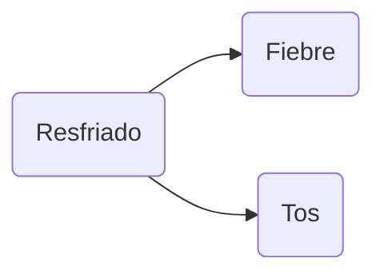
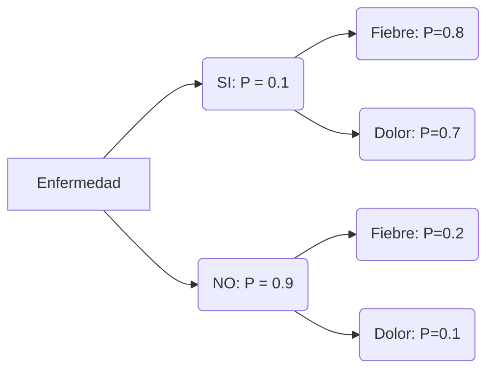
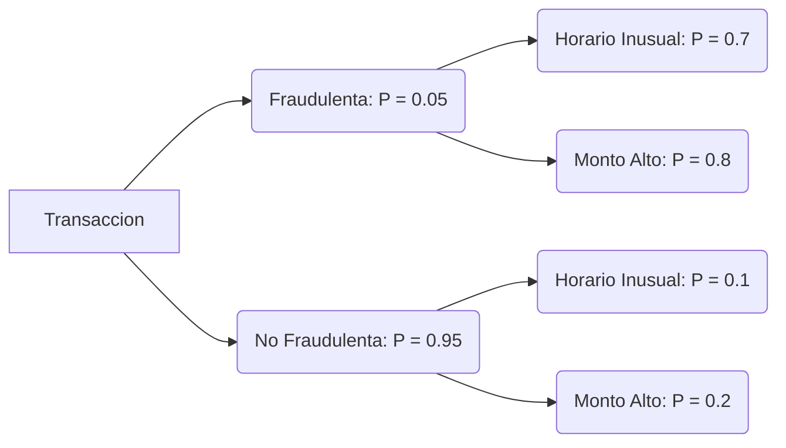

# Tema 2. Sistemas de razonamiento impreciso

## Teoría de la probabilidad aplicada al razonamiento impreciso

1. Introducción al razonamiento probabilístico
2. Importancia del razonamiento probabilístico en sistemas de IA
3. Conceptos básicos de probabilidad
4. Probabilidad condicionada
5. Independencia y dependencia entre eventos
6. El Teorema de Bayes y su importancia en la IA
7. Aplicaciones del Teorema de Bayes: el clasificador Naïve Bayes
8. Redes bayesianas: representación gráfica de probabilidades
9. Inferencia en redes bayesianas
10. Modelos ocultos de Markov y procesos estocásticos
11. Aplicaciones de los enfoques probabilísticos en IA

---

### Introducción al Razonamiento Probabilístico

En inteligencia artificial, el **razonamiento probabilístico** es un enfoque clave para trabajar con incertidumbre e información incompleta. A diferencia de los sistemas deterministas, donde cada entrada tiene una salida predecible, el razonamiento probabilístico permite que los modelos tomen decisiones basadas en probabilidades, evaluando múltiples resultados posibles y sus probabilidades asociadas. Esto es especialmente útil en la IA, ya que muchos problemas del mundo real, como la percepción visual, el lenguaje natural o el diagnóstico médico, presentan incertidumbre inherente y datos ruidosos.

En este capítulo exploraremos los **fundamentos teóricos de la probabilidad** y cómo aplicarlos para manejar incertidumbre en sistemas de IA. Nos enfocaremos en definir conceptos clave, como la **probabilidad condicionada** o la **independencia estadística**, para entender la base matemática detrás de los modelos probabilísticos. Progresivamente, llegaremos al **teorema de Bayes**, una herramienta fundamental para la actualización de creencias basada en nueva evidencia, y a modelos avanzados de inferencia probabilística, como las redes bayesianas o los modelos ocultos de Markov.

El objetivo final es ofrecer una visión clara de cómo el razonamiento probabilístico permite crear modelos de IA que no sólo realizan inferencias con datos completos, sino que también son capaces de **adaptarse a situaciones ambiguas o datos incompletos**. La lógica de la probabilidad aplicada a estos sistemas permite mejorar la robustez y flexibilidad de la IA en entornos dinámicos.

#### Importancia del razonamiento probabilístico en sistemas de IA

El razonamiento probabilístico es fundamental en IA por su capacidad para manejar **situaciones de incertidumbre**, lo cual es fundamental en aplicaciones que requieren la identificación de patrones y la toma de decisiones en contextos inciertos. Algunas de sus aplicaciones más destacadas incluyen:

**La identificación de patrones**: En sistemas de reconocimiento de patrones (como el reconocimiento de voz o visión por computadora), la información puede estar incompleta o ser ambigua. Los modelos probabilísticos permiten evaluar múltiples hipótesis sobre los datos de entrada y seleccionar la más probable, mejorando la precisión del sistema.

**La toma de decisiones en contextos inciertos**: Muchos sistemas de IA, como los asistentes virtuales o los vehículos autónomos, operan en entornos donde la información es incierta o cambia constantemente. El razonamiento probabilístico permite a estos sistemas ajustar sus decisiones dinámicamente, tomando en cuenta probabilidades y riesgos asociados.

**La actualización de creencias**: La probabilidad ofrece un marco formal para actualizar las creencias de un sistema cuando se obtiene nueva información. A través del **teorema de Bayes**, los modelos de IA pueden ajustar sus estimaciones y mejorar su precisión conforme reciben más datos, algo esencial en aplicaciones que requieren aprendizaje continuo.

**La inferencia en redes complejas**: En sistemas donde las relaciones entre variables son complejas y no siempre directas, como en redes bayesianas, el razonamiento probabilístico ayuda a modelar dependencias indirectas y a realizar inferencias en escenarios multivariables.

> [!important] 
>
> La capacidad de manejar **incertidumbre y adaptarse a nuevos datos** hace del razonamiento probabilístico una herramienta fundamental para el desarrollo de sistemas de IA que deben operar de manera efectiva en entornos del mundo real, donde las condiciones pueden cambiar y la información es muchas veces ambigua o incompleta.

### Conceptos Básicos de Probabilidad

Para comprender el razonamiento probabilístico, es esencial revisar los conceptos fundamentales de la teoría de probabilidad, que proporciona un marco matemático para modelar sistemas donde el resultado es incierto y los sucesos posibles se representan como eventos aleatorios.

#### Experimento aleatorio y espacio muestral

Un **experimento aleatorio** es un proceso cuyo resultado no se puede predecir con certeza y que se puede repetir indefinidamente bajo condiciones controladas. A diferencia de los procesos deterministas, en un experimento aleatorio cada realización puede generar resultados distintos.

> **Ejemplo**: Lanzar una moneda es un experimento aleatorio, ya que no se puede prever si el resultado será cara o cruz en un lanzamiento específico.

El **espacio muestral** (denotado como $S$) es el conjunto de todos los resultados posibles de un experimento aleatorio. Para el caso de lanzar una moneda, el espacio muestral es:

$$
S=\{ \text{cara, cruz} \}
$$

Para experimentos más complejos, el espacio muestral puede contener un número mayor de resultados, y su conocimiento es fundamental para calcular las probabilidades de los eventos de interés.

#### Eventos y operaciones entre eventos

Un **evento** es cualquier subconjunto del espacio muestral y representa una situación de interés dentro del experimento aleatorio. Los eventos pueden ser simples (contienen un solo resultado) o compuestos (contienen varios resultados posibles).

##### **Unión de eventos**

La unión de dos eventos $A$ y $B$ (denotada como $A \cup B$) es el conjunto de resultados que pertenecen a $A$, a $B$ o a ambos. En términos de probabilidad, representa la ocurrencia de al menos uno de los dos eventos:

$$
P(A \cup B)=P(A)+P(B)-P(A \cap B)
$$

> **Ejemplo**: Supongamos que lanzamos un dado de seis caras y definimos dos eventos:
>
> - **Evento A**: Obtener un número par, es decir, $A=\{2, 4, 6\}$.
> - **Evento B**: Obtener un número mayor que 4, es decir, $B=\{5, 6\}$.
>
> La **unión de los eventos A y B** representa obtener un número que sea par o mayor que 4. Para calcular $P(A \cup B)$, usamos la fórmula de la unión de eventos:
>
> $$
P(A \cup B)=P(A)+P(B)-P(A \cap B)
> $$
> 
> Primero, calculamos cada probabilidad:
>
> - $P(A)=\frac{3}{6}=\frac{1}{2}$, ya que hay tres resultados favorables para $A$ en seis posibles.
> - $P(B)=\frac{2}{6}=\frac{1}{3}$, ya que hay dos resultados favorables para $B$ en seis posibles.
>
> - La **intersección de los eventos** $A$ y $B$ es el conjunto de resultados que cumplen ambos eventos, es decir, $A \cap B=\{6\}$.
> - Por lo tanto, $P(A \cap B)=\frac{1}{6}$, ya que solo el número 6 satisface ambos eventos.
>
> Sustituyendo estos valores en la fórmula, obtenemos:
>
> $$
P(A \cup B)=\frac{1}{2}+\frac{1}{3}-\frac{1}{6}=\frac{2}{3}
> $$
>
> La probabilidad de la unión de los eventos $A$ y $B$, $P(A \cup B)$, es $\frac{2}{3}$.

##### **Intersección de eventos**

La intersección de dos eventos $A$ y $B$ (denotada como $A \cap B$) es el conjunto de resultados que pertenecen tanto a $A$ como a $B$. En términos de probabilidad, representa la ocurrencia simultánea de ambos eventos:

$$
P(A \cap B)
$$

> **Ejemplo**: Supongamos que lanzamos un dado de seis caras y definimos dos eventos:
>
> - **Evento A**: Obtener un número par, es decir, $A=\{2, 4, 6\}$.
> - **Evento B**: Obtener un número mayor que 3, es decir, $B=\{4, 5, 6\}$.
>
> La **intersección de los eventos A y B** representa el conjunto de resultados que cumplen ambos eventos, es decir, aquellos números que son pares y mayores que 3. En este caso:
>
>$$
> A \cap B=\{4, 6\}
>$$
>
> Si asumimos que cada número tiene la misma probabilidad de salir, la probabilidad de que ocurra la intersección de $A$ y $B$, denotada $P(A \cap B)$, es:
>
>$$
P(A \cap B)=\frac{\text{número de elementos en }A \cap B}{\text{número total de posibles resultados}}=\frac{2}{6}=\frac{1}{3}
>$$
>
> Así, la probabilidad de obtener un número que sea par y mayor que 3 es

 $\frac{1}{3}$.

##### **Complemento de un evento**

El complemento de un evento $A$ (denotado como $A^c$ o $\overline{A}$) es el conjunto de resultados en $S$ que no pertenecen a $A$. En términos de probabilidad, representa la no ocurrencia del evento $A$:

$$
P(A^c)=1-P(A)
$$

Estas operaciones entre eventos son herramientas fundamentales para combinar y analizar probabilidades en experimentos complejos.

#### Definición de probabilidad y axiomas de Kolmogorov

La **probabilidad** de un evento $A$, denotada como $P(A)$, es una medida numérica que expresa la posibilidad de que ocurra dicho evento dentro del espacio muestral. Los valores de probabilidad siempre están en el intervalo $[0, 1]$, donde:

- $P(A)=1$: El evento $A$ es cierto y ocurrirá en cada realización del experimento.
- $P(A)=0$: El evento $A$ es imposible y no ocurrirá en ninguna realización del experimento.
- $0 < P(A) < 1$: Existe una probabilidad intermedia para el evento $A$, indicando una incertidumbre en su ocurrencia.

La teoría de la probabilidad se fundamenta en los **axiomas de Kolmogorov**, los cuales son los principios básicos para cualquier cálculo de probabilidades:

1. **Axioma de no negatividad**: La probabilidad de un evento es siempre mayor o igual a cero.

  $$
   P(A) \geq 0
  $$

2. **Axioma de certeza**: La probabilidad de que ocurra algún resultado en el espacio muestral es 1.

  $$
   P(S)=1
  $$

3. **Axioma de aditividad**: Para cualquier conjunto de eventos mutuamente excluyentes $A_1, A_2, \dots, A_n$, la probabilidad de que ocurra al menos uno de ellos es la suma de sus probabilidades individuales.

$$
P(A_1 \cup A_2 \cup \dots \cup A_n)=P(A_1)+P(A_2)+\dots+P(A_n)
$$

Estos axiomas establecen las bases de la teoría de probabilidad y permiten realizar cálculos con eventos simples y compuestos en experimentos aleatorios. En IA, estos conceptos son cruciales para modelar y manejar la incertidumbre en la toma de decisiones.

#### Probabilidad condicionada

La **probabilidad condicionada** es una extensión fundamental de la probabilidad que permite evaluar la ocurrencia de un evento **cuando ya se conoce cierta información sobre el resultado del experimento**. Esta herramienta es esencial en el análisis de dependencia e independencia entre eventos y es utilizada ampliamente en inferencia estadística y modelos de IA para ajustar probabilidades en función de nueva información.

##### Definición de probabilidad condicionada

La probabilidad condicionada de un evento $A$ dado que otro evento $B$ ha ocurrido (denotada como $P(A|B)$ ) mide la probabilidad de que ocurra $A$ bajo la condición de que $B$ ya ha sucedido. La fórmula general para la probabilidad condicionada es:

$$
P(A|B)=\frac{P(A \cap B)}{P(B)}
$$

donde $P(A \cap B)$ es la probabilidad de que ambos eventos $A$ y $B$ ocurran simultáneamente, y $P(B)$ es la probabilidad de que ocurra $B$. Esta definición es válida solo cuando $P(B)>0$, ya que no es posible condicionar sobre un evento de probabilidad cero.

> **Ejemplo**: Supongamos que tenemos un mazo de 52 cartas, y seleccionamos una carta al azar. Definimos los siguientes eventos:
>
> - **Evento A**: La carta seleccionada es un as.
> - **Evento B**: La carta seleccionada es negra.
>
> Sabemos que hay 4 ases en total, de los cuales 2 son negros (de picas y tréboles). **La probabilidad de obtener un as (evento $A$) sabiendo que la carta es negra (evento $B$)** sería:
>
> - $P(B)=\frac{26}{52}=\frac{1}{2}$, ya que la mitad del mazo son cartas negras.
> - $P(A \cap B)=\frac{2}{52}=\frac{1}{26}$, porque hay 2 ases negros en el mazo de 52 cartas.
>
> Aplicando la fórmula de probabilidad condicionada:
>
>$$
> P(A|B)=\frac{P(A \cap B)}{P(B)}=\frac{\frac{1}{26}}{\frac{1}{2}}=\frac{1}{13}
>$$
>
> Por lo tanto, la probabilidad de que la carta seleccionada sea un as, sabiendo que es negra, es $\frac{1}{13}$.

#### Regla de la multiplicación

La **regla de la multiplicación** es una propiedad fundamental que permite descomponer la probabilidad conjunta de dos eventos en términos de sus probabilidades condicionadas:

$$
P(A \cap B)=P(A|B) \cdot P(B)
$$

Esta propiedad es especialmente útil en el cálculo de probabilidades conjuntas y en la descomposición de probabilidades complejas en probabilidades más manejables.

> **Ejemplo**: Supongamos que un 30% de los estudiantes de una clase estudian matemáticas y que, de esos estudiantes, el 20% también estudian física. Si elegimos un estudiante al azar, la probabilidad de que estudie tanto matemáticas como física es:
>
> - $P(\text{Matemáticas})=0.3$
> - $P(\text{Física | Matemáticas})=0.2$
>
> Aplicando la regla de la multiplicación:
>
>$$
> P(\text{Física} \cap \text{Matemáticas})=P(\text{Física | Matemáticas}) \cdot P(\text{Matemáticas})=0.2 \cdot 0.3=0.06
>$$
>
> Así, la probabilidad de que un estudiante al azar estudie tanto matemáticas como física es 0.06 o 6%.


#### Independencia y dependencia entre eventos

La **independencia entre eventos** es un concepto central en teoría de probabilidad que simplifica el cálculo de probabilidades conjuntas. Dos eventos son independientes si la ocurrencia de uno no afecta la probabilidad de ocurrencia del otro. Esta propiedad es clave en muchos modelos probabilísticos, ya que permite descomponer problemas complejos en componentes más manejables.

##### Independencia de eventos

Dos eventos $A$ y $B$ son **independientes** si la probabilidad de que ambos ocurran es igual al producto de sus probabilidades individuales. En términos matemáticos, esto se expresa como:

$$
P(A \cap B)=P(A) \cdot P(B)
$$

Otra forma de expresar independencia es a través de la **probabilidad condicionada**. Si $A$ y $B$ son independientes, entonces la probabilidad de que ocurra $A$ dado que $B$ ha ocurrido es simplemente la probabilidad de $A$:

$$
P(A|B)=P(A)
$$

Esta propiedad también se cumple en sentido inverso: $P(B|A)=P(B)$. La independencia es útil en el cálculo de probabilidades porque permite simplificar las expresiones conjuntas, lo que facilita el análisis de sistemas complejos.

> **Ejemplo**: En un experimento donde lanzamos dos dados, el resultado del primer dado no influye en el resultado del segundo dado. Por lo tanto, el evento de obtener un "3" en el primer dado es independiente del evento de obtener un "5" en el segundo dado. Si la probabilidad de obtener un "3" en el primer dado es $\frac{1}{6}$ y la probabilidad de obtener un "5" en el segundo dado es $\frac{1}{6}$, la probabilidad conjunta de obtener un "3" en el primer dado y un "5" en el segundo es:
> 
>$$
>P(\text{3 en el primer dado} \cap \text{5 en el segundo dado})=\frac{1}{6} \cdot \frac{1}{6}=\frac{1}{36}
>$$

##### Dependencia de eventos

Dos eventos son **dependientes** si la ocurrencia de uno afecta la probabilidad de ocurrencia del otro. En este caso, la probabilidad de la intersección de $A$ y $B$ no se puede descomponer como el producto de sus probabilidades individuales. En términos de probabilidad condicionada, si $A$ y $B$ son dependientes, entonces $P(A|B) \neq P(A)$

> **Ejemplo**: Supongamos que en una bolsa hay 5 bolas rojas y 5 bolas azules. Si extraemos una bola al azar sin reemplazo, el evento de sacar una bola roja afecta la probabilidad de sacar una bola azul en la siguiente extracción, ya que ahora habrá menos bolas en la bolsa. Esto hace que los eventos "sacar una bola roja" y "sacar una bola azul" en extracciones consecutivas sean dependientes.

#### Independencia condicional

La **independencia condicional** es un concepto clave en modelos probabilísticos más avanzados, como las redes bayesianas. Dos eventos $A$ y $B$ son condicionalmente independientes dado un tercer evento $C$ si, al conocer la ocurrencia de $C$, la ocurrencia de $A$ no afecta la probabilidad de $B$, y viceversa. Matemáticamente, la independencia condicional se expresa como:

$$
P(A \cap B | C)=P(A | C) \cdot P(B | C)
$$

Esto implica que, bajo la condición de $C$, los eventos $A$ y $B$ pueden tratarse como si fueran independientes. Este principio es fundamental en la construcción de modelos de inferencia probabilística, donde se descomponen probabilidades complejas en relaciones condicionales más simples.

> **Ejemplo**: Supongamos que tenemos información sobre la probabilidad de que un estudiante apruebe un examen (evento $A$), la probabilidad de que haya estudiado (evento $B$), y sabemos si ha asistido a clases (evento $C$). Si sabemos que el estudiante ha asistido a clases, entonces el evento de haber estudiado puede ser condicionalmente independiente del evento de aprobar. Esto quiere decir que, dado el conocimiento de que el estudiante asistió a clase, el hecho de que haya estudiado ya no afecta directamente la probabilidad de aprobar.

La independencia condicional permite que modelos como las redes bayesianas simplifiquen cálculos al representar sólo las dependencias directas, lo que hace más eficiente el manejo de grandes cantidades de variables interrelacionadas.

### El Teorema de Bayes y su importancia en la IA

El **Teorema de Bayes** es uno de los fundamentos clave en el razonamiento probabilístico y es esencial en la IA para manejar la incertidumbre. **Permite actualizar las probabilidades de eventos a medida que se obtiene nueva información,** ajustando las creencias previas en función de la evidencia observada.

> [!tip]
>
> Imagina que observas un animal a lo lejos que parece tener rayas, pero las condiciones de observación no permiten identificarlo con certeza. Sabes que, en general, es **mucho más probable ver un caballo que una cebra** debido a la frecuencia de ambos animales en la zona.
>
> En este caso, tienes dos posibles hipótesis:
>
> 1. **Hipótesis H1**: El animal es un caballo.
> 2. **Hipótesis H2**: El animal es una cebra.
>
> Inicialmente, antes de observar cualquier detalle específico, estás inclinado a pensar que el animal es un caballo, ya que, por ejemplo, un 99% de los animales en el área son caballos, mientras que solo un 1% son cebras. Esta es tu **probabilidad a priori**.
>
> Ahora, al observar el detalle de las **rayas**, surge un dato interesante. Aunque las rayas son un indicador claro de una cebra, es posible (aunque poco común) que un caballo pueda parecer que las tiene debido a sombras, pintura o un patrón inusual. Este detalle, aunque no definitivo, se convierte en una **evidencia** que modifica tu evaluación inicial.
>
> El teorema de Bayes te permite actualizar tus probabilidades iniciales al considerar esta nueva información. Aunque la observación de rayas aumenta la probabilidad de que sea una cebra, la probabilidad de ver caballos sigue siendo alta en comparación, y esto se tiene en cuenta en el cálculo.
>
> En resumen, aunque el hecho de observar rayas hace que la hipótesis de que el animal sea una cebra sea más probable que antes, tus probabilidades iniciales (que favorecen ver un caballo) siguen siendo relevantes. Así, la evidencia de las rayas ajusta tu perspectiva, pero no necesariamente cambia tu hipótesis inicial de manera radical si los caballos siguen siendo abrumadoramente más comunes.

#### Definición y explicación del Teorema de Bayes

El Teorema de Bayes establece una relación entre las probabilidades condicionadas de eventos, proporcionando una forma de "invertir" el orden de la probabilidad condicionada. Dado un evento $A$ y un evento $B$, la probabilidad de $A$ dado $B$ (denotada $P(A | B)$) se puede expresar en términos de la probabilidad de $B$ dado $A$ y las probabilidades individuales de $A$ y $B$.

##### Enunciado del Teorema de Bayes

Matemáticamente, el Teorema de Bayes se expresa como:

$$
P(A|B)=\frac{P(B|A) \cdot P(A)}{P(B)}
$$

donde:

- $P(A|B)$ es la **probabilidad posterior** de $A$ dado $B$, es decir, la probabilidad de $A$ actualizada en función de la ocurrencia de $B$.
- $P(B|A)$ es la **probabilidad de verosimilitud** de $B$ dado $A$, que mide la probabilidad de observar $B$ si se supone que $A$ es verdadero.
- $P(A)$ es la **probabilidad a priori** de $A$, o la probabilidad inicial que teníamos sobre $A$ antes de observar $B$.
- $P(B)$ es la **probabilidad marginal** de $B$, que representa la probabilidad total de observar $B$ y se puede descomponer en función de los eventos posibles.

##### Derivación del Teorema de Bayes

La derivación del Teorema de Bayes parte de la definición de probabilidad condicionada. Sabemos que:

$$
P(A|B)=\frac{P(A \cap B)}{P(B)}
$$

y, de manera similar:

$$
P(B|A)=\frac{P(A \cap B)}{P(A)}
$$

Al despejar $P(A \cap B)$ en ambas ecuaciones, obtenemos:

$$
P(A \cap B)=P(A|B) \cdot P(B)=P(B|A) \cdot P(A)
$$

Igualando las expresiones, llegamos a la forma del Teorema de Bayes:

$$
P(A|B)=\frac{P(B|A) \cdot P(A)}{P(B)}
$$

##### Interpretación del Teorema de Bayes: Evidencia y creencias

El Teorema de Bayes se interpreta como un mecanismo de actualización de **creencias** en función de **nueva evidencia**. En el contexto de IA, esta interpretación es útil para ajustar las probabilidades en problemas de diagnóstico, predicción o clasificación, donde se deben adaptar las probabilidades de diferentes hipótesis al recibir nueva información.

> **Ejemplo**: Supongamos que queremos diagnosticar si un paciente tiene una enfermedad $D$ en función de un síntoma $S$ (por ejemplo, fiebre). Inicialmente, sabemos que la probabilidad de que cualquier persona tenga la enfermedad (probabilidad previa) es $P(D)=0.01$. También sabemos que si alguien tiene la enfermedad, hay una alta probabilidad de que presente fiebre, es decir, $P(S|D)=0.8$. Además, conocemos que la probabilidad de fiebre en la población general es $P(S)=0.1$.
>
> Aplicando el Teorema de Bayes, podemos calcular la **probabilidad a posteriori** de que un paciente tenga la enfermedad dado que presenta fiebre:
>
>$$
> P(D|S)=\frac{P(S|D) \cdot P(D)}{P(S)}=\frac{0.8 \cdot 0.01}{0.1}=0.08
>$$
>
> Esto significa que, dado que el paciente presenta fiebre, la probabilidad de que tenga la enfermedad se actualiza al 8%. Esta técnica de actualización de creencias permite a los modelos de IA mejorar sus predicciones al incorporar nueva información relevante.

#### Aplicaciones del Teorema de Bayes: El clasificador Naïve Bayes

El Teorema de Bayes es una herramienta fundamental en la inteligencia artificial, especialmente útil en problemas de clasificación, inferencia probabilística, diagnóstico médico y toma de decisiones en situaciones con incertidumbre. Su capacidad para actualizar la probabilidad de un evento a partir de evidencia observada permite a los modelos de IA adaptarse y responder de manera dinámica a la nueva información. A efectos del presente curso vamos a exponer una de las aplicaciones más comunes en IA: **El clasificador Naïve Bayes**

El **clasificador Naive Bayes** es un modelo probabilístico simple, basado en el teorema de Bayes, que se utiliza para resolver problemas de clasificación. La premisa clave del clasificador es la suposición de **independencia condicional** entre las características, es decir, que cada característica es independiente de las demás dado el valor de la clase. A pesar de esta simplificación (que raramente se cumple en el mundo real), el clasificador Naive Bayes ofrece buenos resultados en muchos casos prácticos y es eficiente para grandes conjuntos de datos.

##### Fundamento teórico del clasificador Naive Bayes

Dado un conjunto de datos con instancias (o ejemplos) y sus características asociadas, el clasificador Naive Bayes utiliza la probabilidad para predecir la clase de una instancia desconocida. La predicción se basa en el **teorema de Bayes**, que calcula la probabilidad de una clase específica $C$ dada una instancia con características $X=(x_1, x_2, \ldots, x_n)$.

El teorema de Bayes establece que:

$$
P(C|X)=\frac{P(X|C) \cdot P(C)}{P(X)}
$$

donde:

- $P(C|X)$ es la **probabilidad posterior** de la clase $C$ dado el conjunto de características $X$.
- $P(X|C)$ es la **verosimilitud** o la probabilidad de observar $X$ dado que la clase es $C$.
- $P(C)$ es la **probabilidad a priori** de la clase $C$.
- $P(X)$ es la **probabilidad marginal** de observar el conjunto de características $X$, independientemente de la clase.

Para el clasificador Naive Bayes, queremos encontrar la clase $C$ que **maximiza la probabilidad posterior** $P(C|X)$, lo cual se expresa como:

$$
\hat{C}=\arg \max_C P(C|X)
$$

Al aplicar el teorema de Bayes, podemos reescribir esta expresión como:

$$
\hat{C}=\arg \max_C \frac{P(X|C) \cdot P(C)}{P(X)}
$$

Dado que $P(X)$ es constante para todas las clases, se puede simplificar:

$$
\hat{C}=\arg \max_C P(X|C) \cdot P(C)
$$

##### Suposición de independencia condicional

Para simplificar el cálculo de $P(X|C)$, el clasificador Naive Bayes asume que **cada característica $i$ es independiente de las demás dado el valor de la clase $C$.** Bajo esta suposición, la verosimilitud se descompone en el producto de las probabilidades individuales de cada característica $i$ dada la clase $C$:

$$
P(X|C)=P(x_1, x_2, \ldots, x_n|C)=\prod_{i=1}^n P(x_i|C)
$$

La fórmula final para el clasificador Naive Bayes es:

$$
\hat{C}=\arg \max_C P(C) \cdot \prod_{i=1}^n P(x_i|C)
$$

La simplicidad del clasificador Naive Bayes lo hace eficiente y efectivo en muchos escenarios, aunque su rendimiento puede verse afectado cuando la suposición de independencia condicional no se cumple. Sin embargo, es ampliamente utilizado en aplicaciones de texto (como filtrado de spam y análisis de sentimiento) y ofrece buenos resultados en conjuntos de datos de gran dimensión.

##### Entrenamiento del clasificador Naive Bayes

Para entrenar el clasificador Naive Bayes, se debe:

1. **Calcular las probabilidades a priori** $P(C)$ para cada clase $C$. Esto se hace contando la frecuencia de cada clase en el conjunto de entrenamiento y dividiendo por el número total de instancias.

2. **Calcular las probabilidades condicionales** $P(x_i|C)$ para cada característica $i$ dada cada clase $C$. El método de cálculo depende del tipo de características:
   - **Características categóricas**: Se calcula la probabilidad condicional contando la frecuencia de cada valor de $i$ en cada clase $C$.
   - **Características continuas**: Se asume generalmente una **distribución normal** y se calcula $P(x_i|C)$ usando la función de densidad de probabilidad normal con la media y varianza estimadas a partir de los datos de entrenamiento.

##### Clasificación de una nueva instancia

Para clasificar una nueva instancia con características $X=(x_1, x_2, \ldots, x_n)$:

1. Para cada clase $C$, se calcula el valor $P(C) \cdot \prod_{i=1}^n P(x_i|C)$.
2. La clase predicha $\hat{C}$ es aquella que maximiza este valor.

> **Ejemplo**: Supongamos que tenemos un conjunto de datos para predecir si un correo es "spam" o "no spam" basado en las palabras que contiene (por ejemplo, "gratis", "oferta", "urgente").
>
> - Calculamos $P(\text{spam})$ y $P(\text{no spam})$ como la frecuencia de correos spam y no spam en los datos.
> - Para cada palabra relevante, calculamos $P(\text{"gratis"}|\text{spam})$, $P(\text{"oferta"}|\text{spam})$, y así sucesivamente, y hacemos lo mismo para los correos no spam.
> - Para clasificar un correo que contiene las palabras "gratis" y "urgente", calculamos:
>
>$$
> P(\text{spam}) \cdot P(\text{"gratis"}|\text{spam}) \cdot P(\text{"urgente"}|\text{spam})
>$$
>
> y
>
>$$
> P(\text{no spam}) \cdot P(\text{"gratis"}|\text{no spam}) \cdot P(\text{"urgente"}|\text{no spam})
>$$
>
> La categoría que dé el valor mayor será la predicción del clasificador Naive Bayes.


##### Ejemplo resuelto de aplicación del algoritmo Naïve Bayes

Vamos a resolver de forma manual un ejemplo relacionado con un caso de clasificación siguiendo el algoritmo Naïve Bayes. Supongamos que queremos usar dicho algoritmo para saber si podemos jugar o no al golf. Imaginemos un conjunto de datos en el que cada registro representa un día y contiene las siguientes características:

- **Tiempo**: Puede ser soleado, nublado o lluvioso.
- **Temperatura**: Puede ser alta, templada o baja.
- **Humedad**: Puede ser alta o normal.
- **Viento**: Puede estar presente o no.

La variable de salida (*target*) es **Jugar al Golf**, que indica si el día fue adecuado para jugar al golf (sí o no). A continuación, un ejemplo de conjunto de datos:

| Tiempo   | Temperatura | Humedad | Viento | Jugar al Golf |
| -------- | ----------- | ------- | ------ | ------------- |
| Soleado  | Alta        | Alta    | No     | No            |
| Soleado  | Alta        | Alta    | Sí     | No            |
| Nublado  | Alta        | Alta    | No     | Sí            |
| Lluvioso | Templada    | Alta    | No     | Sí            |
| Lluvioso | Baja        | Normal  | No     | Sí            |
| Lluvioso | Baja        | Normal  | Sí     | No            |
| Nublado  | Baja        | Normal  | Sí     | Sí            |
| Soleado  | Templada    | Alta    | No     | No            |
| Soleado  | Baja        | Normal  | No     | Sí            |
| Lluvioso | Templada    | Normal  | No     | Sí            |
| Soleado  | Templada    | Normal  | Sí     | Sí            |
| Nublado  | Templada    | Alta    | Sí     | Sí            |
| Nublado  | Alta        | Normal  | No     | Sí            |
| Lluvioso | Templada    | Alta    | Sí     | No            |

**Objetivo:** Supongamos que queremos predecir si alguien jugará al golf en un día que tiene las siguientes condiciones:

- **Tiempo**: Soleado
- **Temperatura**: Alta
- **Humedad**: Alta
- **Viento**: No

Primero, debemos calcular las probabilidades a priori observando cuántos días se clasificaron como "Jugar al Golf = Sí" y "Jugar al Golf = No".

- Total de días = 14
- Días en que se juega al golf (Sí) = 9
- Días en que no se juega al golf (No) = 5

Probabilidades iniciales (a priori):

$$
P(\text{Sí}) = \frac{9}{14}, \quad P(\text{No}) = \frac{5}{14}
$$

A continuación, calculamos las probabilidades condicionadas para cada característica en las condiciones dadas, por ejemplo, $P(\text{Tiempo} = \text{Soleado}|\text{Sí})$ y $P(\text{Tiempo} = \text{Soleado}|\text{No})$.

1. **Tiempo = Soleado**
   - $P(\text{Tiempo} = \text{Soleado}|\text{Sí}) = \frac{2}{9}$
   - $P(\text{Tiempo} = \text{Soleado}|\text{No}) = \frac{3}{5}$

2. **Temperatura = Alta**
   - $P(\text{Temperatura} = \text{Alta}|\text{Sí}) = \frac{3}{9}$
   - $P(\text{Temperatura} = \text{Alta}|\text{No}) = \frac{2}{5}$

3. **Humedad = Alta**
   - $P(\text{Humedad} = \text{Alta}|\text{Sí}) = \frac{3}{9}$
   - $P(\text{Humedad} = \text{Alta}|\text{No}) = \frac{4}{5}$

4. **Viento = No**
   - $P(\text{Viento} = \text{No}|\text{Sí}) = \frac{6}{9}$
   - $P(\text{Viento} = \text{No}|\text{No}) = \frac{2}{5}$

Para predecir si se jugará al golf en un día con las condiciones dadas, calculamos la probabilidad de "Sí" y "No" usando el teorema de Bayes.

**Calcular $P(\text{Sí}|\text{Condiciones})$**

$$
P(\text{Sí}|\text{Condiciones}) \propto P(\text{Sí}) \cdot P(\text{Tiempo} = \text{Soleado}|\text{Sí}) \cdot P(\text{Temperatura} = \text{Alta}|\text{Sí}) \cdot P(\text{Humedad} = \text{Alta}|\text{Sí}) \cdot P(\text{Viento} = \text{No}|\text{Sí})
$$

Sustituyendo valores:

$$
P(\text{Sí}|\text{Condiciones}) \propto \frac{9}{14} \cdot \frac{2}{9} \cdot \frac{3}{9} \cdot \frac{3}{9} \cdot \frac{6}{9}
$$

**Calcular $P(\text{No}|\text{Condiciones})$**

$$
P(\text{No}|\text{Condiciones}) \propto P(\text{No}) \cdot P(\text{Tiempo} = \text{Soleado}|\text{No}) \cdot P(\text{Temperatura} = \text{Alta}|\text{No}) \cdot P(\text{Humedad} = \text{Alta}|\text{No}) \cdot P(\text{Viento} = \text{No}|\text{No})
$$

Sustituyendo valores:

$$
P(\text{No}|\text{Condiciones}) \propto \frac{5}{14} \cdot \frac{3}{5} \cdot \frac{2}{5} \cdot \frac{4}{5} \cdot \frac{2}{5}
$$

Comparando los valores resultantes de $P(\text{Sí}|\text{Condiciones})$ y $P(\text{No}|\text{Condiciones})$, la opción con el mayor valor será la predicción final. En este caso, si $P(\text{Sí}|\text{Condiciones})$ es mayor, **concluimos que es probable que se juegue al golf en estas condiciones**.

Este ejemplo de Naive Bayes ilustra cómo combinar la información de múltiples características para realizar una predicción probabilística en un problema de clasificación.

### Redes bayesianas: representación gráfica de probabilidades

Las **redes bayesianas** son un tipo de modelo probabilístico que representa relaciones de dependencia condicional entre variables a través de **un grafo dirigido y acíclico**. Estos modelos permiten estructurar y organizar la información probabilística de forma gráfica, lo que facilita la interpretación y el cálculo de probabilidades conjuntas en sistemas complejos.

Las redes bayesianas se utilizan ampliamente en inteligencia artificial para representar y analizar dependencias probabilísticas en sistemas con múltiples variables. Estos modelos ofrecen una manera intuitiva de visualizar y razonar sobre las relaciones entre variables, además de simplificar cálculos complejos que serían inabordables si se trataran las dependencias de forma directa.

#### Definición de red bayesiana

Una red bayesiana es una estructura de grafo dirigida y acíclica donde cada **nodo** representa una variable aleatoria, y cada **arista** (o flecha) representa una relación de dependencia probabilística entre dos nodos. La orientación de las flechas en el grafo indica la dirección de la influencia entre variables y se basa en la probabilidad condicional. Los modelos bayesianos utilizan el Teorema de Bayes y las propiedades de independencia condicional para descomponer las probabilidades conjuntas en componentes más sencillos de calcular.

Una red bayesiana se define por los siguientes elementos:

- **Nodos**: Cada nodo representa una variable aleatoria que puede tomar distintos valores. Por ejemplo, en un sistema de diagnóstico médico, un nodo puede representar la variable "enfermedad" y otro nodo, la variable "síntoma".
  
- **Aristas (flechas)**: Las flechas entre nodos representan dependencias condicionales entre las variables. Si existe una flecha desde el nodo $A$ hacia el nodo $B$, esto indica que $A$ afecta directamente la probabilidad de $B$.

- **Probabilidades condicionales**: Para cada nodo, se especifica una tabla de probabilidad condicional (CPT, por sus siglas en inglés) que detalla la probabilidad de cada valor de la variable dado el valor de sus nodos padres. Si un nodo no tiene padres, la probabilidad que se define es simplemente su probabilidad marginal.

> **Ejemplo:** Red bayesiana de cuatro nodos
>
> ```mermaid
> graph LR
>     A[Condiciones Ambientales]
>     B[Síntoma B]
>     C[Síntoma C]
>     D[Diagnóstico]
>     
>     A --> B
>     A --> C
>     B --> D
>     C --> D
> ```
>
> - **Condiciones Ambientales (A)** actúa como nodo raíz, influenciando tanto a **Síntoma B** como a **Síntoma C**.
> - **Síntoma B** y **Síntoma C** son nodos hijos de **Condiciones Ambientales (A)**, pero ambos afectan al **Diagnóstico (D)**.
> - **Diagnóstico (D)** se calcula en función de las probabilidades condicionales de **Síntoma B** y **Síntoma C**.
>
> Esta red bayesiana ilustra cómo las dependencias entre variables pueden influir en la probabilidad de un diagnóstico basado en factores observables (síntomas) y condiciones ambientales.

#### Interpretación probabilística en una red bayesiana

Una red bayesiana permite descomponer la **probabilidad conjunta** de un conjunto de variables en términos de las probabilidades condicionales de cada nodo dado sus nodos padres. Para un conjunto de variables $X_1, X_2, \dots, X_n $, la probabilidad conjunta se expresa como:

$$
P(X_1, X_2, \dots, X_n) = \prod_{i=1}^n P(X_i | \text{padres}(X_i))
$$

Esta descomposición facilita los cálculos al aprovechar las dependencias condicionales y permite evaluar la probabilidad de eventos complejos de forma eficiente. La estructura gráfica de una red bayesiana también hace explícitas las independencias condicionales entre variables, lo que ayuda a simplificar el análisis y reducir la complejidad del modelo.

> **Ejemplo**: Supongamos una red bayesiana simple para un sistema de diagnóstico médico, con tres nodos: "Enfermedad" (D), "Fiebre" (F) y "Dolor" (P). La estructura de la red tiene una flecha de "Enfermedad" hacia "Fiebre" y otra hacia "Dolor".
>
> ```mermaid
> graph LR
>  D(Enfermedad) --> F(Fiebre)
>  D --> P(Dolor)
> 
> ```
>
> 
>
> Esto indica que tanto "Fiebre" como "Dolor" dependen de la presencia de "Enfermedad". La probabilidad conjunta para estos tres eventos se expresa como:
> 
> $$
> P(D, F, P) = P(D) \cdot P(F|D) \cdot P(P|D)
> $$
>
> En esta red, la probabilidad de observar fiebre y dolor puede calcularse en función de la probabilidad de tener la enfermedad y las probabilidades condicionales de presentar fiebre o dolor si se tiene la enfermedad. Esta descomposición permite al sistema calcular probabilidades de manera más eficiente y facilita la interpretación del impacto de cada variable en el diagnóstico.

Las redes bayesianas son herramientas poderosas en el análisis probabilístico, especialmente en IA, porque permiten representar de manera gráfica y comprensible relaciones de dependencia condicional en sistemas complejos. Además, su estructura modular permite actualizar las probabilidades a medida que se incorpora nueva evidencia, lo que las hace altamente adaptativas y eficaces en el razonamiento bajo incertidumbre.

#### Construcción de redes bayesianas

La construcción de una **red bayesiana** implica identificar las variables relevantes de un sistema, establecer las relaciones de dependencia condicional entre ellas, y definir las probabilidades que modelan dichas relaciones. Este proceso permite representar de forma estructurada el conocimiento sobre un problema, facilitando la inferencia y actualización de creencias en sistemas con incertidumbre.

##### Ejemplo de construcción de una red bayesiana simple

Imaginemos que queremos construir una red bayesiana para diagnosticar si una persona está resfriada, basado en los síntomas de fiebre y tos. Identificamos las variables:

- **Resfriado (R)**: Variable que indica si la persona tiene un resfriado o no.
- **Fiebre (F)**: Indica si la persona tiene fiebre.
- **Tos (T)**: Indica si la persona presenta tos.

En esta red, **Resfriado** es la causa probable de los síntomas **Fiebre** y **Tos**. Entonces, el grafo dirigido sería:



##### Importancia de la independencia condicional

Un principio fundamental en la construcción de redes bayesianas es la **independencia condicional**, que permite simplificar los cálculos al evitar la necesidad de especificar todas las probabilidades conjuntas posibles. En el ejemplo anterior, si sabemos que una persona tiene resfriado, la probabilidad de fiebre es independiente de la probabilidad de tos, ya que ambas dependen únicamente de **Resfriado**. 

En términos matemáticos, esto permite expresar la probabilidad conjunta de las tres variables como:

$$
P(R, F, T) = P(R) \cdot P(F|R) \cdot P(T|R)
$$

Esta independencia condicional reduce la complejidad del modelo, haciendo innecesario el cálculo de probabilidades conjuntas más extensas.

##### Pasos para establecer las probabilidades a partir de tablas de probabilidad condicional

Los pasos a seguir a la hora de articular una red bayesiana son los siguientes:

###### **Definir las probabilidades marginales**

Especificar las probabilidades individuales para las variables que no tienen nodos padres en el grafo. En este caso, la probabilidad de **Resfriado** $P(R)$ debe estar definida, ya que **Resfriado** es la causa inicial de los síntomas.

###### **Establecer las probabilidades condicionales**

Para cada variable que tiene nodos padres, definimos la **tabla de probabilidad condicional** (CPT) en función de los valores de su(s) padre(s). En este ejemplo:

- La probabilidad de **Fiebre** dado **Resfriado** $P(F|R)$ debe estar especificada en una tabla que incluya los valores de **Fiebre** cuando hay resfriado y cuando no lo hay.
- Similarmente, para **Tos** dado **Resfriado**, debemos definir $P(T|R)$ en función de si hay o no resfriado.

> **Ejemplo**: Supongamos que conocemos las siguientes probabilidades:
>
> - $P(R = \text{sí}) = 0.1$ (probabilidad de tener resfriado).
> - $P(F = \text{sí} | R = \text{sí}) = 0.8$ y $P(F = \text{sí} | R = \text{no}) = 0.2$ (probabilidad de fiebre con y sin resfriado).
> - $P(T = \text{sí} | R = \text{sí}) = 0.7$ y $P(T = \text{sí} | R = \text{no}) = 0.1$ (probabilidad de tos con y sin resfriado).
>
> Con estos valores, podemos calcular la probabilidad conjunta de cada combinación posible de **Resfriado**, **Fiebre** y **Tos**, simplificando los cálculos y permitiendo que el modelo opere de forma eficiente. 

> [!important]
>
> Las redes bayesianas, al organizar dependencias y aprovechar la independencia condicional, no solo reducen la cantidad de datos necesarios para su construcción, sino que también facilitan una inferencia efectiva y rápida en sistemas complejos con múltiples variables interrelacionadas.

### Inferencia en redes bayesianas

La **inferencia bayesiana** es un método para actualizar probabilidades en función de nueva evidencia, proporcionando un mecanismo de ajuste de creencias iniciales (probabilidades a priori) mediante el cálculo de probabilidades a posteriori. Este enfoque, basado en el **Teorema de Bayes**, se utiliza ampliamente en sistemas de IA para ajustar hipótesis y mejorar predicciones en contextos de incertidumbre.

En una red bayesiana, la inferencia bayesiana permite calcular la probabilidad de un nodo objetivo condicionado a la observación de otros nodos relacionados, respetando la estructura de dependencias probabilísticas del modelo. Esto permite, por ejemplo, en diagnósticos o predicciones, que la probabilidad de una hipótesis inicial se ajuste en función de síntomas o comportamientos observados, lo que permite actualizar las probabilidades sin recalcular todo el modelo.

La inferencia bayesiana es crítica en IA porque permite una integración flexible y continua de nueva información en sistemas predictivos, adaptándose a datos cambiantes sin necesidad de reconstruir el modelo. Esto es esencial para aplicaciones que requieren decisiones en tiempo real y con información incompleta, como sistemas de recomendación, detección de fraudes o diagnóstico médico, donde los modelos se enriquecen y refinan a medida que reciben nuevas evidencias.

#### Ejemplos de inferencia en redes bayesianas simples

##### Ejemplo: Probabilidad en red de dos nodos

Supongamos que tenemos dos variables:

1. **Lluvia (R)**: Que representa si ha llovido o no.
2. **Césped mojado (W)**: Que representa si el césped está mojado o no.

La estructura de nuestra red es simple: la variable **Lluvia (R)** afecta la probabilidad de que el **Césped esté mojado (W)**.

### Probabilidades
Supongamos que conocemos las siguientes probabilidades:

- Probabilidad a priori de que haya lluvia:

  - $P(R = \text{sí}) = 0.3$
  - $P(R = \text{no}) = 0.7$

- Probabilidades condicionales de que el césped esté mojado dependiendo de si ha llovido o no:

  - $P(W = \text{sí} | R = \text{sí}) = 0.9$
  - $P(W = \text{sí} | R = \text{no}) = 0.1$

### Inferencia Bayesiana
Queremos calcular la probabilidad de que haya llovido **dado que observamos que el césped está mojado**, es decir, $P(R = \text{sí} | W = \text{sí})$.

Usamos el **Teorema de Bayes** para actualizar la probabilidad de lluvia a partir de la evidencia observada (césped mojado):

$$
P(R = \text{sí} | W = \text{sí}) = \frac{P(W = \text{sí} | R = \text{sí}) \cdot P(R = \text{sí})}{P(W = \text{sí})}
$$

Donde $P(W = \text{sí})$ es la **probabilidad marginal** de que el césped esté mojado, que podemos calcular sumando las probabilidades de todas las formas en que el césped puede estar mojado:

$$
P(W = \text{sí}) = P(W = \text{sí} | R = \text{sí}) \cdot P(R = \text{sí}) + P(W = \text{sí} | R = \text{no}) \cdot P(R = \text{no})
$$

Sustituyendo los valores:

$$
P(W = \text{sí}) = (0.9 \cdot 0.3) + (0.1 \cdot 0.7) = 0.27 + 0.07 = 0.34
$$

Ahora, aplicamos el Teorema de Bayes:

$$
P(R = \text{sí} | W = \text{sí}) = \frac{0.9 \cdot 0.3}{0.34} = \frac{0.27}{0.34} \approx 0.794
$$

### Interpretación
Dado que hemos observado que el césped está mojado, la probabilidad de que haya llovido **aumenta a aproximadamente 79.4%** en comparación con la probabilidad inicial del 30%. Este proceso de inferencia bayesiana permite ajustar nuestras creencias iniciales sobre la lluvia al tener en cuenta la nueva evidencia del césped mojado.

##### Ejemplo: Probabilidad de síntomas en enfermedad

Supongamos una red bayesiana que representa el diagnóstico de una **Enfermedad (E)** en función de los síntomas **Fiebre (F)** y **Dolor (D)**.

**Objetivo:** Queremos calcular la probabilidad de que una persona tenga fiebre dado que presenta dolor, es decir, $P(F | D) $.

Partimos de los siguientes datos:

- $P(E = \text{sí}) = 0.1$ y $P(E = \text{no}) = 0.9$.
- $P(F = \text{sí} | E = \text{sí}) = 0.8$ y $P(F = \text{sí} | E = \text{no}) = 0.2$.
- $P(D = \text{sí} | E = \text{sí}) = 0.7$ y $P(D = \text{sí} | E = \text{no}) = 0.1$.

En forma de grafo es más fácil visualizar los datos del problema



Esta red indica que la **Enfermedad** es la causa probable de **Fiebre** y **Dolor**. La inferencia paso a paso es la siguiente:

**Inferencia bayesiana**

1. **Descomponer la probabilidad deseada**: Para calcular $P(F | D) $, utilizamos la definición de probabilidad condicional:

  $$
   P(F | D) = \frac{P(F \cap D)}{P(D)}
  $$

2. **Expresar la probabilidad conjunta en términos de la red**: En una red bayesiana, la probabilidad conjunta de las variables se descompone en probabilidades condicionales. Así, para esta red tenemos:

  $$
   P(F, D) = \sum_{E} P(F | E) \cdot P(D | E) \cdot P(E)
  $$

   Sumamos las probabilidades conjuntas para cada posible valor de $E$:

  $$
   P(F \cap D) = P(F = \text{sí}, D = \text{sí}) = (0.8 \cdot 0.7 \cdot 0.1) + (0.2 \cdot 0.1 \cdot 0.9) = 0.056 + 0.018 = 0.074
  $$

3. **Calcular $P(D) $**: Sumamos las probabilidades de que haya dolor en ambos casos de $E$:

  $$
   P(D = \text{sí}) = P(D = \text{sí} | E = \text{sí}) \cdot P(E = \text{sí}) + P(D = \text{sí} | E = \text{no}) \cdot P(E = \text{no})
  $$

   Sustituyendo:

  $$
   P(D = \text{sí}) = (0.7 \cdot 0.1) + (0.1 \cdot 0.9) = 0.07 + 0.09 = 0.16
  $$

4. **Calcular $P(F | D) $**: Finalmente, aplicamos la fórmula de probabilidad condicional:

  $$
   P(F | D) = \frac{P(F = \text{sí}, D = \text{sí})}{P(D = \text{sí})} = \frac{0.074}{0.16} \approx 0.4625
  $$

En conclusión, la probabilidad de fiebre dado que la persona presenta dolor es aproximadamente 46.25%. Este tipo de cálculo facilita la inferencia en redes bayesianas, lo que permite realizar diagnósticos o tomar decisiones en función de la probabilidad condicional en un sistema con dependencias probabilísticas.

Aquí tienes un ejemplo de inferencia en una red bayesiana en el contexto de la **detección de fraudes financieros**.

##### Ejemplo 2: Detección de fraude financiero

Supongamos una red bayesiana para analizar si una **Transacción (T)** es fraudulenta, en función de dos variables relacionadas: si la transacción ocurre en un **Horario inusual (H)** y si el **Monto (M)** es elevado.

**Objetivo:** Calcular la probabilidad de que una transacción sea en un horario inusual dado que el monto es elevado, es decir, $P(H | M) $.

Los datos son los siguientes:

- $P(T = \text{fraudulenta}) = 0.05$ y $P(T = \text{no fraudulenta}) = 0.95$
- $P(H = \text{sí} | T = \text{fraudulenta}) = 0.7$ y $P(H = \text{sí} | T = \text{no fraudulenta}) = 0.1$
- $P(M = \text{alto} | T = \text{fraudulenta}) = 0.8$ y $P(M = \text{alto} | T = \text{no fraudulenta}) = 0.2$

En forma de grafo se representa así:



Esta red indica que la **Transacción** (T) puede afectar la probabilidad de que ocurra en un **Horario inusual** (H) o tenga un **Monto alto** (M). A continuación, calcularemos $P(H | M)$ usando inferencia bayesiana.

**Inferencia bayesiana**

1. **Descomposición de la probabilidad deseada**: Queremos calcular $P(H | M)$ usando probabilidad condicional:
  
  $$
   P(H | M) = \frac{P(H \cap M)}{P(M)}
  $$

2. **Expresión de la probabilidad conjunta en términos de la red**: Utilizamos la descomposición en la red:

  $$
   P(H, M) = \sum_{T} P(H | T) \cdot P(M | T) \cdot P(T)
  $$

3. **Cálculo de $P(H \cap M) $**: Sumamos las probabilidades conjuntas para cada valor de $T$:

  $$
   P(H = \text{sí}, M = \text{alto}) = (0.7 \cdot 0.8 \cdot 0.05) + (0.1 \cdot 0.2 \cdot 0.95) = 0.028 + 0.019 = 0.047
  $$

4. **Cálculo de $P(M) $**: Sumamos las probabilidades de que el monto sea alto en ambos casos de $T$:

  $$
   P(M = \text{alto}) = P(M = \text{alto} | T = \text{fraudulenta}) \cdot P(T = \text{fraudulenta}) + P(M = \text{alto} | T = \text{no fraudulenta}) \cdot P(T = \text{no fraudulenta})
  $$

   Sustituyendo:

  $$
   P(M = \text{alto}) = (0.8 \cdot 0.05) + (0.2 \cdot 0.95) = 0.04 + 0.19 = 0.23
  $$

5. **Cálculo de $P(H | M) $**: Finalmente, aplicamos la fórmula de probabilidad condicional:

  $$
   P(H | M) = \frac{P(H = \text{sí}, M = \text{alto})}{P(M = \text{alto})} = \frac{0.047}{0.23} \approx 0.204
  $$

La probabilidad de que una transacción ocurra en un horario inusual dado que el monto es elevado es aproximadamente 20.4%. Esta inferencia es útil para sistemas de detección de fraudes, ya que permite calcular probabilidades condicionales y evaluar la presencia de indicios de fraude en función de patrones de datos.

##### Ejemplo 3: Verosimilitud en la inferencia bayesiana

Imagina que tienes una urna que puede ser de dos tipos:

1. **Tipo A**: Contiene un 70% de bolas rojas y un 30% de bolas azules.
2. **Tipo B**: Contiene un 30% de bolas rojas y un 70% de bolas azules.

No sabemos de qué tipo es la urna, pero tenemos una **hipótesis inicial (a priori)** de que la urna tiene un 50% de probabilidad de ser del tipo A y un 50% de probabilidad de ser del tipo B.

Decidimos extraer una bola al azar y observamos que es **roja**.

**Paso 1: Definir las probabilidades iniciales (a priori)**

- $P(\text{A}) = 0.5$ (probabilidad de que la urna sea de tipo A).
- $P(\text{B}) = 0.5$ (probabilidad de que la urna sea de tipo B).

**Paso 2: Calcular la verosimilitud**

La **verosimilitud** mide la probabilidad de observar el dato (en este caso, extraer una bola roja) bajo cada una de las hipótesis (A o B). Es decir:

- Si la urna es de tipo A, la probabilidad de extraer una bola roja es **alta**, $P(\text{roja} | \text{A}) = 0.7$.
- Si la urna es de tipo B, la probabilidad de extraer una bola roja es **baja**, $P(\text{roja} | \text{B}) = 0.3$.

Estas probabilidades se interpretan como la **verosimilitud** de observar el evento "bola roja" bajo cada hipótesis sobre el tipo de urna.

**Paso 3: Aplicar el teorema de Bayes para actualizar las creencias**

Ahora usamos el teorema de Bayes para calcular la **probabilidad posterior** de cada hipótesis tras observar que la bola extraída es roja.

1. **Calcular el término de evidencia** $P(\text{roja})$, que es la probabilidad total de sacar una bola roja, sumando las probabilidades para cada tipo de urna:

  $$
   P(\text{roja}) = P(\text{roja} | \text{A}) \cdot P(\text{A}) + P(\text{roja} | \text{B}) \cdot P(\text{B})
  $$

   Sustituyendo los valores:

  $$
   P(\text{roja}) = (0.7 \cdot 0.5) + (0.3 \cdot 0.5) = 0.35 + 0.15 = 0.5
  $$

2. **Calcular las probabilidades posteriores** para cada tipo de urna:

- Para la hipótesis **A** (urna de tipo A):

$$
P(\text{A} | \text{roja}) = \frac{P(\text{roja} | \text{A}) \cdot P(\text{A})}{P(\text{roja})} = \frac{0.7 \cdot 0.5}{0.5} = 0.7
$$

   - Para la hipótesis **B** (urna de tipo B):

$$
P(\text{B} | \text{roja}) = \frac{P(\text{roja} | \text{B}) \cdot P(\text{B})}{P(\text{roja})} = \frac{0.3 \cdot 0.5}{0.5} = 0.3
$$

**Interpretación**

- La **verosimilitud** de la observación de una bola roja era mayor bajo la hipótesis de que la urna es de tipo A ($P(\text{roja} | \text{A}) = 0.7$) que bajo la hipótesis de que es de tipo B ($P(\text{roja} | \text{B}) = 0.3$).
- Después de actualizar nuestras creencias usando el teorema de Bayes, la **probabilidad posterior** de que la urna sea de tipo A ha aumentado a 0.7, mientras que la de que sea de tipo B ha disminuido a 0.3.

Este ejemplo muestra cómo la verosimilitud afecta la probabilidad posterior y ayuda a ajustar nuestra creencia inicial en función de la probabilidad de observar el dato bajo cada hipótesis.

### Modelos Ocultos de Markov y Procesos Estocásticos

#### Introducción a los Modelos Ocultos de Markov (HMM)

Los **Modelos Ocultos de Markov** (HMM, por sus siglas en inglés) son modelos probabilísticos que se utilizan para representar y analizar **secuencias temporales** donde la observación de cada momento no proporciona información completa sobre el estado del sistema. En un HMM, los estados subyacentes que generan las observaciones son **ocultos** y solo se pueden inferir a través de las observaciones que realizamos.

En términos generales, un HMM consiste en:

1. **Estados ocultos**: Son los estados que el sistema transita en el tiempo, pero que no son observables directamente. Estos estados siguen una cadena de Markov, es decir, el estado actual solo depende del estado anterior.

2. **Observaciones**: Representan la información observable en cada paso de tiempo. Estas observaciones se generan a partir de los estados ocultos.

3. **Probabilidades de transición**: Representan la probabilidad de transición entre los estados ocultos. Si denotamos por $t$ el estado en el tiempo $t$, entonces la probabilidad de transición de un estado $S_t = s_i$ a un estado $S_{t+1} = s_j$ es $P(S_{t+1} = s_j | S_t = s_i) $.

4. **Probabilidades de emisión**: Son las probabilidades de que un estado oculto genere una observación particular. Si denotamos por $t$ la observación en el tiempo $t$, entonces la probabilidad de emisión de una observación $O_t = o_k$ desde un estado $S_t = s_i$ es $P(O_t = o_k | S_t = s_i) $.

> **Ejemplo**: Un HMM es útil en el análisis de secuencias temporales, como el reconocimiento de voz o la predicción de secuencias de ADN, donde las observaciones visibles (por ejemplo, el sonido) son producidas por estados ocultos (por ejemplo, fonemas o palabras en el caso del habla).

Los modelos ocultos de Markov permiten inferir la **secuencia de estados ocultos** que más probablemente generó una secuencia dada de observaciones, entre otras tareas. Esta inferencia se puede realizar mediante varios algoritmos específicos.

---

#### Algoritmos de Inferencia en HMM

Para trabajar con HMM y extraer inferencias útiles de ellos, existen varios algoritmos de inferencia que facilitan el cálculo de probabilidades y la predicción de estados. Los dos algoritmos principales son el **algoritmo de Viterbi** y el **algoritmo Forward-Backward**.

##### Algoritmo de Viterbi

El **algoritmo de Viterbi** es un procedimiento de inferencia utilizado para encontrar la **secuencia de estados más probable** que explica una secuencia de observaciones en un HMM. Dado un conjunto de observaciones, el objetivo del algoritmo es determinar la trayectoria óptima de estados que maximiza la probabilidad de las observaciones, dada la estructura del modelo y las probabilidades de transición y emisión.

El proceso general del algoritmo de Viterbi se basa en:

1. **Inicialización**: Establecemos las probabilidades iniciales para cada estado en el primer paso de tiempo, considerando tanto las probabilidades de inicio como las probabilidades de emisión para la primera observación.
  
   Para el tiempo $t = 1$, en cada estado $i$:

$$
\delta_1(i) = P(O_1 | S_1 = s_i) \cdot P(S_1 = s_i)
$$

2. **Recursión**: Para cada tiempo $t$ posterior, calculamos la probabilidad de cada estado en función de las probabilidades de transición desde el estado anterior y de las probabilidades de emisión para la observación actual.
  
   Para cada $t$ y $j$:

$$
   \delta_t(j) = \max_i \left[ \delta_{t-1}(i) \cdot P(S_t = s_j | S_{t-1} = s_i) \right] \cdot P(O_t | S_t = s_j)
$$

3. **Terminación**: Al final de la secuencia de observaciones, seleccionamos la probabilidad máxima en los últimos estados, lo que nos da la probabilidad de la secuencia de estados más probable.

4. **Backtracking**: Una vez que identificamos la probabilidad más alta, reconstruimos la secuencia de estados siguiendo los estados anteriores que maximizaron la probabilidad en cada paso de tiempo.

El resultado del algoritmo de Viterbi es la secuencia de estados más probable para la secuencia de observaciones dada.

> **Ejemplo**: Si usamos un HMM para analizar secuencias de estados emocionales de una persona en función de su lenguaje, el algoritmo de Viterbi nos permitirá encontrar la secuencia de emociones (estados) que mejor explica las palabras (observaciones) que ha dicho.

---

##### Algoritmo Forward-Backward

El **algoritmo Forward-Backward** es otro método de inferencia en HMM, y se utiliza principalmente para calcular las **probabilidades posteriores** de los estados en cada tiempo, dados todos los datos de observación.

1. **Algoritmo Forward**: En esta primera etapa, calculamos la probabilidad de llegar a cada estado en el tiempo $t$, dado el conjunto de observaciones anteriores hasta $t$. Para cada $t$ y $j$:

  $$
   \alpha_t(j) = P(O_1, O_2, \ldots, O_t, S_t = s_j)
  $$

   Este cálculo se realiza de forma recursiva a partir de las probabilidades de transición y de emisión.

2. **Algoritmo Backward**: En la segunda etapa, calculamos la probabilidad de observar el conjunto de datos **futuros** desde un estado específico $j$ en el tiempo $t$, usando las observaciones posteriores a $t$. Para cada $t$ y $j$:

  $$
   \beta_t(j) = P(O_{t+1}, O_{t+2}, \ldots, O_T | S_t = s_j)
  $$

3. **Cálculo de la Probabilidad Posterior**: La probabilidad posterior de estar en un estado específico $j$ en el tiempo $t$, dados los datos completos de observación, se calcula combinando los pasos forward y backward:

  $$
   P(S_t = s_j | O_1, O_2, \ldots, O_T) \propto \alpha_t(j) \cdot \beta_t(j)
  $$

El algoritmo Forward-Backward se utiliza en aplicaciones donde queremos conocer la probabilidad de los estados en cada paso temporal, dados todos los datos de observación. Este tipo de inferencia es especialmente útil en aplicaciones de filtrado y para ajustar los parámetros del modelo HMM en el caso de secuencias con observaciones conocidas.

> **Ejemplo**: En el reconocimiento de voz, el algoritmo Forward-Backward permite calcular las probabilidades de distintos fonemas (estados ocultos) en cada instante de tiempo, dados todos los sonidos (observaciones) de la secuencia. Esto es útil para identificar cómo cambian los fonemas a lo largo de la secuencia de habla.

### Aplicaciones de los Enfoques Probabilísticos en IA

#### Introducción

Los enfoques probabilísticos son herramientas fundamentales en inteligencia artificial, especialmente para manejar incertidumbre y realizar inferencias en entornos complejos. Esta sección explora algunas de las aplicaciones más destacadas de los modelos probabilísticos, abarcando ejemplos en áreas como la clasificación de texto, diagnóstico médico o la toma de decisiones en entornos dinámicos. Sin embargo, es importante destacar que los ejemplos que se presentan no agotan todas las posibilidades de aplicación. La versatilidad de estos métodos permite su integración en una amplia gama de problemas, desde sistemas de recomendación hasta análisis predictivo en finanzas o la optimización en procesos industriales.

A lo largo de las próximas subsecciones, se verán aplicaciones concretas de algoritmos como el clasificador **Naïve Bayes** en el filtrado de spam, el uso de **redes bayesianas** para modelar relaciones de causalidad en el diagnóstico médico, y el empleo de **Modelos Ocultos de Markov (HMM)** para la planificación autónoma y la toma de decisiones en robótica. Cada ejemplo ilustra el poder de los enfoques probabilísticos para representar dependencias e incertidumbres inherentes a diversos contextos de la IA. Estos modelos permiten a los sistemas de IA adaptarse a cambios y generar predicciones informadas, haciendo de la probabilidad una herramienta clave para resolver problemas reales con precisión y flexibilidad.

#### Clasificación de Documentos y Filtrado de Correo Spam

El **teorema de Bayes** se utiliza ampliamente en la clasificación de documentos y en el **filtrado de correo spam**. Uno de los métodos más comunes es el clasificador **Naïve Bayes**, que aplica el teorema de Bayes asumiendo independencia condicional entre características. En el caso del correo electrónico, este clasificador evalúa la probabilidad de que un mensaje sea spam dado el contenido de sus palabras.

La idea básica es calcular la probabilidad de que un correo sea spam en función de la presencia de ciertas palabras clave. Dado un correo con palabras $w_1, w_2, \ldots, w_n $, el clasificador calcula la probabilidad posterior de cada clase (spam y no spam) según:

$$
P(\text{Spam} | w_1, w_2, \ldots, w_n) \propto P(\text{Spam}) \prod_{i=1}^n P(w_i | \text{Spam})
$$

El clasificador Naïve Bayes permite identificar automáticamente patrones característicos de correos spam. Por ejemplo, palabras como “gratis” o “urgente” pueden aumentar la probabilidad de clasificar un correo como spam. Una vez entrenado con ejemplos etiquetados, el modelo puede clasificar nuevos correos basándose en las probabilidades de cada palabra.

#### Sistemas de Diagnóstico y Asistencia Médica

Los modelos probabilísticos son herramientas fundamentales en el desarrollo de **sistemas de diagnóstico médico** y **asistencia sanitaria**. Mediante redes bayesianas, es posible representar relaciones causales entre síntomas y enfermedades, proporcionando un marco para inferir el diagnóstico más probable en función de los síntomas observados.

En un sistema de diagnóstico, una red bayesiana modela la relación entre síntomas observables (fiebre, tos, dolor) y enfermedades (gripe, neumonía, etc.). Cada nodo en la red representa una variable, y las conexiones entre nodos indican dependencias causales. Con estas probabilidades, se puede calcular la probabilidad de cada enfermedad dada la observación de ciertos síntomas.

> **Ejemplo**: Si un paciente presenta fiebre y tos, un sistema de diagnóstico basado en una red bayesiana podría calcular la probabilidad de enfermedades como gripe o neumonía, y sugerir el diagnóstico más probable. Al ajustar las probabilidades basándose en datos históricos, estos sistemas se vuelven más precisos y útiles en la asistencia médica.

#### Toma de Decisiones en Entornos Dinámicos

En entornos dinámicos, como la robótica y la planificación autónoma, es esencial contar con sistemas capaces de realizar inferencias bajo condiciones de incertidumbre. Los **Modelos Ocultos de Markov (HMM)** y las **redes bayesianas** se emplean en estos casos para ayudar en la toma de decisiones adaptativas y en la predicción de cambios en el entorno.

Por ejemplo, un robot autónomo que navega en un ambiente cambiante puede usar un HMM para modelar las posiciones posibles y la probabilidad de transición entre ellas, dados sus sensores. Las observaciones pueden no ser exactas, pero el modelo permite predecir la ubicación probable del robot en cada momento y ajustar su estrategia de movimiento en consecuencia.

En la **planificación autónoma**, las redes bayesianas y los HMM también se usan para prever la ocurrencia de ciertos eventos y adaptar decisiones basadas en probabilidad. En la robótica avanzada, estos enfoques probabilísticos permiten a los robots realizar movimientos de forma segura y eficiente, ajustándose dinámicamente a los cambios en el entorno.
