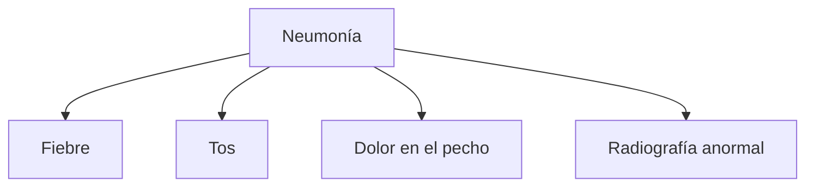

# Tema 2. Sistemas de razonamiento impreciso

> 1. Introducción a los sistemas de razonamiento impreciso
> 2. Fundamentos teóricos
> 3. **Principales modelos de razonamiento impreciso**
> 4. Algoritmos de inferencia
> 5. Aplicaciones prácticas
> 6. Comparación con otros enfoques en IA
> 7. Tendencias futuras
---

## 3. Principales modelos de razonamiento impreciso

En esta sección, nos centraremos en los principales modelos utilizados para gestionar la incertidumbre dentro del campo del **razonamiento impreciso**. Estos modelos incluyen la **lógica difusa**, las **redes bayesianas** y los **modelos basados en la teoría de la posibilidad**. Cada uno de estos enfoques ofrece herramientas matemáticas para modelar problemas en los que la información es incierta, incompleta o ambigua.

En el contexto de los **sistemas de razonamiento impreciso**, los **modelos** son estructuras matemáticas y conceptuales diseñadas para representar situaciones o fenómenos donde la información es incierta, incompleta o imprecisa. Estos modelos permiten realizar razonamientos y tomar decisiones a pesar de la falta de claridad o precisión en los datos. A diferencia de los modelos convencionales, que operan con información exacta y determinista, los modelos de razonamiento impreciso gestionan grados de incertidumbre y ambigüedad de manera efectiva.

Tres podrían ser las características principales de los modelos de razonamiento impreciso. Primeramente habría que mencionar su capacidad de **representación de la incertidumbre**. Los modelos en sistemas de razonamiento impreciso están diseñados para manejar la incertidumbre inherente a muchos problemas del mundo real. La incertidumbre puede surgir debido a la naturaleza incompleta o ruidosa de los datos, o porque no es posible describir con exactitud todas las variables que afectan una situación. En segundo lugar, son capaces de **manejar información parcial o ambigua**. A menudo, los datos que alimentan a los sistemas de razonamiento impreciso no son precisos o completos. En estos casos, los modelos permiten tomar decisiones razonables basadas en la información disponible, incluso si esta información es incierta o imprecisa. Por último, son capaces de asignar **grados de pertenencia y probabilidades**. En efecto, a diferencia de los modelos deterministas, que asignan valores absolutos (como "verdadero" o "falso"), los modelos de razonamiento impreciso suelen utilizar grados de pertenencia o probabilidades para expresar la relación entre los datos observados y los posibles resultados. En el caso de la lógica difusa, por ejemplo, se emplean **funciones de pertenencia** para definir el grado en que un elemento pertenece a un conjunto determinado. En modelos probabilísticos, se usan **distribuciones de probabilidad** para reflejar las posibilidades de que un evento ocurra bajo condiciones inciertas.

Como se ha comentado al principio de la sección, podemos encontrar tres tipos de modelos de razonamiento impreciso que son lo más habituales

1. **Modelos basados en lógica difusa**: Se construyen utilizando la lógica difusa. Útiles en situaciones donde no es posible definir límites claros entre categorías, y se requiere una evaluación continua o gradual. Un modelo difuso está compuesto por conjuntos difusos, reglas difusas (del tipo "si-entonces") y funciones de pertenencia que permiten razonamientos en situaciones ambiguas.

2. **Modelos probabilísticos**: Utilizan la teoría de la probabilidad para gestionar la incertidumbre y se basan en la idea de que los eventos tienen una probabilidad asociada que puede calcularse a partir de los datos disponibles. Las **redes bayesianas** son un ejemplo típico de este tipo de modelo. Permiten representar y manipular relaciones de dependencia entre múltiples variables, actualizando las probabilidades a medida que se dispone de nueva información.

3. **Modelos basados en teoría de la posibilidad**: A diferencia de los modelos probabilísticos, están diseñados para capturar la noción de que algunos eventos son más "posibles" que otros, sin requerir un conocimiento detallado sobre la probabilidad de cada evento. Estos modelos son útiles cuando se dispone de información limitada o cuando las probabilidades exactas no están disponibles.

### Modelos basados en lógica difusa

Los **modelos basados en lógica difusa** son sistemas diseñados para manejar incertidumbre y vaguedad en situaciones donde los datos no son claros o están incompletos. A diferencia de los modelos basados en lógica clásica, que operan bajo un marco rígido de verdadero o falso, los modelos de lógica difusa permiten un grado de flexibilidad, permitiendo que las afirmaciones se evalúen en un espectro continuo entre 0 y 1, donde 0 representa completamente falso y 1 completamente verdadero.

#### Conceptos fundamentales de la lógica difusa

La lógica difusa se basa en **conjuntos difusos**, que amplían la noción de conjuntos clásicos al permitir que los elementos pertenezcan a un conjunto en diversos grados. Por ejemplo, en un sistema clásico, una persona puede ser clasificada como alta o baja, pero en un sistema difuso, la pertenencia a un conjunto como "personas altas" puede variar. De esta manera, alguien que mida 1,75 metros puede tener una pertenencia parcial al conjunto de "personas altas" de 0,7.

**Funciones de pertenencia** son la herramienta matemática que permiten asignar estos grados intermedios. Estas funciones pueden tener diversas formas, como funciones triangulares, trapezoidales o gausianas, que se utilizan dependiendo de la naturaleza del problema a modelar. Las funciones de pertenencia permiten modelar conceptos vagos y hacer inferencias sobre situaciones ambiguas, lo cual es crítico en problemas donde no existen límites claros entre categorías.

#### Reglas en los modelos de lógica difusa

Los modelos de lógica difusa se basan en **reglas difusas** para realizar inferencias y tomar decisiones. Estas reglas siguen una estructura **"si-entonces"** que trabaja con conjuntos difusos y sus grados de pertenencia. Por ejemplo, una regla podría ser: "Si la temperatura es alta, entonces aumentar la velocidad del ventilador". En un contexto difuso, "alta" no es un valor absoluto, sino que se refiere a un rango de temperaturas con diferentes grados de pertenencia, lo que permite tomar decisiones más flexibles y realistas.

El uso de estas reglas permite manejar sistemas complejos donde las variables pueden ser inciertas o imprecisas. Las reglas difusas permiten que un sistema integre múltiples entradas imprecisas, las evalúe a través de sus funciones de pertenencia y emita una salida que sea coherente con el grado de pertenencia de los inputs evaluados.

#### Aplicaciones de los modelos difusos: Sistemas de control

Los **modelos de lógica difusa** se utilizan en una amplia gama de aplicaciones, especialmente en sistemas de control y toma de decisiones. Estos sistemas son populares en entornos donde los modelos clásicos fallan debido a la incertidumbre inherente o la vaguedad de los datos. 

El **control difuso** es una de las aplicaciones más destacadas y prácticas de la lógica difusa en el campo de la ingeniería y la automatización. Su principal ventaja radica en su capacidad para manejar situaciones en las que los sistemas no pueden ser modelados con precisión o cuando el comportamiento del sistema está influido por múltiples factores que no son fáciles de describir mediante ecuaciones exactas. A diferencia de los controladores tradicionales, que requieren un modelo matemático exacto del sistema, el control difuso permite utilizar el conocimiento empírico y la experiencia humana, traducido en reglas difusas, para tomar decisiones de control en tiempo real.

La **lógica difusa**, como hemos visto, trabaja con grados intermedios de verdad. Esto permite que las decisiones se tomen en función de reglas lingüísticas que describen el comportamiento de un sistema sin necesidad de un modelo estricto o exacto. El **control difuso** se basa en esta misma idea: en lugar de establecer límites precisos para las acciones de control, como lo haría un sistema clásico, utiliza reglas difusas que describen el comportamiento esperado del sistema en función de las condiciones actuales. 

> **Ejemplo:** en un sistema de calefacción, en lugar de decir "si la temperatura es inferior a 18°C, encender la calefacción", el control difuso puede definir reglas más flexibles como "si la temperatura es algo baja, aumentar un poco la calefacción". Este enfoque permite realizar ajustes más suaves y graduales, mejorando la eficiencia energética y el confort.

El control difuso no es una técnica aislada, sino que se basa directamente en los principios de la lógica difusa y el uso de **conjuntos difusos**. Las **funciones de pertenencia** son esenciales para definir las variables de entrada y salida del sistema, y las operaciones sobre conjuntos difusos, como la **unión** y la **intersección**, permiten combinar estas variables para tomar decisiones complejas.

La **inferencia difusa** que se utiliza en los controladores difusos es similar a la **inferencia en sistemas expertos**, donde se aplican reglas para obtener conclusiones basadas en un conjunto de entradas. Sin embargo, a diferencia de los sistemas basados en reglas clásicas, donde las decisiones son categóricas (verdadero/falso), en el control difuso las decisiones son graduales, lo que permite una mayor flexibilidad y adaptabilidad al entorno.

#### Fases del control difuso

El control difuso puede dividirse en tres etapas fundamentales:

##### **Fuzzificación**

En esta fase, se convierten las entradas del sistema (que suelen ser valores exactos) en valores difusos mediante el uso de funciones de pertenencia. Cada entrada se asocia a uno o varios conjuntos difusos, lo que permite que las entradas se representen con grados de pertenencia. Por ejemplo, si la temperatura actual es de 19°C, esta podría pertenecer en un 0,7 al conjunto "templada" y en un 0,3 al conjunto "fría".

##### **Inferencia difusa**

Durante esta etapa, se aplican las reglas difusas sobre las entradas difusas obtenidas en la fase de fuzzificación. Las reglas difusas se componen de proposiciones como "si la temperatura es baja y la velocidad del ventilador es lenta, entonces aumentar el calor". A través de operaciones lógicas difusas (como la intersección, unión o complemento de conjuntos), el sistema determina cómo combinar las entradas para generar una salida difusa.

##### **Desfuzzificación**

Finalmente, la salida difusa generada en la fase de inferencia debe convertirse nuevamente en un valor exacto que pueda ser utilizado por el sistema para tomar una acción. Este proceso, conocido como desfuzzificación, traduce las salidas difusas en valores concretos que pueden activar mecanismos en el sistema, como el ajuste de un ventilador o una válvula de control.

> **Ejemplo**: Control difuso en un sistema de calefacción
>
> **Problema**: Un sistema de calefacción debe mantener la temperatura de una habitación dentro de un rango confortable, pero la temperatura puede variar constantemente y los controles no son binarios (encendido/apagado), sino que permiten ajustes graduales en la potencia de la calefacción.
>
> 1. **Fuzzificación**: Se definen tres conjuntos difusos para la entrada "temperatura": **fría**, **templada** y **caliente**. La temperatura actual se mide y, a través de las funciones de pertenencia, se determina que una temperatura de 19°C pertenece en un 0,7 al conjunto "templada" y en un 0,3 al conjunto "fría".
>
> 2. **Inferencia difusa**: Se establecen reglas difusas como:
>
>    - **Regla 1**: "Si la temperatura es fría, aumentar la potencia de la calefacción mucho."
>    - **Regla 2**: "Si la temperatura es templada, aumentar la potencia de la calefacción un poco."
>    - **Regla 3**: "Si la temperatura es caliente, reducir la potencia de la calefacción."
>
>    Aplicando estas reglas, el sistema determinará cuánto debe aumentar la potencia de la calefacción basándose en los grados de pertenencia de la temperatura medida.
>
> 3. **Desfuzzificación**: La salida del sistema, que también es difusa (en términos de cuánto aumentar o reducir la potencia), se convierte en un valor concreto. Por ejemplo, el sistema puede decidir aumentar la potencia de la calefacción en un 30%, basándose en la combinación de reglas.

#### Ventajas del control difuso frente a otros controles

Uno de los puntos fuertes del control difuso es su capacidad para manejar sistemas complejos sin necesidad de un modelo matemático detallado. Esto es especialmente útil en sistemas dinámicos complejos, o cuando las condiciones cambian constantemente.

El **control difuso** no requiere ningún tipo de conocimiento previo detallado. En lugar de eso, se basa en reglas sencillas que pueden derivarse de la experiencia de operadores humanos. Este enfoque es particularmente útil en situaciones donde el modelo exacto del sistema es difícil de obtener, como en la robótica autónoma o en sistemas con múltiples variables de entrada y salida que interactúan de manera no lineal.

> **Ejemplo**: Un robot que navega en un entorno desconocido puede tener reglas difusas como: "Si la distancia al obstáculo es pequeña, reducir la velocidad rápidamente", o "Si la distancia al obstáculo es moderada, reducir la velocidad ligeramente". Estas reglas permiten que el robot ajuste su comportamiento de manera suave y adaptativa sin necesidad de un modelo matemático preciso del entorno.

#### Integración en sistemas más amplios de IA

El **control difuso** se puede integrar con otros enfoques de IA para formar **sistemas híbridos**. Por ejemplo, un robot autónomo podría utilizar redes neuronales para aprender de su entorno y mejorar su rendimiento con el tiempo, mientras que simultáneamente usa control difuso para tomar decisiones en tiempo real, como ajustar su velocidad o trayectoria en función de la distancia a obstáculos.

Este enfoque híbrido aprovecha las fortalezas de diferentes técnicas de IA. La **lógica difusa** proporciona la flexibilidad y robustez necesarias para manejar la incertidumbre, mientras que otros enfoques como el **aprendizaje automático** permiten que el sistema mejore su rendimiento y se adapte a entornos dinámicos.

En conclusión, el control difuso es una herramienta poderosa dentro de la lógica difusa, y su capacidad para manejar sistemas complejos sin modelos exactos lo convierte en una solución eficiente en una amplia variedad de aplicaciones, desde la automatización industrial hasta la robótica avanzada. 

> [!important]
>
> Los **modelos basados en lógica difusa** proporcionan un marco poderoso para abordar problemas complejos en situaciones donde la información es incierta o imprecisa, ya que la lógica difusa proporciona un mecanismo para modelar conceptos imprecisos y realizar inferencias en sistemas donde normalmente los modelos tradicionales fallan. 
>
> Los modelos difusos ofrecen **flexibilidad** y **adaptabilidad**, permitiendo manejar información inexacta de manera natural. Sin embargo, una limitación clave es la **subjetividad en la definición de las funciones de pertenencia**. Aunque estas funciones permiten modelar la vaguedad, su diseño depende en gran medida del conocimiento experto y puede introducir sesgos.

### Modelos probabilísticos:  Redes Bayesianas

#### Concepto y representación gráfica

Las **redes bayesianas** son modelos probabilísticos que se utilizan para representar las relaciones de dependencia condicional entre un conjunto de variables aleatorias. Estas redes toman la forma de un **grafo dirigido acíclico (DAG)**, donde los nodos representan las variables y los arcos dirigidos indican la relación de dependencia entre ellas. Cada nodo está asociado a una **tabla de probabilidad condicional (CPT)** que define la probabilidad de la variable en función de las variables de las que depende (sus "padres").

Este enfoque gráfico permite gestionar la incertidumbre de forma estructurada y eficiente, ofreciendo una representación clara de cómo interactúan las diferentes variables dentro del sistema. La capacidad de modelar estas dependencias probabilísticas es fundamental para el análisis de sistemas complejos donde la información es incompleta o incierta.

> **Ejemplo**: En un modelo para el diagnóstico de enfermedades respiratorias, podríamos tener nodos que representan variables como "fiebre", "tos" y "gripe". Si sabemos que el paciente tiene fiebre, la red bayesiana nos permitirá actualizar la probabilidad de que el paciente tenga gripe, incluso si no sabemos aún si tiene tos.

#### Ventajas y desafíos del modelado con redes bayesianas

El uso de redes bayesianas en inteligencia artificial presenta varias ventajas, entre las que se destacan:

- **Manejo estructurado de la incertidumbre**: Las redes bayesianas permiten representar explícitamente la incertidumbre asociada a las relaciones entre variables, lo que es crucial en dominios como la medicina o la ingeniería, donde los datos disponibles pueden ser ruidosos o incompletos.

- **Flexibilidad**: Estos modelos pueden adaptarse a una amplia gama de problemas, desde sistemas pequeños con pocas variables hasta sistemas complejos con múltiples interacciones entre variables.

- **Facilidad para la actualización de creencias**: Las redes bayesianas permiten actualizar las probabilidades a medida que se dispone de nueva información, lo que es útil en sistemas dinámicos que requieren una toma de decisiones en tiempo real.

Sin embargo, a pesar de sus ventajas, el modelado con redes bayesianas también enfrenta ciertos desafíos:

- **Complejidad computacional**: A medida que crece el número de variables y las relaciones entre ellas, los cálculos necesarios para modelar y actualizar la red se vuelven exponencialmente más complejos. Aunque existen técnicas para mejorar la eficiencia del cálculo, como la factorización de las distribuciones de probabilidad, modelar sistemas grandes sigue siendo un reto.

- **Dificultad en la modelización**: Crear una red bayesiana efectiva requiere un conocimiento profundo de las dependencias causales entre las variables. En algunos casos, identificar estas dependencias puede ser complicado o requerir datos extensos y detallados.

- **Selección de las distribuciones condicionales**: Definir las tablas de probabilidad condicional puede ser difícil en situaciones donde no se dispone de suficientes datos, lo que puede afectar la precisión del modelo.

---

#### Problema práctico: Diagnóstico médico con redes bayesianas

Supón que estás diseñando un sistema para **diagnosticar neumonía** basado en varios síntomas y resultados de pruebas diagnósticas. El objetivo es utilizar una **red bayesiana** para determinar la probabilidad de que un paciente tenga neumonía dado un conjunto de síntomas observados y pruebas realizadas.

##### Variables

1. **Fiebre (F)**: Si el paciente tiene fiebre o no (sí/no).
2. **Tos (T)**: Si el paciente tiene tos o no (sí/no).
3. **Dolor en el pecho (D)**: Si el paciente tiene dolor en el pecho o no (sí/no).
4. **Radiografía anormal (R)**: Resultado de la radiografía (anormal/normal).
5. **Neumonía (N)**: Si el paciente tiene neumonía o no (sí/no).

##### Relaciones entre las variables

- La presencia de **neumonía (N)** aumenta la probabilidad de tener **fiebre (F)**, **tos (T)** y **dolor en el pecho (D)**.
- Si el paciente tiene **neumonía (N)**, es más probable que la **radiografía (R)** sea anormal.
- Los síntomas como fiebre, tos y dolor en el pecho también pueden ocurrir por otras causas (por ejemplo, resfriados o infecciones virales), no necesariamente debido a la neumonía.

##### Estructura de la red bayesiana

Las conexiones entre las variables en la red podrían ser las siguientes:

1. **Neumonía (N)** -> **Fiebre (F)**
2. **Neumonía (N)** -> **Tos (T)**
3. **Neumonía (N)** -> **Dolor en el pecho (D)**
4. **Neumonía (N)** -> **Radiografía anormal (R)**

##### Datos de probabilidad

Suponiendo que cuentas con algunos datos históricos, las probabilidades condicionales se expresan como:

- **Probabilidad de tener neumonía**: $P(N) = 0.05$ (5% de los pacientes en general tienen neumonía).
- **Probabilidad de fiebre dada neumonía**: $P(F = \text{sí} | N = \text{sí}) = 0.90$; $P(F = \text{sí} | N = \text{no}) = 0.20$.
- **Probabilidad de tos dada neumonía**: $P(T = \text{sí} | N = \text{sí}) = 0.80$; $P(T = \text{sí} | N = \text{no}) = 0.30$.
- **Probabilidad de dolor en el pecho dada neumonía**: $P(D = \text{sí} | N = \text{sí}) = 0.70$; $P(D = \text{sí} | N = \text{no}) = 0.10$.
- **Probabilidad de radiografía anormal dada neumonía**: $P(R = \text{anormal} | N = \text{sí}) = 0.95$; $P(R = \text{anormal} | N = \text{no}) = 0.10$.

##### Pregunta a resolver

Dado que un paciente presenta los siguientes síntomas y pruebas:
- Fiebre (sí)
- Tos (sí)
- Dolor en el pecho (sí)
- Radiografía anormal (sí)

¿Cuál es la probabilidad de que este paciente tenga neumonía?

##### Solución

Para resolver este problema, utilizamos la **regla de Bayes** y la estructura de la red bayesiana:

$$
P(N = \text{sí} | F = \text{sí}, T = \text{sí}, D = \text{sí}, R = \text{anormal}) = \frac{P(F, T, D, R | N = \text{sí}) \cdot P(N = \text{sí})}{P(F, T, D, R)}
$$

Para calcularlo, primero debemos encontrar el **numerador**, que se puede descomponer utilizando las probabilidades condicionales de la red bayesiana:

$$
P(F, T, D, R | N = \text{sí}) = P(F | N = \text{sí}) \cdot P(T | N = \text{sí}) \cdot P(D | N = \text{sí}) \cdot P(R | N = \text{sí})
$$

Sustituyendo los valores dados:

$$
P(F = \text{sí} | N = \text{sí}) = 0.90
$$
$$
P(T = \text{sí} | N = \text{sí}) = 0.80
$$
$$
P(D = \text{sí} | N = \text{sí}) = 0.70
$$
$$
P(R = \text{anormal} | N = \text{sí}) = 0.95
$$

El producto de todas estas probabilidades es:

$$
P(F, T, D, R | N = \text{sí}) = 0.90 \cdot 0.80 \cdot 0.70 \cdot 0.95 = 0.4788
$$

Finalmente, multiplicamos por la probabilidad de tener neumonía:

$$
P(F, T, D, R | N = \text{sí}) \cdot P(N = \text{sí}) = 0.4788 \cdot 0.05 = 0.02394
$$

Para obtener la probabilidad total en el denominador, se suman las probabilidades considerando ambos casos (neumonía sí y neumonía no), y se calculan de manera similar.

El resultado final puede utilizarse para obtener la probabilidad de que el paciente tenga neumonía dado sus síntomas observados, y puede ser interpretado para la toma de decisiones clínicas.

---

> [!important]
>
> Las **redes bayesianas** son una herramienta potente y flexible para el modelado probabilístico en sistemas con incertidumbre. Su capacidad para representar gráficamente las relaciones de dependencia entre variables, combinada con su enfoque estructurado para manejar la incertidumbre, las convierte en un recurso clave en áreas como el diagnóstico médico, la toma de decisiones bajo incertidumbre y la robótica. Aunque su implementación puede ser compleja, las redes bayesianas ofrecen una forma clara y efectiva de abordar problemas complejos en inteligencia artificial.

### Modelos basados en la teoría de la posibilidad

La **teoría de la posibilidad**, introducida por **Lotfi Zadeh** en 1978, ofrece una alternativa a los modelos probabilísticos tradicionales al manejar de manera eficiente situaciones en las que los datos disponibles son insuficientes para realizar estimaciones confiables. Esta teoría es una extensión natural del concepto de conjuntos difusos y está orientada hacia la representación y gestión de la incertidumbre. A diferencia de los enfoques probabilísticos, que requieren información cuantitativa detallada, los **modelos basados en la posibilidad** permiten trabajar con datos cualitativos o incompletos, proporcionando un marco flexible para el razonamiento bajo incertidumbre.

#### Función de posibilidad y necesidad

Como vimos, el núcleo de estos modelos es el uso de dos conceptos fundamentales: la **función de posibilidad** y la **función de necesidad**. La **función de posibilidad** mide cuán plausible es un evento en función de la información disponible, mientras que la **función de necesidad** evalúa cuán necesario es que dicho evento ocurra para que el conocimiento sobre el sistema sea coherente.

- **Posibilidad**: Cuantifica el grado de plausibilidad de un evento. Si la posibilidad de un evento es igual a 1, significa que el evento es completamente plausible dado el conocimiento actual. Si la posibilidad es 0, el evento es imposible.
  
- **Necesidad**: Mide la certeza de que un evento debe ocurrir. Una función de necesidad igual a 1 indica que el evento es absolutamente necesario, mientras que un valor de 0 indica que no es necesario.

Estas funciones permiten modelar sistemas donde la incertidumbre es tan alta que no se pueden asignar probabilidades de manera confiable, pero sí se puede hacer una evaluación cualitativa de las opciones disponibles.

> **Ejemplo:** Imaginemos un escenario en el que una persona necesita decidir la mejor ruta para ir al trabajo, pero no tiene datos detallados sobre el tráfico. Sin embargo, sabe lo siguiente:
>
> - **Ruta A**: Es la ruta más directa, pero ocasionalmente tiene problemas de tráfico pesado.
> - **Ruta B**: Es un poco más larga, pero suele ser más fluida.
> - **Ruta C**: Es una ruta intermedia, donde la situación del tráfico es más impredecible.
>
> Usando la teoría de la posibilidad, podemos asignar valores de posibilidad a cada ruta **con base en la plausibilidad de que el tráfico sea ligero**:
>
> - **Ruta A**: Posibilidad de 0.4 (moderadamente plausible que el tráfico sea fluido).
> - **Ruta B**: Posibilidad de 0.7 (más plausible que el tráfico sea fluido).
> - **Ruta C**: Posibilidad de 0.5 (incertidumbre moderada sobre el tráfico).
>
> Con estas funciones de posibilidad, la persona puede decidir qué ruta tomar. Si necesita llegar con un alto grado de certeza y la **ruta B** tiene la mayor posibilidad de ser fluida, podría ser la mejor opción, aunque la ruta A sea más corta.

> **Ejemplo**: Un médico está evaluando a un paciente que presenta síntomas vagos. Se pueden identificar tres posibles diagnósticos:
>
> - **Diagnóstico A**: El paciente podría tener una enfermedad leve y común (como un resfriado).
> - **Diagnóstico B**: El paciente podría tener una enfermedad grave pero rara.
> - **Diagnóstico C**: Los síntomas podrían deberse a una condición no relacionada con ninguna enfermedad seria.
>
> No se dispone de datos suficientes para calcular las probabilidades exactas de cada diagnóstico, pero se pueden hacer evaluaciones cualitativas con base en la experiencia del médico y la información obtenida de otros pacientes:
>
> - **Diagnóstico A**: Posibilidad de 0.8 (muy plausible, dado que los síntomas son comunes).
> - **Diagnóstico B**: Posibilidad de 0.3 (posible, pero poco probable debido a la rareza de la enfermedad).
> - **Diagnóstico C**: Posibilidad de 0.6 (plausible, pero menos probable que el diagnóstico A).
>
> Con estos valores de posibilidad, el médico puede evaluar la situación y tomar decisiones iniciales sobre pruebas o tratamientos. Aunque no tenga suficientes datos para una estimación probabilística exacta, puede utilizar la teoría de la posibilidad para orientar su toma de decisiones.

#### Comparación con los modelos probabilísticos

A diferencia de los modelos probabilísticos, donde la suma de las probabilidades de todos los eventos debe ser 1, en los modelos de posibilidad esto no es necesario. De hecho, la teoría de la posibilidad permite que varios eventos tengan posibilidad máxima, reflejando la flexibilidad inherente al modelo para manejar escenarios inciertos.

Esta diferencia es clave en situaciones donde no se dispone de suficiente información para calcular probabilidades exactas. Mientras que un modelo probabilístico depende de datos cuantitativos precisos, un modelo de posibilidad puede operar con datos incompletos o fragmentarios, proporcionando una evaluación cualitativa de la plausibilidad de los eventos. Este enfoque es útil cuando el conocimiento sobre el sistema es limitado, pero aún se pueden hacer valoraciones sobre qué escenarios son más o menos plausibles.

#### Construcción de modelos basados en la teoría de la posibilidad

La construcción de un modelo basado en la **teoría de la posibilidad** comienza definiendo las **funciones de posibilidad** y **necesidad** para los eventos relevantes del sistema. Estas funciones reflejan el grado de plausibilidad y certeza de los eventos según el conocimiento disponible.

Las fases típicas para el desarrollo de un modelo de posibilidad son:

1. **Definir el conjunto de eventos** que serán evaluados en el sistema.
2. **Asignar funciones de posibilidad** a cada evento, indicando su plausibilidad en el contexto del sistema.
3. Si es necesario, **definir las funciones de necesidad**, que complementan las funciones de posibilidad al proporcionar una medida de cuán necesario es que los eventos ocurran.

Al igual que con los modelos difusos, las variables que se manejan en estos sistemas suelen ser **variables lingüísticas**, que permiten describir los estados del sistema de manera cualitativa.

---

#### Problema práctico: Evaluación de la calidad de un proyecto bajo condiciones inciertas

Supongamos que un equipo de desarrollo de software necesita evaluar la **calidad** de un proyecto bajo condiciones de incertidumbre significativa. Existen tres factores clave que influyen en la evaluación de la calidad:

1. **Cumplimiento de los plazos**: El equipo debe entregar el proyecto dentro del plazo establecido.
2. **Nivel de errores**: La cantidad de errores o fallos en el software entregado debe ser mínima.
3. **Satisfacción del cliente**: El cliente debe estar satisfecho con el resultado final.

En este escenario, no se dispone de datos históricos suficientes para evaluar probabilidades precisas. Sin embargo, se puede hacer una evaluación cualitativa de estos factores.

- El plazo es **altamente probable** de ser cumplido debido a la capacidad del equipo.
- El nivel de errores es **moderadamente probable** de ser bajo, dado que se han identificado algunos problemas en las fases de prueba.
- La satisfacción del cliente es **incierta**, ya que se ha recibido retroalimentación variada durante el proceso de desarrollo.

##### Paso 1: Definir las funciones de posibilidad

Se asignan valores de **posibilidad** a cada evento relevante, utilizando escalas cualitativas:

- **Plazo cumplido**: Función de posibilidad de 0.9 (alta plausibilidad de que se cumpla el plazo).
- **Nivel de errores bajo**: Función de posibilidad de 0.6 (posibilidad moderada de que los errores sean mínimos).
- **Cliente satisfecho**: Función de posibilidad de 0.5 (incertidumbre alta sobre la satisfacción del cliente).

##### Paso 2: Definir las funciones de necesidad

En este caso, podemos asignar funciones de **necesidad** para evaluar qué tan necesario es que estos factores se cumplan para que el proyecto sea exitoso:

- **Plazo cumplido**: Necesidad de 0.8 (es importante cumplir el plazo para que el proyecto sea considerado exitoso).
- **Nivel de errores bajo**: Necesidad de 0.7 (es importante minimizar errores para entregar un producto de calidad).
- **Cliente satisfecho**: Necesidad de 0.9 (es crucial que el cliente esté satisfecho para el éxito del proyecto).

##### Paso 3: Evaluar el resultado del proyecto

Con estas funciones de posibilidad y necesidad, se puede construir un modelo de evaluación del proyecto. Si el equipo cumple los plazos pero el cliente no está satisfecho, el modelo reflejará que, aunque el proyecto fue plausible en términos de ejecución, no fue exitoso en lo que respecta a la satisfacción del cliente. De manera similar, si el nivel de errores es alto, esto afectará negativamente la evaluación del proyecto, a pesar de que otros factores hayan sido cumplidos.

Este ejemplo ilustra cómo los modelos basados en la **teoría de la posibilidad** permiten evaluar proyectos o sistemas en condiciones de alta incertidumbre, donde no es factible realizar un análisis probabilístico detallado. Las funciones de posibilidad y necesidad proporcionan una herramienta flexible para gestionar la incertidumbre y tomar decisiones en entornos donde los datos son escasos o de calidad limitada.

---

