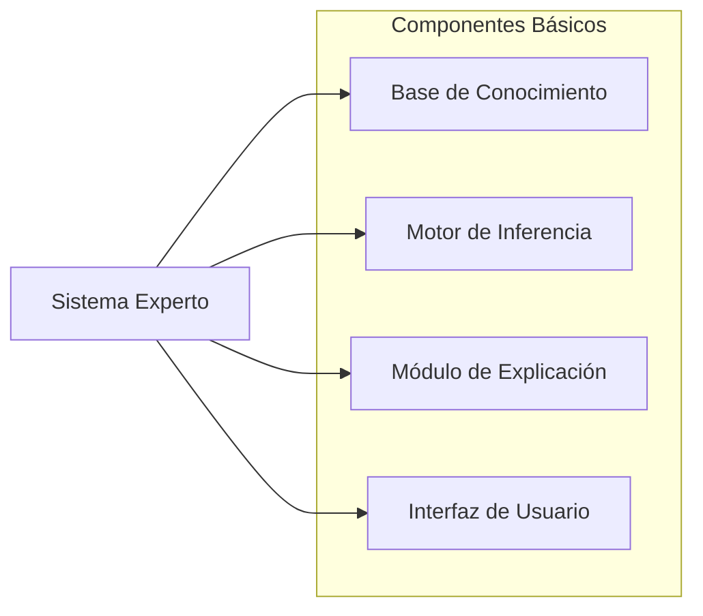

# Tema 3. Sistemas expertos

## Introducción a los sistemas expertos

1. Concepto y origen
2. Características principales
3. Contenidos de aprendizaje

---

### Concepto y origen de los sistemas expertos

Los sistemas expertos son una categoría particular de modelos dentro de la inteligencia artificial, que está compuesta por sistemas que emulan la toma de decisiones de un experto humano en dominios específicos. A diferencia de otros sistemas informáticos convencionales, estos se caracterizan por su capacidad de almacenar y utilizar conocimiento especializado, permitiendo que se realicen inferencias lógicas sobre problemas complejos y específicos. Esta capacidad se fundamenta en un proceso de razonamiento que imita la forma en que los especialistas humanos abordarían estos problemas, utilizando reglas y criterios basados en experiencia y conocimiento técnico. **El objetivo principal de un sistema experto es replicar, de forma automatizada, la experiencia y juicio de un experto en tareas que requieren una interpretación profunda y contextualizada de datos.**

#### Origen histórico y evolución

La historia de los sistemas expertos se entrelaza estrechamente con el desarrollo general de la inteligencia artificial, un campo que ya hemos visto cómo surgió formalmente a mediados del siglo XX y que ha experimentado diversas fases de desarrollo e innovación a lo largo de su historia. La idea de que las máquinas puedan simular ciertos aspectos del pensamiento humano, particularmente el razonamiento lógico, comenzó a tomar forma en los años 50, cuando un grupo de investigadores en el marco de la Conferencia de Dartmouth, en 1956, estableció las bases de la inteligencia artificial como disciplina independiente dentro del contexto de las ciencias de la computación. Este evento marcó el inicio de un movimiento intelectual que buscaba diseñar sistemas capaces de resolver problemas y tomar decisiones de manera similar a un humano. Aunque en sus primeras etapas la IA abordaba problemas generales de lógica y computación, con el tiempo surgió un interés particular en crear sistemas que pudieran manejar conocimientos específicos de ciertas disciplinas, como lo haría un experto humano en esos campos. Esta visión dio lugar al desarrollo de los primeros sistemas expertos.

Durante las décadas de 1960 y 1970, los investigadores comenzaron a trabajar en el diseño de programas que emularan el proceso de toma de decisiones en áreas técnicas especializadas, como la medicina o la química. Uno de los primeros sistemas expertos de relevancia fue **Dendral**, desarrollado en los años 60 por Edward Feigenbaum, Bruce Buchanan y Joshua Lederberg en la Universidad de Stanford. Este sistema fue creado para ayudar a los químicos a identificar estructuras moleculares complejas a partir de datos de espectrometría de masas. Su diseño se basaba en la implementación de reglas específicas del dominio químico, y logró resultados sorprendentes, demostrando que un sistema computacional podía, efectivamente, operar a nivel de un experto humano en un ámbito específico. Dendral no solo constituyó una prueba de concepto importante en el ámbito de la IA, sino que también sentó las bases de lo que más tarde se conocería como la **ingeniería del conocimiento**, el proceso de extraer y estructurar el conocimiento experto en un conjunto de reglas y datos que un sistema informático pudiera procesar.

A partir del éxito de Dendral, otros investigadores se interesaron en aplicar la IA a dominios donde la experiencia y el juicio humano eran fundamentales. En la década de los 70, el desarrollo del sistema experto **MYCIN**, también en la Universidad de Stanford, fue un avance significativo en el campo médico. MYCIN fue diseñado para ayudar a los médicos en el diagnóstico y tratamiento de infecciones bacterianas, y utilizaba un conjunto de reglas basadas en el conocimiento médico para emitir recomendaciones de diagnóstico. Aunque nunca se implementó en la práctica clínica, MYCIN demostró el potencial de los sistemas expertos en la asistencia sanitaria y puso de manifiesto un aspecto clave de estos sistemas: su capacidad para manejar la incertidumbre. Los desarrolladores de MYCIN implementaron el uso de factores de certeza, permitiendo que el sistema operara en situaciones donde la información podía ser incompleta o incierta, un desafío común en la práctica médica.

El éxito de estos primeros sistemas expertos impulsó una creciente inversión en el campo de la IA durante los años 80, época en la que los sistemas expertos se consolidaron como una tecnología prometedora para la automatización del conocimiento especializado. Varias empresas comenzaron a adoptar sistemas expertos en áreas como la planificación, el diagnóstico o la gestión de inventarios. En el sector industrial, se destacaron aplicaciones en el mantenimiento predictivo de equipos y en la optimización de procesos, donde el conocimiento experto era clave para la toma de decisiones. A medida que avanzaba la tecnología, surgieron también los primeros entornos de desarrollo de sistemas expertos o ***shells***, que permitían a los ingenieros construir sistemas personalizados sin necesidad de programar cada componente desde cero. Herramientas como EMYCIN (una versión de MYCIN adaptada para otros usos), OPS5 y CLIPS facilitaron la creación de sistemas expertos en un amplio rango de aplicaciones industriales y comerciales.

Sin embargo, el entusiasmo en torno a los sistemas expertos comenzó a disminuir a finales de los años 80, cuando se hizo evidente que estos sistemas enfrentaban limitaciones significativas. Uno de los desafíos principales era la adquisición y actualización del conocimiento: la creación de un sistema experto requería un extenso proceso de recopilación de conocimientos de expertos humanos y su traducción a un formato estructurado. Esto se traducía en un costo elevado, tanto en tiempo como en recursos, lo que dificultaba la escalabilidad de los sistemas y su adaptación a cambios rápidos en el conocimiento del dominio. Además, la dependencia de reglas explícitas hacía que los sistemas expertos fueran rígidos y poco adaptables a nuevas situaciones o a datos no previstos en su diseño inicial.

A pesar de estos problemas, la investigación en sistemas expertos no se detuvo. A lo largo de los años 90, la comunidad de IA comenzó a explorar métodos que permitieran a los sistemas adaptarse y aprender de los datos, lo que llevó al desarrollo de enfoques híbridos que combinaban reglas con técnicas estadísticas y de aprendizaje automático. Estas innovaciones marcaron el comienzo de una nueva generación de sistemas expertos más flexibles y adaptables, capaces de integrarse con otras tecnologías de IA, como las redes bayesianas o los algoritmos de aprendizaje profundo. En este contexto, los sistemas expertos evolucionaron hacia sistemas de apoyo a la decisión y herramientas analíticas que continúan siendo relevantes en la actualidad, especialmente en sectores como la salud, la ingeniería y la logística.

Hoy en día, los sistemas expertos representan una de las aplicaciones clásicas de la IA y son una muestra de la evolución de esta disciplina. Su desarrollo inicial, impulsado por la necesidad de automatizar el conocimiento especializado, sentó las bases para muchas de las técnicas que ahora se utilizan en inteligencia artificial. Aunque los sistemas expertos tradicionales han sido superados en algunos aspectos por las tecnologías de aprendizaje automático, su capacidad para estructurar y aplicar el conocimiento en forma de reglas continúa siendo un recurso valioso en aplicaciones **donde la transparencia y la explicabilidad son esenciales**. Sin duda, los sistemas expertos han dejado una huella duradera en el campo de la inteligencia artificial, y su historia refleja la evolución y los desafíos constantes de la IA en la búsqueda de emular el pensamiento humano.

### Características principales

La característica distintiva de los sistemas expertos es su habilidad para emular el razonamiento humano en tareas altamente especializadas. A través de un proceso de inferencia lógica y análisis de datos, estos sistemas pueden interpretar la información del mismo modo que lo haría un experto humano, tomando decisiones informadas basadas en el conocimiento específico del dominio. Esta emulación del razonamiento humano es especialmente valiosa en sectores donde las decisiones requieren precisión y están fundamentadas en el análisis profundo de una situación, como en la medicina, la ingeniería o las finanzas.

Para lograr esta capacidad de análisis, los sistemas expertos estructuran su funcionamiento en torno a la representación del conocimiento y la toma de decisiones. La representación del conocimiento, normalmente mediante una serie de reglas y hechos, permite que el sistema almacene y recupere información clave del dominio en el que opera. La toma de decisiones se sustenta en la capacidad del sistema para aplicar estas reglas y hechos en contextos específicos, ejecutando procesos de razonamiento que simulan el proceso de pensamiento de un experto humano.

Los componentes básicos de un sistema experto, que facilitan tanto la representación del conocimiento como la toma de decisiones, son el motor de inferencia y la base de conocimiento. La base de conocimiento es el repositorio central de datos, reglas y hechos del dominio, recopilados y estructurados para ser fácilmente accesibles y aplicables. Esta base de conocimiento puede incluir desde información categórica hasta reglas condicionales complejas que permiten al sistema realizar inferencias de alto nivel. Por su parte, el motor de inferencia es el mecanismo que permite al sistema aplicar las reglas de la base de conocimiento a situaciones concretas, produciendo así conclusiones y recomendaciones. A través de una serie de métodos de razonamiento, como el encadenamiento hacia adelante y hacia atrás, el motor de inferencia puede analizar los datos disponibles y generar una respuesta lógica o recomendación basada en el contexto.

Además de estos elementos, algunos sistemas expertos incluyen un módulo de explicación, que permite al sistema justificar sus decisiones de manera comprensible para el usuario. Este módulo es especialmente útil en aplicaciones sensibles, como el diagnóstico médico o el asesoramiento financiero, donde los usuarios necesitan comprender cómo y por qué se llegó a una determinada conclusión.

### Objetivos de aprendizaje

En este tema nos centraremos en los elementos esenciales de los sistemas expertos, proporcionando un recorrido por sus fundamentos teóricos y su aplicación práctica. Hemos comenzado explorando los conceptos básicos y la historia de los sistemas expertos en el contexto de la inteligencia artificial, para luego ir profundizando en sus características distintivas y cada uno de sus componentes. Cada sección del capítulo trata de cubrir la estructura y el funcionamiento de estos sistemas, abordando tanto su desarrollo como los métodos de razonamiento que emplean para resolver problemas específicos.

A medida que avancemos en el tema, se analizarán las técnicas utilizadas para representar el conocimiento, las estrategias de razonamiento aplicadas, y se revisarán ejemplos de aplicaciones en la industria. La última parte del tema examina los desafíos que enfrentan actualmente los sistemas expertos, así como las tendencias en su evolución hacia sistemas híbridos e integrados con otras técnicas de IA.
