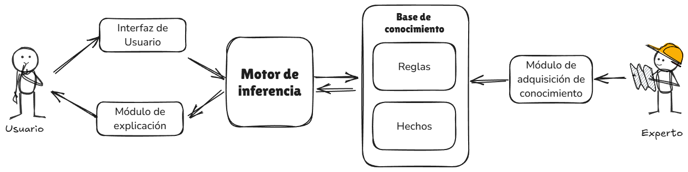
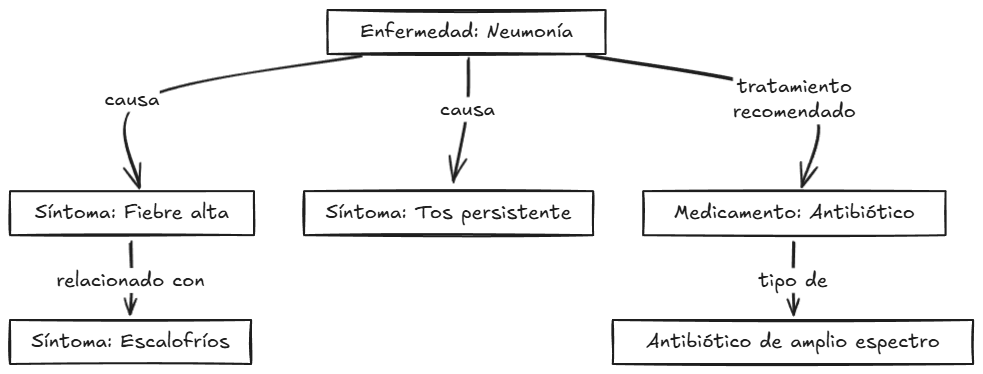
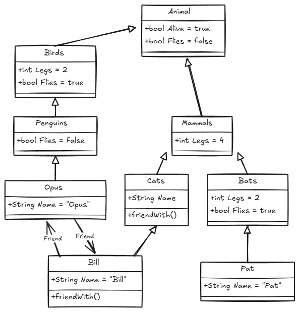
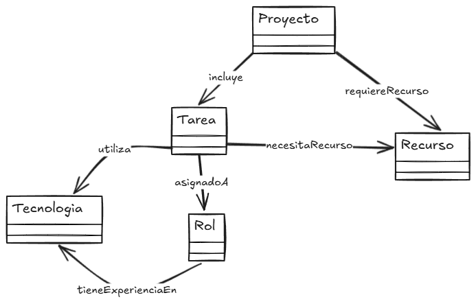
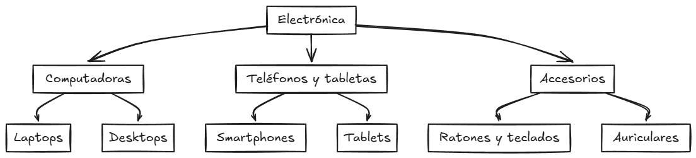

# Tema 3. Sistemas expertos

## Arquitectura de los sistemas expertos

1. Base de conocimiento
2. Motor de inferencia
3. Módulo de explicación
4. Interfaz de usuario y módulo de adquisición de conocimiento
5. Representación del conocimiento

---

En un sistema experto podemos identificar varios módulos clave que trabajan en conjunto para simular el proceso de toma de decisiones de un experto humano en un dominio específico. Esta estructura o arquitectura permite al sistema capturar, procesar y aplicar el conocimiento necesario para resolver problemas complejos de manera eficiente. Los componentes principales incluyen la base de conocimiento, el motor de inferencia, un módulo de explicación y la interfaz de usuario, además de un módulo opcional de adquisición de conocimiento. El cómo se represente el conocimiento jugará un papel crucial en la eficacia del sistema, ya que define cómo se estructuran y manipulan los datos.




La **base de conocimiento** es el repositorio central donde se almacenan los hechos y reglas que describen el dominio de aplicación. Este conocimiento se organiza de forma que permita un acceso y actualización eficientes, y puede incluir tanto información declarativa como procedimental. La calidad de la base de conocimiento es un factor determinante en la precisión y efectividad del sistema. En este sentido, la representación del conocimiento puede adoptar distintas formas, ya sea como reglas de producción, marcos, redes semánticas u ontologías. La elección de dicha representación influirá en la eficiencia de las operaciones de búsqueda e inferencia y en la capacidad del sistema para manejar datos complejos.

El **motor de inferencia** es el mecanismo que procesa la base de conocimiento para aplicar reglas y llegar a conclusiones lógicas. Emplea métodos como el encadenamiento hacia adelante o hacia atrás para simular el razonamiento humano. Dependiendo del problema, el motor de inferencia puede usar factores de certeza para manejar la incertidumbre, proporcionando respuestas probabilísticas en lugar de decisiones estrictamente binarias.

El **módulo de explicación** es un componente que permite que el sistema justifique sus recomendaciones o conclusiones al usuario. Ofrece una trazabilidad de las reglas y datos utilizados durante el proceso de inferencia, aumentando la transparencia y la confianza en el sistema. Las explicaciones pueden adaptarse según el nivel de detalle que requiera el usuario, desde un resumen general hasta un análisis detallado.

La **interfaz de usuario** es la vía a través de la cual los usuarios interactúan con el sistema. Una interfaz bien diseñada facilita la entrada de datos y la comprensión de las respuestas y explicaciones proporcionadas por el sistema. En sistemas complejos, es esencial que la interfaz sea intuitiva para usuarios con distintos niveles de especialización.

Por último, el **módulo de adquisición de conocimiento**, aunque puede ser opcional, es fundamental en sistemas que necesitan actualizar su base de conocimiento con regularidad. Permite la incorporación de nueva información sin necesidad de una reprogramación completa, adaptando el sistema a los cambios en el dominio.

> [!important]
>
> Al final, la arquitectura de un sistema experto integra de manera coordinada estos módulos para **simular el proceso de razonamiento humano y ofrecer soluciones en dominios específicos**. La combinación de una base de conocimiento sólida y un motor de inferencia eficaz, junto con módulos de explicación y adquisición de conocimiento, permite a los sistemas expertos proporcionar recomendaciones precisas y adaptarse a nuevos escenarios.

### Base de conocimiento

La base de conocimiento es el componente fundamental en un sistema experto, encargada de almacenar la información y las reglas que representan el conocimiento del dominio específico en el que opera el sistema. Su diseño y estructura son críticos para garantizar que el sistema pueda acceder, interpretar y aplicar este conocimiento de manera eficiente al resolver problemas y tomar decisiones.

#### Características de la base de conocimiento

La base de conocimiento no se limita a ser un simple almacenamiento de datos; es un repositorio estructurado que contiene tanto hechos como reglas, permitiendo que el sistema simule el razonamiento de un experto humano. Los elementos que componen una base de conocimiento se pueden clasificar en dos categorías principales. Por un lado el denominado **conocimiento declarativo**, que Incluye **hechos y descripciones estáticas sobre el dominio**. Estos datos representan información específica que el sistema puede utilizar directamente, del tipo "la fiebre es una temperatura corporal superior a 37 grados Celsius". Por otro lado se dispone del **conocimiento procedimental**, consistente en un conjunto de instrucciones que indican cómo actuar o proceder en situaciones específicas. Por ejemplo, una regla del tipo “si la fiebre supera los 39 grados, recomendar medicamentos antipiréticos” formaría parte del conocimiento procedimental, ya que guía la acción a tomar en función de los datos disponibles.

#### Representación del conocimiento

Ya se ha comentado que el modo en que se representa el conocimiento en la base de conocimiento afecta directamente la capacidad del sistema para realizar inferencias de manera eficiente. Existen varias técnicas de representación del conocimiento que se enumeran a continuación

##### **Reglas de producción**

Estas son estructuras del tipo “si-entonces” que permiten modelar el conocimiento en forma de condiciones y acciones. Por ejemplo, "si un paciente presenta tos seca y fiebre alta, entonces sospechar una infección viral". Las reglas de producción son ideales para sistemas expertos porque simulan de manera natural el proceso de razonamiento humano, descomponiendo problemas complejos en decisiones más pequeñas y manejables.

##### **Hechos**

Representan información concreta y verificable, como "la presión arterial alta es aquella superior a 140/90 mm Hg". Estos hechos actúan como entradas que el motor de inferencia utiliza para evaluar y aplicar las reglas de producción.

##### **Marcos**

Una estructura que agrupa atributos y valores relacionados con un objeto o concepto específico. Los marcos se utilizan cuando es necesario organizar datos complejos, permitiendo que cada marco contenga subcampos y propiedades que describan en detalle un tema. Por ejemplo, un marco que describe un paciente puede incluir atributos como “edad”, “síntomas” y “historial médico”.

##### **Redes semánticas**

Una representación gráfica en la que los nodos representan conceptos y los enlaces muestran las relaciones entre ellos. Este enfoque es útil para capturar relaciones complejas entre términos, facilitando la comprensión y visualización de cómo los conceptos están interconectados.

> **Ejemplo**: En un sistema experto diseñado para el diagnóstico de enfermedades respiratorias, la base de conocimiento podría incluir hechos como “tos productiva” o “saturación de oxígeno por debajo de 90%”, y reglas como “si el paciente tiene tos productiva y fiebre alta, entonces considerar neumonía”. Estos elementos se basan en el conocimiento aportado por especialistas médicos y literatura científica.

#### Fuentes de la base de conocimiento

El conocimiento almacenado en la base proviene de diversas fuentes, entre las que se encuentran fundamentalmente los expertos humanos, la documentación técnica o en algunos casos los propios datos empíricos.

En el caso de los **expertos** en el dominio su participación es fundamental, ya que es necesario capturar conocimiento implícito que no siempre está documentado. Este proceso puede incluir entrevistas, observaciones y talleres donde se extraen las estrategias y criterios que los expertos utilizan al tomar decisiones.

Por su parte, la **documentación y los manuales** en forma de libros de texto, artículos académicos o manuales técnicos son fuentes valiosas de información verificable que se pueden traducir en hechos y reglas para la base de conocimiento.

Y también, en algunos casos, la **experiencia empírica** puede servir para construir o refinar la base de conocimiento. En este sentido, el análisis de datos históricos y patrones observados en casos previos puede ser de mucha utilidad. Este enfoque es común en sistemas expertos que aprenden y adaptan su base de conocimiento con el tiempo.

#### Mantenimiento y actualización de la base de conocimiento

El mantenimiento de la base de conocimiento es un aspecto clave para la eficacia continua del sistema experto. Primeramente debe existir una **actualización periódica** que permita reflejar los cambios en el dominio, en forma de nuevos descubrimientos o procedimientos actualizados. Esto es especialmente relevante en campos en rápida evolución, como la medicina o la tecnología. A medida que se incorporan nuevas reglas y hechos, es crucial garantizar que no se introduzcan inconsistencias o contradicciones a través de un proceso de **verificación de consistencia**. En este sentido, un sistema de gestión de la base de conocimiento podría ayudar a automatizar esta verificación, asegurando que las nuevas entradas no comprometan la integridad del sistema.

Algunos sistemas expertos avanzados incluyen módulos de **adquisición de conocimiento automatizada**, que permiten la adquisición automática de nuevo conocimiento mediante el análisis de datos y la integración de información actualizada. Estos módulos pueden ayudar a mantener la relevancia del sistema sin una intervención manual muy extensa.

#### Importancia de la calidad del conocimiento

Evidentemente la efectividad de un sistema experto depende en gran parte de la calidad del conocimiento almacenado en la base. Un conocimiento incompleto o mal estructurado puede llevar a inferencias incorrectas, afectando la confianza del usuario en el sistema. Por ello, es fundamental que el proceso de captura y validación del conocimiento sea riguroso y se enfoque en obtener información relevante, precisa y bien organizada.

---

> [!important]
>
> La base de conocimiento es el pilar sobre el que se construye un sistema experto. Su diseño debe ser lo suficientemente flexible para permitir actualizaciones y adaptaciones, y lo suficientemente robusto para garantizar la precisión y la confiabilidad de las respuestas que proporciona el sistema.

### Motor de inferencia

El motor de inferencia es un componente crítico en la arquitectura de un sistema experto, encargado de procesar la información almacenada en la base de conocimiento para generar conclusiones, recomendaciones o decisiones. Este módulo **simula el razonamiento humano aplicando reglas y evaluando hechos**, lo que permite al sistema experto resolver problemas de manera similar a un especialista en el dominio.

Si bien el motor de inferencia aporta la capacidad de replicar el razonamiento de un experto humano y la posibilidad de manejar un gran volumen de reglas y datos, hay que tener en cuenta también que la **complejidad computacional** es un factor a tener muy en cuenta ya que, a medida que la base de conocimiento crece, el número de reglas y hechos que el motor debe procesar puede aumentar exponencialmente, afectando el rendimiento del sistema. Es crucial optimizar los algoritmos de búsqueda y las estrategias de control de la agenda para mantener la eficiencia.

El motor de inferencia funciona mediante la aplicación de reglas lógicas que se encuentran en la base de conocimiento, combinando estas con los datos proporcionados por el usuario o los hechos conocidos. Existen dos principales enfoques para el proceso de inferencia: el encadenamiento hacia adelante (*forward chaining*) y el encadenamiento hacia atrás (*backward chaining*).

#### Encadenamiento hacia adelante (Forward Chaining)

El encadenamiento hacia adelante es el método de inferencia que comienza con los datos iniciales y aplica reglas de manera secuencial para derivar nuevos hechos o conclusiones. Este enfoque es ideal para sistemas expertos donde el objetivo es explorar un conjunto de datos y obtener posibles soluciones basadas en condiciones y reglas aplicadas en un orden determinado.

El algoritmo de encadenamiento hacia adelante consta de las siguientes fases:

1. **Inicialización**: El proceso comienza con un conjunto de hechos conocidos, que suelen ser datos de entrada proporcionados por el usuario o el estado actual del sistema.
2. **Aplicación de reglas**: El motor de inferencia revisa la base de conocimiento para encontrar reglas cuyas condiciones iniciales se cumplan con los hechos actuales.
3. **Derivación de nuevos hechos**: Cada vez que se activa una regla, se ejecuta la acción en la parte “entonces” de la regla, lo que lleva a la generación de nuevos hechos que se agregan al conjunto de conocimiento.
4. **Reiteración**: El proceso se repite iterativamente hasta que se alcanzan los objetivos definidos o no quedan reglas aplicables.

Este procedimiento presenta algunas ventajas:

- **Exploración amplia**: Es particularmente útil en aplicaciones de diagnóstico y monitoreo, donde se necesita explorar todas las posibles conclusiones a partir de un conjunto de datos inicial.
- **Facilidad de implementación**: La implementación de un motor de encadenamiento hacia adelante suele ser más sencilla, ya que no requiere definir una hipótesis de partida.
- **Respuestas progresivas**: Genera una secuencia de conclusiones a medida que avanza, lo cual es útil en sistemas que necesitan proporcionar actualizaciones en tiempo real.

Este enfoque es común en sistemas expertos de diagnóstico médico, monitoreo de condiciones industriales y sistemas de recomendación. Por ejemplo, un sistema experto que monitorea una planta de energía puede usar encadenamiento hacia adelante para analizar cambios en los sensores y determinar posibles fallos antes de que ocurran problemas graves.

> **Ejemplo**: Un sistema experto para detección de enfermedades comienza con los hechos “temperatura corporal de 39°C” y “tos persistente”. Aplica la regla “si la temperatura es alta y hay tos persistente, entonces sospechar infección”, derivando la conclusión de que el paciente puede tener una infección.

#### Encadenamiento hacia atrás (Backward Chaining)

El encadenamiento hacia atrás es un método que **parte de una hipótesis o conclusión potencial** y trabaja en sentido inverso para comprobar si los hechos y reglas de la base de conocimiento pueden validar esa hipótesis. Este enfoque es ideal cuando se busca confirmar o refutar un objetivo específico.

Al igual que en el *forward chaining*, el algoritmo de encadenamiento hacia atrás presenta fases diferenciadas:

1. **Establecimiento de la hipótesis**: Se selecciona una conclusión o meta que el sistema debe validar.
2. **Búsqueda de reglas relevantes**: El motor de inferencia identifica las reglas que tienen como resultado la hipótesis deseada y evalúa las condiciones necesarias para que se cumplan.
3. **Comprobación de hechos**: Si las condiciones de las reglas no se cumplen directamente, el motor de inferencia retrocede en la búsqueda de otras reglas que puedan proporcionar los hechos necesarios.
4. **Resolución de subobjetivos**: En caso de que se necesiten otros hechos, el sistema genera subobjetivos y repite el proceso de comprobación.
5. **Verificación**: La inferencia se detiene cuando se validan todas las condiciones necesarias para la hipótesis o cuando se demuestra que no es posible llegar a una conclusión.

También este mecanismo de inferencia presenta algunas ventajas:

- **Búsqueda enfocada**: Es eficiente para confirmar objetivos específicos, ya que evita recorrer toda la base de conocimiento y se enfoca en las reglas relevantes para la hipótesis.
- **Ahorro de recursos**: Al trabajar hacia atrás desde una conclusión, el sistema no necesita procesar todas las reglas y hechos disponibles, lo que puede reducir el tiempo de cómputo en escenarios con muchas reglas.
- **Flexibilidad en la toma de decisiones**: Permite que el sistema descomponga problemas complejos en subproblemas más manejables, validando cada uno de ellos antes de concluir la hipótesis principal.

Podremos encontrar motores construidos bajo este enfoque en sistemas expertos de asesoramiento y planificación, como por ejemplo sistemas legales que verifican si un caso cumple con ciertos criterios de ley.

> **Ejemplo**: Un sistema experto en el ámbito jurídico puede comenzar con la hipótesis de que un contrato es válido. Luego, el motor de inferencia retrocede para verificar las reglas relacionadas, como "si ambas partes han firmado el contrato y no hay cláusulas ilegales, entonces el contrato es válido". Si alguna condición no se cumple, el sistema buscará hechos o reglas adicionales que puedan confirmar o refutar el objetivo.

##### Comparación entre encadenamiento hacia adelante y hacia atrás

| Aspecto                | Encadenamiento hacia adelante                         | Encadenamiento hacia atrás               |
| ---------------------- | ----------------------------------------------------- | ---------------------------------------- |
| **Inicio del proceso** | Con datos conocidos                                   | Con una hipótesis o meta                 |
| **Aplicación**         | Exploración y monitoreo                               | Confirmación de objetivos                |
| **Eficiencia**         | Puede ser menos eficiente si se aplican muchas reglas | Más eficiente para validación específica |
| **Complejidad**        | Más sencilla de implementar                           | Requiere gestión de subobjetivos         |


---


> [!important]
>
> La elección entre encadenamiento hacia adelante y hacia atrás depende de la naturaleza del problema que el sistema experto debe resolver. El encadenamiento hacia adelante es ideal para explorar datos y descubrir nuevas conclusiones, mientras que el encadenamiento hacia atrás es más adecuado para confirmar hipótesis específicas y trabajar de manera más eficiente en entornos con reglas extensas.

#### Componentes del motor de inferencia

En el motor de inferencia, a su vez, pueden identificarse varios subcomponentes que trabajan en conjunto para interactuar con la base de conocimiento y llevar a cabo inferencias. Uno de los más importantes es el **motor de búsqueda**, que se encarga de explorar la base de conocimiento y aplicar ciertos algoritmos de búsqueda según el enfoque de encadenamiento seleccionado. Para gestionar este componente el motor de inferencia cuenta con una **agenda de reglas**, una estructura de control que organiza y prioriza las reglas aplicables según el contexto, permitiendo al motor de inferencia elegir las más pertinentes en situaciones donde múltiples reglas pueden coincidir. Este proceso se complementa con el **mecanismo de control de conflictos**, encargado de resolver los casos en los que varias reglas podrían aplicarse al mismo tiempo. Para decidir cuál regla ejecutar primero, algunos sistemas expertos implementan estrategias de priorización que consideran la especificidad de la regla o el orden de llegada.

Existen escenarios donde la incertidumbre es un factor relevante, y en ellos el motor de inferencia incorpora lo que se denomina **un gestor de certeza**. Este componente calcula el grado de certeza de las conclusiones basándose en medidas como la probabilidad o factores de certeza. Así, el sistema puede ofrecer respuestas más flexibles y realistas cuando los datos no son completamente precisos o están incompletos. Este componente lo encontraremos fundamentalmente en sistema imprecisos.

#### Tipos de mecanismos de razonamiento

Vimos en el tema anterior cómo funcionan los **sistemas imprecisos** y cuales son sus fundamentos. En cierto modo todos los sistemas imprecisos son sistemas expertos, si bien no puede afirmarse lo contrario. Así pues, un motor de inferencia puede implementar dos tipos básicos de mecanismos de razonamiento: el razonamiento determinista y el razonamiento con incertidumbre:

##### **Razonamiento determinista**

Se basa en reglas y hechos que conducen a conclusiones absolutas. Cada vez que se cumplen las condiciones de una regla, la conclusión es siempre la misma. Este tipo de razonamiento es adecuado para dominios donde los datos son precisos y no hay ambigüedad.

##### **Razonamiento con incertidumbre**

Utiliza medidas probabilísticas o factores de certeza para manejar datos incompletos o ambiguos. Este tipo de razonamiento es común en sistemas expertos médicos y financieros, donde los datos no siempre son exactos o completos. Las técnicas como la lógica difusa, redes bayesianas y factores de certeza permiten al motor de inferencia modelar el grado de confianza en las conclusiones. Es importante tener en cuenta que el razonamiento en escenario de incertidumbre puede volverse complicado al tratar con múltiples fuentes de incertidumbre. En estos casos la implementación de modelos como redes bayesianas es necesaria para garantizar respuestas precisas y confiables.

> **Ejemplo**: Un sistema experto en finanzas puede usar factores de certeza para evaluar la probabilidad de que una inversión sea rentable. Si los datos sobre el mercado son inciertos, el motor de inferencia puede calcular un porcentaje de certeza que indique la confiabilidad de la recomendación.

#### 

> [!important]
>
> El motor de inferencia es el corazón del sistema experto, actuando como un intermediario que aplica las reglas de la base de conocimiento a los datos para simular el razonamiento humano. Sus mecanismos de encadenamiento hacia adelante y hacia atrás permiten diferentes enfoques de resolución de problemas, y la capacidad de manejar incertidumbre lo hace adaptable a situaciones reales donde los datos no son perfectos. La eficacia de un sistema experto depende en gran medida de la capacidad de su motor de inferencia para procesar datos de manera eficiente y precisa, aplicando el conocimiento almacenado en la base de conocimiento para ofrecer conclusiones fiables y útiles.

**Para reflexionar...**  

> **¿Qué mecanismos de inferencia consideras más adecuados para un sistema experto en diagnóstico médico?** 
> **Clave**: Reflexiona sobre la utilidad del encadenamiento hacia adelante para explorar síntomas y el encadenamiento hacia atrás para confirmar un diagnóstico específico.

### Módulo de explicación

El módulo de explicación es un elemento esencial en los sistemas expertos, especialmente en aquellos donde la transparencia y la confianza en las decisiones son primordiales. Su función principal es proporcionar al usuario una justificación detallada de cómo el sistema llegó a una conclusión, permitiendo una trazabilidad clara de las reglas y datos que se aplicaron durante el proceso de inferencia. Esta capacidad de explicación es particularmente valiosa en sectores como la medicina, la asesoría financiera o el ámbito legal, donde los profesionales necesitan comprender y confiar en las recomendaciones del sistema antes de actuar sobre ellas. Un módulo de explicación bien diseñado contribuye al aprendizaje del usuario, ya que facilita la comprensión de las reglas subyacentes y del proceso de toma de decisiones del sistema.

Otro aspecto fundamental del módulo de explicación es la mejora de la confianza en el sistema. Los usuarios tienden a confiar más en un sistema experto si pueden entender el razonamiento detrás de sus recomendaciones. Esta confianza es un factor clave en la adopción y uso sostenido de la tecnología. Por ejemplo, un médico que utiliza un sistema de diagnóstico asistido por IA es más probable que siga sus sugerencias si puede ver claramente cómo se llegaron a las conclusiones y qué datos se utilizaron.

#### Tipos de explicaciones

El módulo de explicación puede ofrecer distintos niveles de detalle y tipos de respuestas, según las necesidades del usuario y la complejidad de la aplicación. Estas pueden ser principalmente de tres tipos:

- **Explicaciones descriptivas**: Proporcionan una visión general de las razones que llevaron a la conclusión, mostrando de forma simplificada las reglas y los hechos relevantes. Son adecuadas para usuarios que necesitan un resumen rápido y claro de las decisiones del sistema sin entrar en detalles técnicos.

- **Explicaciones detalladas**: En situaciones donde se requiere un mayor nivel de profundidad, el módulo de explicación puede ofrecer un desglose completo del proceso de inferencia, incluyendo todas las reglas aplicadas y los hechos consultados. Estas explicaciones son útiles para usuarios técnicos o expertos en el dominio que buscan validar y entender a fondo el comportamiento del sistema.

- **Explicaciones paso a paso**: Detallan cada etapa del proceso de inferencia, mostrando cómo se aplicaron las reglas y cómo se derivaron los nuevos hechos. Resulta útil en entornos educativos o en sistemas donde es fundamental seguir la lógica de manera secuencial.

#### Implementación del módulo de explicación

La implementación de un módulo de explicación eficaz requiere un diseño cuidadoso que equilibre la cantidad de detalle ofrecido con la claridad y accesibilidad de la información. Es común que los sistemas expertos utilicen técnicas como el almacenamiento de rastros de ejecución, que registran los pasos y las decisiones tomadas por el motor de inferencia durante el proceso. Este rastro permite al módulo de explicación reconstruir el razonamiento en un formato comprensible para el usuario.

Otra técnica común es la **justificación de reglas**, en la que el sistema resalta qué reglas específicas de la base de conocimiento se aplicaron y cómo estas contribuyeron a la conclusión. Este enfoque es especialmente útil en sistemas basados en reglas de producción, donde las decisiones son el resultado de aplicar secuencias complejas de condiciones y acciones.

En sistemas más avanzados, la generación de explicaciones puede incluir técnicas de visualización que permiten a los usuarios ver gráficos de las relaciones entre los hechos y las reglas aplicadas. Estas herramientas visuales facilitan la comprensión de la estructura lógica del proceso de inferencia, haciendo que las explicaciones sean más intuitivas.

#### Beneficios y desafíos

El módulo de explicación ofrece beneficios claros en términos de confianza, transparencia y aceptación del sistema. Sin embargo, también presenta desafíos. Uno de los más notables es el **balance entre detalle y comprensión**: ofrecer explicaciones demasiado técnicas puede ser abrumador para usuarios no especializados, mientras que explicaciones demasiado simplificadas pueden carecer de la información necesaria para ser útiles.

Otro posible desafío es el que tiene que ver con el **rendimiento del sistema**. La generación de explicaciones detalladas y rastreos de la inferencia puede aumentar la carga computacional, especialmente en sistemas complejos con múltiples reglas y hechos. Para superar este problema, los diseñadores de sistemas expertos deben encontrar un equilibrio entre la riqueza de las explicaciones y la eficiencia operativa del sistema.

> **Ejemplo**: Un sistema experto en diagnóstico médico puede proporcionar explicaciones de por qué sugirió un diagnóstico de neumonía. El módulo de explicación podría detallar que la conclusión se basó en la presencia de síntomas como fiebre alta, tos productiva y dolor en el pecho, mostrando también la regla que aplicó: "si fiebre alta, tos y dolor en el pecho, entonces considerar neumonía". Además, podría indicar que esta regla fue aplicada con un 90% de certeza basado en datos históricos.

En conclusión, el módulo de explicación es vital para la aceptación y confianza en los sistemas expertos. Su capacidad para proporcionar justificativos comprensibles y adaptados a diferentes niveles de usuario convierte a los sistemas expertos en herramientas más transparentes y efectivas, permitiendo a los usuarios tomar decisiones mejor informadas y, al mismo tiempo, aprender del proceso de inferencia del sistema.

### Interfaz de usuario y módulo de adquisición de conocimiento

#### Interfaz de usuario

La interfaz de usuario es un componente crucial en cualquier sistema experto, ya que define el punto de interacción entre el usuario y el sistema. Una interfaz bien diseñada permite no solo la entrada de datos, sino también el acceso a las recomendaciones, conclusiones y explicaciones que el sistema proporciona. En entornos industriales, médicos o financieros, donde se manejan datos complejos y las decisiones tienen un impacto significativo, la claridad y la accesibilidad de la interfaz se vuelven esenciales. 

Una interfaz de usuario eficaz en un sistema experto debe garantizar la usabilidad y la comprensión de sus funciones. Es importante que sea **intuitiva**, permitiendo al usuario operar el sistema con facilidad y sin necesidad de una capacitación excesiva, lo cual es especialmente relevante en entornos donde el personal puede no contar con experiencia técnica avanzada. La **interactividad** es otra característica esencial, ya que un diseño interactivo posibilita la entrada de datos, el ajuste de parámetros y la realización de consultas de forma dinámica. Las interfaces modernas mejoran la experiencia del usuario al incorporar elementos gráficos como menús desplegables, cuadros de diálogo y gráficos interactivos.

La **presentación de los resultados** también juega un papel crítico. Las recomendaciones y conclusiones deben mostrarse de manera clara y relevante, con formatos que se adapten a las necesidades del usuario, ya sea mediante tablas, gráficos o texto. Por último es importante un aspecto de la interfaz como es su **capacidad de proporcionar acceso al módulo de explicación**. Este recurso permite que los usuarios comprendan las razones detrás de las decisiones o recomendaciones del sistema, lo cual incrementa la transparencia y la confianza en su uso.

> **Ejemplo**: Un sistema experto para el mantenimiento preventivo de maquinaria industrial puede tener una interfaz que muestre alertas cuando ciertas condiciones se cumplan (por ejemplo, vibraciones anormales en un motor). El usuario puede hacer clic en la alerta para ver una explicación detallada que incluya los datos monitoreados y las reglas aplicadas.

#### Módulo de adquisición de conocimiento

El módulo de adquisición de conocimiento es otra pieza fundamental de los sistemas expertos, especialmente en dominios que requieren actualización continua de información. Este módulo facilita la incorporación de nuevos datos y reglas en la base de conocimiento, asegurando que el sistema permanezca actualizado sin necesidad de reprogramaciones exhaustivas.

El módulo de adquisición de conocimiento desempeña funciones esenciales que permiten mantener la relevancia y precisión de un sistema experto. La **capacidad de actualización automática** es fundamental en sistemas que integran fuentes de datos externas, como bases de datos de investigación o sensores en tiempo real. Esta característica permite que el módulo procese y actualice la base de conocimiento sin intervención manual, adaptando el sistema a nuevos estudios y recomendaciones, como en el caso de sistemas médicos que incorporan avances y directrices recientes de asociaciones profesionales.

La **curación y validación del conocimiento adquirido** es otro aspecto vital. No toda la información que se obtiene automáticamente es apta para ser integrada directamente en la base de conocimiento. Por esta razón, el módulo incluye mecanismos de validación que aseguran la coherencia y precisión de los datos, los cuales pueden ser verificados mediante algoritmos automáticos o revisiones por expertos humanos. Esta validación es crucial para mantener la consistencia del sistema y evitar la incorporación de información errónea o contradictoria.

La **capacidad de adaptación** del módulo a nuevos contextos le confiere flexibilidad al sistema experto, lo cual es indispensable en dominios en constante cambio. Implica la habilidad del sistema para ajustar su comportamiento y sus reglas en respuesta a cambios en el entorno del dominio o en las condiciones bajo las que opera. Esta capacidad es más amplia que la actualización, ya que no solo se trata de agregar nuevos datos, sino de modificar y ajustar los procesos de inferencia, reglas de decisión y patrones de razonamiento para que el sistema mantenga su eficacia frente a nuevos contextos o escenarios. Por ejemplo, en el sector financiero, el módulo puede ajustar las reglas y los datos del sistema conforme se modifican las políticas económicas o se introducen nuevos indicadores de riesgo, asegurando que el sistema permanezca relevante y actualizado.

Otro elemento a tener en cuenta en cualquier módulo enfocado a la adquisición conocimiento es el de las **metodologías**. Existe diversidad en el uso de las mismas. Por ejemplo, la **extracción manual** es una de las formas más tradicionales de recopilar y estructurar información que luego se formaliza en la base de conocimiento. Esta metodología se basa en la colaboración de los expertos a través de entrevistas y talleres. En otros casos, la **adquisición automática** permite que el sistema utilice técnicas avanzadas de procesamiento de lenguaje natural y aprendizaje automático para extraer y organizar conocimiento a partir de grandes volúmenes de datos no estructurados, como documentos y publicaciones científicas.

Evidentemente la **retroalimentación** de los usuarios también juega un papel importante en la adquisición de conocimiento. En sistemas como los que se implementan para asistencia en diagnósticos médicos, los profesionales pueden proporcionar evaluaciones y retroalimentación que enriquecen y optimizan la base de conocimiento, adaptando el sistema a prácticas y experiencias reales que mejoran su rendimiento con el tiempo.

En cualquier caso, el proceso de adquisición de conocimiento no está exento de retos. Uno de los principales es la **veracidad y consistencia de la información**: incorporar datos de múltiples fuentes puede resultar en inconsistencias o contradicciones en la base de conocimiento. Además, es necesario garantizar la **seguridad de los datos**, especialmente en sectores como la salud, donde se maneja información sensible. Otro desafío es la **gestión de la sobrecarga de datos**. Cuando el sistema recibe grandes volúmenes de nueva información, el módulo debe ser capaz de priorizar qué datos son relevantes y cómo integrarlos de manera eficiente sin degradar el rendimiento del sistema.

**Para reflexionar...** 

> **¿Qué ventajas aporta un módulo de adquisición de conocimiento en un sistema experto para mantenimiento preventivo en una planta industrial?** 
> **Clave**: Considera la necesidad de actualizar las reglas y datos del sistema conforme se introducen nuevos equipos y se identifican nuevas fallas o patrones de desgaste.

### Representación del conocimiento

La representación del conocimiento es un componente esencial en un sistema experto, ya que define cómo se estructura, almacena y accede a la información en la base de conocimiento. Una representación eficaz no solo permite que el motor de inferencia acceda y procese datos de forma eficiente, sino que también facilita la comprensión y actualización de la base de conocimiento. Dependiendo de la naturaleza del problema a resolver, se pueden emplear diferentes métodos de representación, cada uno con sus propias ventajas y limitaciones.

#### Representación basada en reglas

La representación basada en reglas es uno de los métodos más utilizados en sistemas expertos debido a su simplicidad y efectividad en la modelización de conocimientos que pueden expresarse en términos de condiciones y acciones. Este enfoque se organiza mediante reglas de producción que siguen un esquema del tipo “si-entonces” (IF-THEN), donde la parte “si” (premisa o antecedente) especifica las condiciones bajo las cuales se activa la regla, y la parte “entonces” (consecuencia) define la acción o conclusión que debe tomarse si se cumplen las condiciones.

##### Estructura y características de las reglas de producción

Una regla de producción en un sistema experto se representa generalmente de la siguiente manera:

```pseudocode
SI <condición1> Y/O <condición2> ENTONCES <acción o conclusión>
```

Cada regla puede ser evaluada de forma independiente, y el motor de inferencia se encarga de analizar todas las reglas relevantes para determinar cuáles deben aplicarse en función de los hechos presentes en la base de conocimiento. Las reglas de producción son particularmente útiles para sistemas que requieren tomar decisiones basadas en un conjunto definido de condiciones lógicas.

> **Ejemplo**: Considere un sistema experto de diagnóstico médico que evalúa los síntomas de un paciente para identificar posibles enfermedades. Una regla de producción para detectar una infección respiratoria podría ser:
>
> ```pseudocode
> SI el paciente tiene fiebre alta Y tos persistente ENTONCES considerar una infección respiratoria.
> ```
>
> En este caso, la premisa está compuesta por dos condiciones: fiebre alta y tos persistente. Si ambas se cumplen al evaluar los hechos del paciente, el sistema concluye que debe considerarse la posibilidad de una infección respiratoria.
>

##### Procesamiento y evaluación de reglas

El motor de inferencia utiliza las reglas de producción para evaluar y derivar nuevas conclusiones a partir de los hechos conocidos. Ya hemos visto que este proceso puede implementarse mediante dos enfoques principales: **encadenamiento hacia adelante** (*forward chaining*) y **encadenamiento hacia atrás** (*backward chaining*). En el encadenamiento hacia adelante, el sistema parte de los hechos iniciales y aplica las reglas para derivar nuevos hechos y conclusiones. En el encadenamiento hacia atrás, el sistema parte de una hipótesis o conclusión y busca validar las condiciones necesarias que la sustentan.

El procesamiento de las reglas puede ser complejo cuando existen muchas reglas potencialmente aplicables al mismo tiempo. Para gestionar esta complejidad, se utilizan mecanismos de resolución de conflictos que ayudan al motor de inferencia a decidir qué regla aplicar primero. Estos mecanismos pueden incluir estrategias de priorización basadas en criterios como la especificidad de la regla, el orden de llegada o el uso de pesos asignados a cada regla.

##### Ventajas y limitaciones de la representación basada en reglas

Este enfoque presenta varias ventajas. Es fácil de entender y de programar, ya que cada regla actúa como una unidad lógica independiente que se puede añadir, modificar o eliminar sin afectar significativamente al resto del sistema. Esto facilita el mantenimiento y la escalabilidad del sistema. Además, las reglas de producción permiten modelar el razonamiento humano de manera natural, haciendo que la lógica de inferencia sea transparente y explicable para los usuarios.

Otra ventaja es la flexibilidad en la creación de sistemas expertos en dominios donde el conocimiento es explícito y bien definido, como en sistemas de diagnóstico médico, control de calidad industrial o sistemas de asistencia en la toma de decisiones financieras.

Pero a pesar de sus beneficios, la representación basada en reglas tiene limitaciones. Cuando el dominio es altamente complejo y existen muchas reglas, el sistema puede volverse difícil de gestionar y mantener. La cantidad de combinaciones posibles de reglas y hechos puede crecer exponencialmente, lo que puede afectar al rendimiento y hacer que el sistema se vuelva menos eficiente.

Otro problema es la falta de capacidad para manejar incertidumbre o datos ambiguos. Las reglas tradicionales del tipo “si-entonces” generalmente asumen que las condiciones son absolutas, lo que puede no ser adecuado en situaciones donde la información es incompleta o incierta. Para abordar este problema, se pueden integrar mecanismos de manejo de incertidumbre, como factores de certeza o probabilidades, pero esto añade complejidad al sistema.

##### Ejemplo detallado: Sistema experto para control de inventario

Consideremos un sistema experto para la gestión de inventarios en una tienda minorista. El objetivo es optimizar la reposición de productos basándose en las condiciones de inventario y la demanda esperada. Las reglas de producción podrían incluir:

```pseudocode
Regla 1:
SI el inventario de un producto es menor a 20 unidades Y la demanda semanal proyectada es alta ENTONCES hacer un pedido de reposición.

Regla 2:
SI el inventario de un producto es mayor a 100 unidades Y la demanda semanal proyectada es baja ENTONCES suspender nuevos pedidos de ese producto.

Regla 3:
SI el inventario de un producto está entre 20 y 100 unidades Y la demanda semanal proyectada es media ENTONCES monitorear y evaluar nuevamente en tres días.

```

Estas reglas permiten que el sistema tome decisiones automáticas para gestionar el inventario de manera eficiente. Cada regla evalúa condiciones específicas de la base de conocimiento (el inventario actual y la demanda proyectada) y realiza una acción que optimiza el proceso de reposición.

En situaciones donde múltiples reglas pueden aplicarse, el motor de inferencia necesita un mecanismo para resolver conflictos y priorizar qué regla ejecutar. Por ejemplo, si un producto tiene un inventario de 19 unidades y la demanda proyectada es media, podrían aplicarse tanto la regla 1 como la regla 3. Un mecanismo de resolución de conflictos podría priorizar la regla 1 debido a su mayor especificidad o a un peso asignado previamente que indique su importancia relativa.

> [!important]
>
> La representación basada en reglas, por tanto, es una herramienta poderosa para modelar sistemas expertos que requieren decisiones basadas en lógica condicional clara y bien definida. Sin embargo, su eficacia depende de una gestión cuidadosa de las reglas y de la capacidad del motor de inferencia para manejar conflictos y aplicar las reglas de manera eficiente.

#### Redes semánticas y marcos

Las **redes semánticas** son una representación gráfica del conocimiento que utiliza nodos y enlaces para ilustrar la relación entre conceptos dentro de un dominio específico. Esta representación se asemeja a un grafo, donde los nodos corresponden a conceptos o entidades, y los enlaces representan las relaciones entre ellos. Por ejemplo, en una red semántica que describe enfermedades y tratamientos, un nodo podría representar el concepto de “neumonía”, mientras que otro nodo representa el “antibiótico”, y el enlace entre ellos podría describir una relación de “tratamiento recomendado”.

> **Ejemplo**: En un sistema de análisis de redes sociales, una red semántica puede utilizarse para representar a los usuarios como nodos y las interacciones entre ellos como enlaces. Las etiquetas en los enlaces pueden indicar el tipo de interacción, como “comentó”, “reaccionó a” o “compartió”, permitiendo al sistema deducir patrones de influencia y conexiones clave en la red.

Una de las ventajas principales de las redes semánticas es su capacidad para capturar relaciones complejas que van más allá de una simple asociación. Los enlaces pueden etiquetarse para indicar diferentes tipos de relaciones, como "causa", "parte de", "es un tipo de", o "afecta a". Esto proporciona un nivel de granularidad y contexto que es difícil de lograr con representaciones más simples, como las basadas solo en reglas. Por ejemplo, una red semántica en un sistema experto médico podría mostrar cómo la “diabetes” se relaciona con “complicaciones cardíacas” a través de un enlace etiquetado como “factor de riesgo”.

Las redes semánticas son especialmente útiles para la visualización de relaciones complejas y para la inferencia de nuevos hechos a partir de los datos existentes. El motor de inferencia puede navegar la red para deducir asociaciones indirectas que no están explícitamente representadas. Por ejemplo, si una red muestra que “X” causa “Y” y “Y” está relacionado con “Z”, el sistema puede inferir que “X” podría estar indirectamente relacionado con “Z”.

Esta capacidad de inferencia es particularmente valiosa en sistemas expertos que operan en dominios con un alto nivel de interconexión de conceptos, como la medicina, la biología o el análisis de riesgos financieros. Sin embargo, un desafío importante en el uso de redes semánticas es el mantenimiento y la gestión de la red, especialmente en sistemas que deben incorporar constantemente nuevos datos y relaciones. La escalabilidad se puede ver comprometida a medida que crece el número de nodos y enlaces, lo que puede requerir herramientas especializadas y algoritmos optimizados para mantener la eficiencia del sistema.

> **Ejemplo**: Red semántica en formato gráfico que podría usarse en la ayuda al diagnóstico de la nueumonía
>
> 
>
> - El nodo **"Enfermedad: Neumonía"** es el concepto central de la red.
> - Hay enlaces que indican que la neumonía **"causa"** síntomas como fiebre alta y tos persistente.
> - Se incluye un nodo de **"tratamiento recomendado"** que conecta la enfermedad con un **"Medicamento: Antibiótico"**.
> - Se detalla que el antibiótico pertenece al tipo **"Antibiótico de amplio espectro"**.
> - Se añade una relación adicional que muestra que la **"fiebre alta"** está **"relacionada con"** otro síntoma, los escalofríos.
>
> Este ejemplo ilustra cómo una red semántica permite representar conceptos y sus relaciones de forma visual y estructurada, facilitando la inferencia y el análisis de datos en sistemas expertos.

---

Los **marcos** son otra técnica de representación que proporciona una estructura para organizar atributos y valores asociados con un objeto o concepto específico. Esta metodología es útil para representar entidades complejas que tienen múltiples propiedades. Un marco es, esencialmente, una estructura de datos que agrupa información en forma de atributos (también conocidos como ranuras o “slots”) y valores.

> **Ejemplo**: En un sistema de tutoría inteligente, un marco para un estudiante podría incluir atributos como “nivel de conocimiento”, “temas completados”, “resultados de evaluaciones” y “objetivos de aprendizaje”. Esto permitiría al sistema adaptar las recomendaciones de estudio basándose en la información almacenada en el marco.

Por ejemplo, en un sistema experto médico, un marco para un paciente puede incluir atributos como “nombre”, “edad”, “síntomas”, “historial médico” y “diagnósticos previos”. Cada uno de estos atributos tiene un valor asociado que puede actualizarse o consultarse durante el proceso de inferencia. Esta forma de representación permite que la información esté organizada de manera que el sistema pueda acceder y modificar los datos de forma eficiente y coherente.

Una de las características más destacadas de los marcos es su capacidad para representar jerarquías y herencia de atributos. Por ejemplo, un marco “paciente” podría heredar atributos comunes de un marco “persona”, como “nombre” y “edad”, mientras que atributos específicos como “síntomas” y “diagnósticos” podrían definirse solo en el marco “paciente”. Esta capacidad de herencia permite la reutilización de estructuras de datos, lo que facilita la gestión y actualización de la base de conocimiento.

Los marcos también permiten definir procedimientos (o “demonios”) que se ejecutan cuando se accede o modifica un atributo. Estos procedimientos pueden realizar cálculos, validar datos o activar otras acciones en el sistema experto. Por ejemplo, un sistema de mantenimiento predictivo podría tener un marco que represente una máquina industrial con un atributo “estado”. Al cambiar el valor del atributo “estado” a “fallo”, un demonio podría activarse automáticamente para registrar el evento y notificar a un operador.


> **Ejemplo:** Representación mediante **marcos** de las relaciones entre distintas entidades que forman parte de un sistema experto. Pueden asimilarse a los esquemas de representación en la programación orientada a objetos4
>
> 

A pesar de sus múltiples ventajas, el uso de marcos puede presentar desafíos, especialmente en la representación de relaciones complejas que no se ajustan fácilmente a una estructura jerárquica. Los marcos están bien adaptados para modelar entidades con atributos definidos y relaciones simples, pero pueden tener dificultades para representar interacciones complejas entre múltiples entidades, como las que se modelan más fácilmente con redes semánticas.

Otro desafío es la gestión de la consistencia de los datos. A medida que un sistema experto crece y la cantidad de marcos se expande, asegurar que los datos y atributos se mantengan actualizados y consistentes puede requerir una revisión y mantenimiento continuos.

##### Uso combinado de redes semánticas y marcos

En la práctica, las redes semánticas y los marcos no son mutuamente excluyentes y, de hecho, pueden complementarse para aprovechar las fortalezas de ambos enfoques. Las redes semánticas pueden utilizarse para modelar las relaciones y asociaciones entre conceptos, mientras que los marcos pueden representar en detalle las características y propiedades de cada entidad. Este uso combinado proporciona una representación más rica y flexible del conocimiento, permitiendo a los sistemas expertos manejar tanto la estructura como las conexiones entre los datos de forma más eficiente.

> **Ejemplo combinado**: Un sistema experto en diagnóstico médico puede usar una red semántica para mapear las relaciones entre enfermedades, síntomas y tratamientos, y marcos para representar la información detallada de cada paciente y sus condiciones particulares. Esta combinación permite que el sistema explore asociaciones complejas y gestione información detallada de manera estructurada, facilitando un diagnóstico más preciso y adaptable.

#### Ontologías y taxonomías en sistemas expertos

Las **ontologías** son una de las formas más avanzadas de representación del conocimiento en los sistemas expertos. Estas estructuras permiten describir de manera explícita no solo los conceptos de un dominio, sino también las propiedades, restricciones y relaciones entre dichos conceptos. Una ontología es más que un simple esquema de datos; es una representación formal y lógica que permite que un sistema no solo almacene conocimiento, sino que también lo interprete, deduzca nueva información y valide la coherencia de los datos. Por ejemplo, en un sistema de asesoría legal, una ontología podría representar términos clave como “contrato”, “parte demandante” o “parte demandada”, incluyendo las propiedades que los definen (como la fecha de inicio o las obligaciones) y las relaciones entre ellos (por ejemplo, “un contrato tiene una parte demandante y una parte demandada”).

El uso de ontologías en sistemas expertos permite una **inferencia lógica más avanzada**, ya que el motor de inferencia puede aplicar reglas complejas definidas en la ontología para deducir nuevas conclusiones. Esto es posible gracias a que las ontologías incluyen axiomas, que son reglas lógicas que definen restricciones y comportamientos. Un sistema de diagnóstico médico basado en una ontología podría, por ejemplo, inferir que si una enfermedad pertenece a la categoría de “infección viral” y un paciente presenta ciertos síntomas, existe una alta probabilidad de que esté enfermo de una infección que se clasifica dentro de esa categoría. La capacidad de manejar y deducir información a partir de axiomas y relaciones permite que el sistema sea mucho más robusto y adaptable frente a nuevos escenarios.

Una ontología se compone de varios elementos esenciales que permiten su funcionamiento efectivo. Se enumeran a continuación:

- **Clases (conceptos)**: Representan las entidades del dominio, como “Paciente”, “Tratamiento” o “Enfermedad”.
- **Propiedades (atributos)**: Detallan las características de las clases. Por ejemplo, la clase “Paciente” podría tener atributos como “edad” y “género”.
- **Relaciones**: Describen cómo las clases interactúan entre sí. Por ejemplo, la relación “es tratado por” podría vincular un “Paciente” con un “Tratamiento”.
- **Axiomas y restricciones**: Son reglas lógicas que definen cómo deben comportarse los conceptos y las relaciones en la ontología. Por ejemplo, un axioma podría indicar que “todo tratamiento requiere un diagnóstico previo”.
- **Individuos (instancias)**: Son las representaciones concretas de las clases. Por ejemplo, un individuo podría ser un paciente específico con un nombre y un historial médico.

La implementación de ontologías proporciona al sistema experto la capacidad de responder preguntas complejas y validar la coherencia de la información, asegurando que los datos cumplan con las restricciones definidas.

> **Ejemplo:** Sistema experto para gestión de proyectos de software
>
> La ontología de este sistema se podría construir para modelar los conceptos relacionados con proyectos, tareas, roles, tecnologías y recursos, así como las relaciones y propiedades entre ellos.
>
> 
>
> Los axiomas de esta ontología podrían ser los siguientes:
>
> - Si una **Tarea** utiliza una **Tecnología**, debe estar asignada a un **Rol** que tenga experiencia en esa tecnología.
> - Un **Proyecto** no puede completarse hasta que todas sus **Tareas** estén asignadas a un **Rol**.
>
> En un sistema experto de gestión de proyectos, esta ontología permitiría validar si un proyecto tiene todos los recursos necesarios antes de su inicio y si cada tarea está debidamente asignada con los recursos y roles adecuados. Por ejemplo, si una tarea de desarrollo requiere un servidor de pruebas como recurso, el sistema verificaría que este recurso esté disponible antes de permitir que la tarea comience.

---

Las **taxonomías** son estructuras jerárquicas que organizan el conocimiento de manera que los conceptos se clasifican en niveles de generalidad o especialización. Una taxonomía puede considerarse una representación más simple en comparación con una ontología, pero es altamente útil para categorizar y clasificar conceptos de forma clara y eficiente. Las taxonomías son esenciales para organizar grandes volúmenes de datos y conceptos en sistemas expertos que necesitan una jerarquización del conocimiento.

Por ejemplo, en un sistema experto de diagnóstico médico, una taxonomía podría clasificar enfermedades en diferentes niveles, comenzando con una categoría general como “enfermedades infecciosas” y dividiéndose en subcategorías más específicas como “infecciones bacterianas” o “infecciones virales”. Esta clasificación permite que el sistema navegue de manera eficiente por el conocimiento, buscando y aplicando reglas y hechos a partir de categorías generales hacia niveles más específicos. Además, una taxonomía bien estructurada permite al sistema realizar búsquedas más rápidas y aplicar inferencias basadas en relaciones de herencia, como “si algo es verdadero para ‘enfermedades infecciosas’, también es cierto para ‘infecciones virales’”.

> **Ejemplo:** Taxonomía en un sistema experto de comercio electrónico
>
> ###### **Contexto del sistema**
>
> El sistema experto se utiliza para organizar y clasificar los productos de un catálogo en un sitio de comercio electrónico. La taxonomía ayuda a categorizar los productos en diferentes niveles de especialización, facilitando la navegación, la búsqueda de productos y la toma de decisiones sobre inventarios y estrategias de marketing.
>
> ##### Estructura de la taxonomía
>
> La taxonomía se organiza jerárquicamente, con categorías generales en la parte superior y subcategorías más específicas en los niveles inferiores.
>
> - Categoría principal: Electrónica
>   - Subcategoría: Computadoras
>     - **Subcategoría específica**: Laptops
>     - **Subcategoría específica**: Desktops
>   - Subcategoría: Teléfonos y tabletas
>     - **Subcategoría específica**: Smartphones
>     - **Subcategoría específica**: Tablets
>   - Subcategoría: Accesorios
>     - **Subcategoría específica**: Ratones y teclados
>     - **Subcategoría específica**: Auriculares
>
> 
>
> En esta taxonomía, los productos electrónicos se dividen en categorías generales y luego se desglosan en subcategorías más específicas:
>
> - **Electrónica** es la categoría general que agrupa todos los productos relacionados con la tecnología electrónica.
> - **Computadoras** es una subcategoría que incluye tanto **Laptops** como **Desktops**, permitiendo al sistema experto clasificar los productos en función de sus características y funciones.
> - **Teléfonos y tabletas** es otra subcategoría que contiene **Smartphones** y **Tablets**, facilitando la búsqueda de estos productos por parte de los usuarios y la organización de inventarios.
> - **Accesorios** abarca productos periféricos como **Ratones y teclados** y **Auriculares**, que son elementos complementarios en el ecosistema de productos electrónicos.
>
> El sistema experto puede usar esta taxonomía para tareas como:
>
> 1. **Clasificación automática de productos**: Cuando un nuevo producto se añade al inventario, el sistema lo clasifica automáticamente en la categoría correspondiente. Por ejemplo, si se introduce un nuevo modelo de **Smartphone**, el sistema lo clasifica bajo **Teléfonos y tabletas > Smartphones**.
> 2. **Recomendaciones de productos**: Basándose en la categoría de productos que un usuario ha navegado o comprado, el sistema puede recomendar productos de la misma subcategoría o de categorías relacionadas.
> 3. **Gestión de inventario**: La taxonomía permite al sistema experto analizar la cantidad de productos en cada subcategoría y ayudar en la toma de decisiones sobre el reabastecimiento o la promoción de productos específicos.
>
> 

##### Diferencias y sinergias entre ontologías y taxonomías

Si bien las taxonomías y las ontologías comparten la característica de organizar el conocimiento, difieren en su capacidad y complejidad. Las taxonomías proporcionan una clasificación simple y jerárquica, lo que las hace fáciles de implementar y mantener. Sin embargo, carecen de la capacidad de representar relaciones complejas y reglas lógicas que sí pueden incluirse en una ontología. Por otro lado, las ontologías son más ricas y detalladas, permitiendo la modelización de interacciones y comportamientos complejos, pero su implementación y mantenimiento requieren un esfuerzo considerablemente mayor, así como el uso de herramientas especializadas como ***OWL (Web Ontology Language)*** o editores de ontologías como ***Protégé***.

Un sistema experto puede beneficiarse de un enfoque híbrido, en el cual la taxonomía se utilice para estructurar el conocimiento en un primer nivel de categorización, mientras que una ontología aporte el detalle y las reglas necesarias para realizar inferencias complejas. Por ejemplo, un sistema de gestión del conocimiento en una empresa puede usar una taxonomía para clasificar documentos y una ontología para modelar las relaciones entre los conceptos tratados en esos documentos, como “proyectos”, “clientes” y “tecnologías utilizadas”.

##### Desafíos en la implementación de ontologías y taxonomías

La creación y mantenimiento de ontologías presenta varios desafíos, entre los que destacan la complejidad en la definición de las relaciones y restricciones, y la necesidad de que estas sean consistentes y completas. Además, a medida que la ontología crece, se incrementa la dificultad de garantizar la coherencia del sistema y evitar contradicciones. Por su parte, las taxonomías, aunque más simples, pueden presentar limitaciones en cuanto a la profundidad del conocimiento que pueden representar, lo cual puede ser un obstáculo en dominios que requieren una mayor sofisticación para realizar inferencias precisas.

#### Conclusiones finales: Consideraciones y desafíos en la representación del conocimiento

Cada enfoque de representación del conocimiento presenta ventajas y desafíos específicos. Las representaciones basadas en reglas son claras y fáciles de gestionar, pero pueden volverse difíciles de mantener en sistemas de gran escala. Las redes semánticas y los marcos proporcionan flexibilidad y facilidad de visualización, pero pueden requerir una gestión más compleja. Las ontologías y taxonomías, aunque altamente organizadas y detalladas, demandan un esfuerzo considerable en su creación y actualización, y pueden requerir herramientas especializadas para su gestión.

La elección del método de representación dependerá en gran medida del dominio de aplicación y de los requisitos específicos del sistema experto. Un enfoque híbrido que combine varios métodos puede ser necesario para abordar dominios particularmente complejos y garantizar que el sistema experto sea lo suficientemente robusto y flexible para adaptarse a distintos tipos de problemas y datos.
