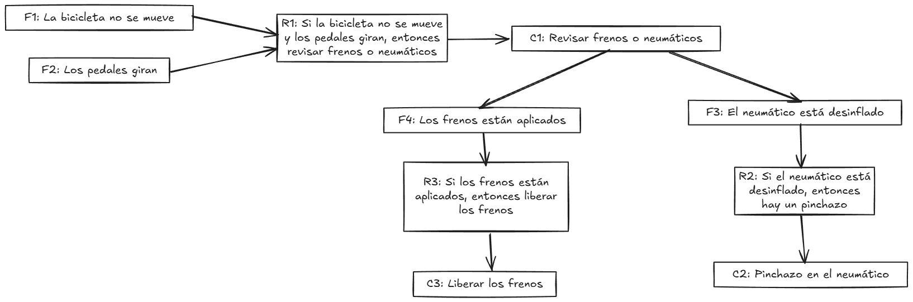

# Tema 3. Sistemas expertos

## Mecanismos de razonamiento en sistemas expertos

1. Razonamiento hacia adelante (forward chaining)
2. Razonamiento hacia atrás (backward chaining)
3. Razonamiento probabilístico y manejo de incertidumbre

----

Los mecanismos de razonamiento en los sistemas expertos son el conjunto de métodos y estrategias que permiten al sistema procesar el conocimiento almacenado en la base y llegar a conclusiones o recomendaciones. Estos mecanismos buscan **emular el razonamiento humano** en la resolución de problemas específicos, ya sea mediante la aplicación de reglas directas o el manejo de incertidumbre cuando la información es incompleta o ambigua. En esta sección, exploraremos tres tipos principales de razonamiento empleados en sistemas expertos: el razonamiento hacia adelante, el razonamiento hacia atrás y el razonamiento probabilístico, abordando sus características, aplicaciones y métodos de implementación.

### Razonamiento hacia adelante (*forward chaining*)

El razonamiento hacia adelante, también conocido como **encadenamiento hacia adelante**, es un método donde el sistema parte de los datos iniciales y aplica reglas de manera progresiva para derivar nuevas conclusiones. Este mecanismo es ideal para escenarios en los que el sistema dispone de una base de hechos conocida desde el inicio y debe explorar las implicaciones de esos datos mediante una secuencia de inferencias. El motor de inferencia, en este caso, revisa cada hecho y aplica las reglas relevantes hasta llegar a una conclusión.

Este tipo de razonamiento es especialmente adecuado para tareas de diagnóstico, donde el sistema debe analizar síntomas y características del caso actual, avanzando hacia una posible conclusión. Por ejemplo, en un sistema experto de diagnóstico médico, el razonamiento hacia adelante permite al sistema procesar síntomas y signos específicos del paciente para llegar a un diagnóstico probable.

> **Ejemplo**: Un sistema experto médico recibe los síntomas de un paciente, como fiebre, tos y dolor en el pecho. A partir de estos datos iniciales, el sistema aplica una serie de reglas en orden secuencial, como “si el paciente tiene fiebre y tos, entonces podría tener una infección respiratoria”. A medida que se añaden datos adicionales, el sistema revisa las reglas para acotar el diagnóstico, hasta llegar a una conclusión más específica como neumonía.

#### Implementación básica del mecanismo

Como se ha comentado más arriba el encadenamiento hacia adelante es un mecanismo de razonamiento utilizado en sistemas expertos, particularmente en aquellos que descansan sobre reglas "Si... entonces...". Este proceso comienza con un conjunto de hechos conocidos y aplica las reglas para obtener nuevas conclusiones. En esencia, **el sistema avanza desde los datos disponibles hacia las conclusiones**.

El mecanismo de encadenamiento hacia adelante es un proceso iterativo que se repite hasta que uno: se alcanza una meta específica o dos: no se pueden obtener más conclusiones a partir de los hechos y reglas existentes.

Los pasos que seguiríamos en este proceso de iteración podrían enumerarse como sigue:

1. **Identificación de hechos:** El sistema identifica los hechos iniciales que son ciertos, los cuales pueden ser proporcionados por el usuario o estar almacenados en la base de conocimientos.
2. **Búsqueda de reglas aplicables:** El motor de inferencia busca reglas cuyas premisas coincidan con los hechos conocidos.
3. **Aplicación de reglas:** Si se encuentra una regla cuyas premisas son ciertas, la conclusión de la regla se añade a la base de hechos como un nuevo hecho.
4. **Repetición:** El proceso vuelve al paso 2 y continúa hasta que no se puedan encontrar más reglas aplicables o se alcance la meta deseada.

> **Ejemplo**
>
> Supongamos que tenemos un sistema experto para diagnosticar enfermedades de las plantas. La base de conocimientos contiene las siguientes reglas:
>
> - **Regla 1:** Si las hojas tienen manchas marrones, entonces la planta tiene la enfermedad X.
> - **Regla 2:** Si la planta tiene la enfermedad X, entonces necesita el tratamiento Y.
>
> El usuario observa que las hojas de su planta tienen manchas marrones. El sistema identifica este hecho como cierto. Luego, busca reglas aplicables y encuentra la Regla 1. Como la premisa de la Regla 1 es cierta (las hojas tienen manchas marrones), la conclusión también es cierta (la planta tiene la enfermedad X). Este nuevo hecho se añade a la base de hechos. A continuación, el sistema busca nuevas reglas aplicables y encuentra la Regla 2. Como la premisa de la Regla 2 es ahora cierta (la planta tiene la enfermedad X), la conclusión también es cierta (la planta necesita el tratamiento Y). El sistema ha llegado a una meta (diagnosticar la enfermedad y recomendar un tratamiento) y el proceso de encadenamiento hacia adelante termina.

#### Optimización del mecanismo

Una vez que se conocen los fundamentos del encadenamiento hacia adelante es como mecanismo de razonamiento en los sistemas expertos, cabe hacer algunas consideraciones sobre cómo optimizar dicho proceso en determinadas situaciones. En efecto, es habitual que cuando la base de conocimiento crece en tamaño y complejidad, surgen problemas derivados de que el sistema explore caminos lógicos **irrelevantes**. Ello afectará tanto al rendimiento como a la eficiencia del razonamiento. Optimizar este proceso es esencial para garantizar que las conclusiones se alcancen de manera precisa y oportuna, especialmente en contextos donde el tiempo y los recursos computacionales son limitados.

##### Priorización de reglas relevantes

Una de las estrategias clave para optimizar el razonamiento es **priorizar reglas relevantes en función de los hechos disponibles**. Esto se puede lograr mediante la asignación de un nivel de importancia a cada regla según su especificidad o frecuencia de uso. Reglas más específicas, que se aplican a situaciones concretas, tienden a ser más útiles que reglas generales en la mayoría de los escenarios.

> **Ejemplo**:
>
> Consideremos un sistema experto para el diagnóstico de problemas mecánicos en bicicletas. La base de conocimiento contiene las siguientes reglas:
>
> 1. **Regla 1**: Si el neumático está desinflado, entonces el problema es un pinchazo.
> 2. **Regla 2**: Si los frenos no funcionan, entonces revisar las pastillas de freno.
> 3. **Regla 3**: Si la bicicleta no se mueve al pedalear y los pedales giran, entonces revisar la transmisión.
> 4. **Regla 4**: Si la bicicleta no se mueve al pedalear y los pedales no giran, entonces revisar la cadena.
>
> Supongamos que el usuario informa los siguientes hechos iniciales:
>
> - La bicicleta no se mueve al pedalear.
> - Los pedales no giran.
>
> En este caso, el sistema debe priorizar las reglas más específicas y directamente relacionadas con los hechos observados, en lugar de evaluar todas las reglas de manera secuencial.
>
> ##### Proceso de priorización y razonamiento
>
> 1. **Hecho inicial**: "La bicicleta no se mueve al pedalear" activa la posibilidad de evaluar tanto la **Regla 3** como la **Regla 4**. Sin embargo, el segundo hecho, "los pedales no giran", es más específico y coincide con la premisa de la **Regla 4**.
> 2. **Evaluación de relevancia**: La **Regla 4** se prioriza porque cumple exactamente con ambas condiciones observadas. Al aplicarla, el sistema concluye: "El problema es la cadena."
> 3. **Evitar evaluaciones irrelevantes**: Dado que la **Regla 4** lleva directamente a una conclusión relevante, las otras reglas (como la **Regla 3**, que requiere condiciones distintas) no se evalúan en este ciclo. Esto ahorra tiempo y recursos computacionales.
>
> Si el sistema hubiese evaluado todas las reglas sin priorización, habría explorado caminos innecesarios, como investigar posibles problemas en la transmisión o frenos, los cuales no son pertinentes a los hechos iniciales. La priorización permite al sistema centrarse en las reglas más relevantes para resolver el problema de manera rápida y eficiente, mejorando su rendimiento incluso en bases de conocimiento más grandes y complejas.
>
> Este enfoque puede mejorarse aún más con técnicas adicionales, como la asignación de pesos a las reglas según su frecuencia de uso o relevancia en contextos similares, lo que optimiza aún más el proceso de inferencia en sistemas expertos dinámicos.
>
> El contexto del problema también puede ser un factor determinante en la selección de reglas prioritarias. En este sentido, las reglas relacionadas directamente con los hechos observados deben evaluarse antes que aquellas que solo tienen una relación indirecta con el problema. Este enfoque evita que el sistema desperdicie recursos procesando reglas que no contribuyen a la solución inmediata.

##### Uso de índices de búsqueda

Otra técnica fundamental es la **organización eficiente de la base de conocimiento mediante el uso de índices de búsqueda**. Estas estructuras permiten acceder rápidamente a las reglas pertinentes a partir de los hechos iniciales. Por ejemplo, una tabla hash puede asociar cada condición evaluada con un conjunto de reglas relevantes, permitiendo que el motor de inferencia acceda directamente a las reglas aplicables en lugar de revisar toda la base de conocimiento. De manera similar, la organización jerárquica de las reglas puede facilitar la evaluación primero de las categorías generales antes de explorar niveles más específicos, reduciendo así el espacio de búsqueda.

> **Ejemplo**:
>
> En un sistema experto como **BikeXpert**, que diagnostica problemas en bicicletas, la base de conocimiento puede crecer significativamente a medida que se añaden reglas y hechos. Para optimizar el proceso de búsqueda en el encadenamiento hacia adelante, podemos utilizar **índices de búsqueda** que asocien condiciones específicas con las reglas relevantes, reduciendo la necesidad de explorar toda la base de conocimiento.
>
> ###### Escenario
>
> La base de conocimiento incluye las siguientes reglas:
>
> 1. **Regla 1**: Si el neumático está desinflado, entonces el problema es un pinchazo.
> 2. **Regla 2**: Si los frenos no funcionan, entonces revisar las pastillas de freno.
> 3. **Regla 3**: Si la bicicleta no se mueve al pedalear y los pedales giran, entonces revisar la transmisión.
> 4. **Regla 4**: Si la bicicleta no se mueve al pedalear y los pedales no giran, entonces revisar la cadena.
>
> Los hechos iniciales son:
>
> - La bicicleta no se mueve al pedalear.
> - Los pedales no giran.
>
> ###### Índices de búsqueda en acción
>
> Para evitar revisar cada regla de manera secuencial, los hechos se indexan y se vinculan con las reglas que dependen de ellos. Esto se implementa creando un mapa o tabla hash donde las condiciones de las reglas se asocian con los hechos pertinentes:
>
> | **Hecho clave**              | **Reglas asociadas** |
> | ---------------------------- | -------------------- |
> | La bicicleta no se mueve     | Regla 3, Regla 4     |
> | Los pedales no giran         | Regla 4              |
> | El neumático está desinflado | Regla 1              |
> | Los frenos no funcionan      | Regla 2              |
>
> #### Proceso de inferencia con índices
>
> 1. **Consulta inicial**: Cuando se reciben los hechos "la bicicleta no se mueve" y "los pedales no giran", el motor de inferencia consulta el índice.
> 2. **Selección de reglas**: El índice filtra rápidamente las reglas relevantes. En este caso, "los pedales no giran" apunta directamente a la **Regla 4**. No es necesario explorar la **Regla 3**, ya que no coincide con el hecho adicional.
> 3. **Evaluación específica**: La **Regla 4** se evalúa inmediatamente porque ambas condiciones se cumplen, concluyendo que "el problema es la cadena."
> 4. **Evita exploraciones innecesarias**: Las reglas como la **Regla 1** y la **Regla 2**, relacionadas con hechos irrelevantes, no son consideradas en este ciclo.
>
> ###### Ventajas del uso de índices
>
> - **Reducción del espacio de búsqueda**: Los índices eliminan rápidamente las reglas que no aplican al caso, disminuyendo la cantidad de evaluaciones necesarias.
> - **Eficiencia en bases de conocimiento extensas**: En sistemas con cientos de reglas, los índices permiten identificar de inmediato las reglas relacionadas con los hechos actuales.
> - **Adaptabilidad a nuevas reglas**: Al añadir una nueva regla, solo es necesario actualizar el índice para mantener la eficiencia del sistema.
>
> ###### Introducción de nuevas reglas
>
> Si se introduce una nueva regla, como:
>
> - **Regla 5**: Si los pedales no giran y la cadena está rota, entonces el problema es una cadena rota.
>
> El índice se actualiza automáticamente para incluir esta asociación:
>
> | **Hecho clave**      | **Reglas asociadas** |
> | -------------------- | -------------------- |
> | Los pedales no giran | Regla 4, Regla 5     |
>
> Cuando el hecho "los pedales no giran" se presenta nuevamente, el índice filtra ambas reglas relacionadas para evaluar la más pertinente, garantizando un razonamiento rápido y eficiente.
>
> Este método ilustra cómo los índices optimizan el encadenamiento hacia adelante al mantener una estructura organizada y accesible, esencial para sistemas expertos con bases de conocimiento en constante crecimiento.

El uso de índices en una base de conocimiento presenta la limitación de que requiere **conocer previamente el conjunto de hechos o las condiciones** más probables que se evaluarán en el sistema. Esto puede ser un desafío en sistemas expertos diseñados para operar en dominios dinámicos o con entradas altamente variadas. Sin embargo, existen estrategias y enfoques que permiten mitigar este problema y aprovechar las ventajas de los índices sin que se conviertan en una barrera. 

Por ejemplo, en sistemas donde los hechos no son completamente predecibles, **el índice puede generarse y actualizarse de manera dinámica a medida que se añaden hechos nuevos**. En este caso, el sistema no parte de un índice predefinido, sino que lo construye en tiempo de ejecución. Es decir, cuando se introduce un nuevo hecho, el sistema busca en la base de conocimiento todas las reglas que contienen condiciones relevantes relacionadas con ese hecho. A continuación el hecho y las reglas asociadas se añaden al índice para refinar el índice y mejorar la eficiencia en iteraciones posteriores. Es cierto que lo anterior implica un costo inicial de construcción del índice para los primeros ciclos de inferencia, pero a medida que se procesan más hechos, el rendimiento mejora.

Otra opción es **construir índices parciales basados en los hechos y condiciones más comunes o probables dentro del dominio**. Este enfoque funciona bien en sistemas que tienen un núcleo de problemas recurrentes. Los hechos menos frecuentes o inesperados pueden manejarse mediante un procesamiento estándar, es decir, sin consultar el índice. Por ejemplo, en **BikeXpert**, los hechos como "los pedales no giran" o "el neumático está desinflado" pueden ser incluidos en el índice porque son problemas comunes. Si surge un hecho raro, como "la luz trasera no enciende", el sistema puede buscar reglas asociadas manualmente en la base de conocimiento.

También es posible, en sistemas donde se pueden anticipar ciertos patrones o conjuntos de hechos, que **los índices se construyan jerárquicamente**. En este enfoque, los índices se organizan por categorías, lo que permite que el sistema navegue primero por los hechos más probables y luego por aquellos menos frecuentes. De nuevo, en nuestro sistema experto para diagnóstico de bicicletas, una categoría de índice puede priorizar problemas mecánicos comunes como "pedales", "frenos" o "cadena". Otra categoría puede manejar problemas eléctricos más raros como "luces" o "batería".

Por último, y para sistemas que registran sus propios patrones de uso, se puede utilizar un enfoque de **aprendizaje automático** para analizar los datos históricos de consultas y construir índices optimizados para los hechos y reglas más utilizados. Este enfoque se adaptaría automáticamente al uso real del sistema, mejorando el rendimiento en función del comportamiento observado. Por ejemplo, si los usuarios de **BikeXpert** frecuentemente reportan problemas relacionados con los frenos, el sistema puede reorganizar su índice para priorizar hechos y reglas relacionados con ese componente.

##### Modelado mediante grafos

En sistemas más avanzados, el modelado lógico de las reglas mediante grafos dirigidos puede ser una solución poderosa para optimizar el razonamiento. Cada nodo del grafo representa un hecho o conjunto de hechos, mientras que los enlaces definen las relaciones entre estos hechos y las reglas que los conectan. Este modelo no solo ayuda a identificar los caminos más relevantes para alcanzar una conclusión, sino que también permite la paralelización del razonamiento, evaluando simultáneamente reglas independientes. Por ejemplo, en un sistema experto para el diagnóstico de redes informáticas, un grafo dirigido podría conectar el hecho "falla en la conectividad de un dispositivo" con posibles causas como "problema en el router" o "problema en el servidor", permitiendo al sistema analizar cada una de estas rutas de manera eficiente.

Además de estas técnicas, es importante considerar el impacto del mantenimiento continuo de la base de conocimiento en la optimización del razonamiento. La incorporación de nuevas reglas y hechos debe gestionarse cuidadosamente para garantizar que no se introduzcan redundancias o inconsistencias que compliquen el proceso de inferencia. Por ello, es recomendable integrar procesos de validación y actualización que mantengan la coherencia de la base de conocimiento a lo largo del tiempo.

> **Ejemplo**:
>
> El sistema experto intenta diagnosticar un problema en función de hechos conocidos y reglas aplicables. El grafo incluye nodos que representan hechos (F) y conclusiones (C), y aristas dirigidas que muestran la relación entre hechos, reglas y conclusiones.
>
> 
>
> Este ejemplo ilustra cómo un **grafo dirigido** puede ayudar a visualizar y estructurar el proceso de razonamiento hacia adelante en un sistema experto. Los nodos representan el flujo de información, mientras que las aristas dirigidas indican el avance lógico desde los hechos iniciales hacia las conclusiones finales.

#### Ventajas y limitaciones del encadenamiento hacia adelante

El encadenamiento hacia adelante ofrece varias ventajas que lo convierten en una técnica útil en muchos sistemas expertos. Su proceso de razonamiento es intuitivo y sencillo de entender, lo que facilita su implementación y seguimiento. Además, resulta eficaz en situaciones de monitoreo continuo, ya que permite a los sistemas tomar decisiones en tiempo real a medida que se reciben nuevos datos. Otra característica destacada es su capacidad para generar nuevas conclusiones a partir de hechos conocidos, proporcionando un enfoque exploratorio valioso en contextos donde se busca inferir nueva información.

Sin embargo, esta técnica también presenta limitaciones importantes que deben considerarse. Una de ellas es su posible ineficiencia al explorar caminos de razonamiento que no son relevantes para alcanzar un objetivo específico, lo que se agrava en sistemas con bases de conocimiento extensas. Además, puede ser menos adecuada para problemas que requieren el manejo de metas complejas o razonamientos que involucren múltiples etapas, ya que no está diseñada específicamente para enfocarse en un objetivo determinado desde el inicio del proceso. Estas limitaciones subrayan la importancia de elegir cuidadosamente el método de inferencia en función del problema a resolver y del contexto del sistema experto.

#### Implementación computacional de motores de inferencia basados en encadenamiento hacia adelante

La implementación computacional de motores de inferencia en sistemas expertos es un aspecto esencial para convertir los conceptos teóricos en herramientas funcionales. Estos motores son responsables de procesar reglas y hechos para derivar conclusiones de manera automatizada. En este apartado, exploraremos brevemente algunos lenguajes, frameworks y enfoques que facilitan la construcción de motores de inferencia basados en encadenamiento hacia adelante.

#### Lenguajes y frameworks especializados

Los lenguajes de programación diseñados específicamente para sistemas expertos suelen proporcionar características avanzadas para la representación del conocimiento y la inferencia lógica. Estos lenguajes han evolucionado desde los inicios de la inteligencia artificial. Inicialmente, se usaban lenguajes de propósito general adaptados a las necesidades de la IA. Sin embargo, con el tiempo, se han desarrollado lenguajes específicos con características que facilitan la representación del conocimiento y el razonamiento. Entre los más destacados están **CLIPS** y **Prolog**, cada uno con sus particularidades.

**CLIPS (C Language Integrated Production System)** es un entorno de programación desarrollado específicamente para sistemas expertos. Este lenguaje permite definir reglas y hechos de manera estructurada, proporcionando herramientas integradas para la gestión del motor de inferencia. Su sintaxis, basada en reglas de producción, simplifica la construcción de sistemas expertos.

> **Ejemplo**: En CLIPS, una regla para diagnosticar un problema en una bicicleta podría representarse así:
>
> ```clips
> (defrule detectar-pinchazo
>   (hecho (nombre "neumático desinflado"))
>   =>
>   (assert (hecho (nombre "posible pinchazo"))))
> ```

Por otro lado, **Prolog**, un lenguaje de programación lógica, se centra en la representación del conocimiento mediante hechos y reglas, combinados con un mecanismo de resolución lógica basado en retroceso (*backtracking*). Aunque Prolog es más conocido por su uso en encadenamiento hacia atrás, también puede implementarse para realizar inferencias hacia adelante.

> **Ejemplo**: En Prolog, un hecho y una regla para diagnosticar problemas podrían definirse así:
>
> ```prolog
> hecho(neumatico_desinflado).
> regla(pinchazo) :- hecho(neumatico_desinflado).
> ```

Estos lenguajes especializados son altamente eficientes para construir sistemas expertos, pero su curva de aprendizaje puede ser pronunciada para quienes están acostumbrados a lenguajes más modernos.

#### Implementación en lenguajes modernos: Python

En la actualidad, lenguajes de programación como **Python** ofrecen bibliotecas y herramientas versátiles para implementar motores de inferencia. Aunque no están diseñados específicamente para sistemas expertos, su flexibilidad y popularidad los convierten en una opción viable para construir sistemas personalizados.

Uno de los enfoques más comunes en Python es la representación de reglas como funciones y el uso de estructuras de datos como listas o diccionarios para almacenar hechos y reglas. A continuación, se presenta un ejemplo básico de un motor de inferencia en Python que utiliza encadenamiento hacia adelante:

> **Ejemplo en Python**: Motor de inferencia simple
>
> ```python
> # Hechos iniciales
> hechos = {"neumatico_desinflado": True, "pedales_giran": True}
> 
> # Reglas de producción
> reglas = [
>     {"si": ["neumatico_desinflado"], "entonces": "posible_pinchazo"},
>     {"si": ["pedales_giran", "neumatico_desinflado"], "entonces": "revisar_neumaticos"}
> ]
> 
> # Motor de inferencia
> conclusiones = set()
> 
> for regla in reglas:
>     if all(hechos.get(cond, False) for cond in regla["si"]):
>         conclusiones.add(regla["entonces"])
> 
> print("Conclusiones derivadas:", conclusiones)
> ```
>
> En este ejemplo, el motor evalúa las reglas basándose en los hechos iniciales, derivando las conclusiones que cumplen con las condiciones especificadas.
>

Python se destaca como una herramienta flexible y versátil para la implementación de motores de inferencia en sistemas expertos, ofreciendo múltiples ventajas tanto para desarrolladores principiantes como avanzados. Su capacidad para integrarse con tecnologías modernas, como bases de datos y servicios web, lo convierte en una opción adecuada para construir sistemas expertos de mayor complejidad. Esta integración permite que los motores de inferencia se conecten de forma fluida con otras aplicaciones, lo que facilita la creación de soluciones completas que combinan diferentes fuentes de datos y funcionalidades.

Además, Python cuenta con bibliotecas complementarias diseñadas específicamente para el desarrollo de sistemas expertos, como **PyKnow** y **Experta**. Estas herramientas simplifican la gestión de hechos y reglas al proporcionar estructuras predefinidas y mecanismos integrados para realizar inferencias. Por ejemplo, **Experta** permite declarar reglas de manera declarativa, automatizando gran parte del trabajo relacionado con la evaluación y el seguimiento de hechos, lo que reduce significativamente el esfuerzo de programación.

Otro aspecto destacado de Python es su accesibilidad. Su sintaxis intuitiva, junto con la amplia documentación disponible y la activa comunidad de usuarios, facilita que desarrolladores de distintos niveles de experiencia puedan utilizarlo de manera eficaz. Esta accesibilidad no solo acelera el proceso de aprendizaje, sino que también promueve la colaboración y el intercambio de soluciones en proyectos de sistemas expertos.

En conjunto, estas características hacen de Python una opción ideal para implementar motores de inferencia, especialmente en proyectos donde se busca combinar la simplicidad de desarrollo con la capacidad de escalar y adaptarse a necesidades más complejas.

> **Ejemplo con Experta**
>
> ```python
> from experta import *
> 
> class DiagnosticoBicicleta(KnowledgeEngine):
>     @Rule(Fact(neumatico="desinflado"))
>     def detectar_pinchazo(self):
>         print("Posible pinchazo detectado.")
> 
> # Crear el motor de inferencia
> motor = DiagnosticoBicicleta()
> motor.reset()
> motor.declare(Fact(neumatico="desinflado"))
> motor.run()
> ```
>
> En este caso, **Experta** gestiona automáticamente los hechos y las reglas, reduciendo la complejidad del desarrollo.
>

> [!Important]
>
> Al implementar motores de inferencia, es crucial optimizar el procesamiento de reglas y hechos para evitar ineficiencias en sistemas con bases de conocimiento grandes. Además, seleccionar el lenguaje o framework adecuado dependerá del nivel de experiencia del equipo y de los requisitos del sistema. Mientras que lenguajes como CLIPS y Prolog ofrecen eficiencia y herramientas especializadas, Python destaca por su versatilidad y facilidad de integración con otras tecnologías modernas.
>
> En el contexto de sistemas expertos avanzados, combinar lenguajes especializados con herramientas modernas puede proporcionar un equilibrio entre rendimiento y flexibilidad, permitiendo construir soluciones que aprovechen lo mejor de ambos mundos.
>


### Razonamiento hacia atrás (*backward chaining*)

El razonamiento hacia atrás, (o **encadenamiento hacia atrás)**, adopta un enfoque centrado en las metas, en contraposición al razonamiento hacia adelante, que parte de los datos iniciales. Este método es particularmente útil cuando el sistema debe validar una conclusión específica o alcanzar un objetivo predeterminado, trabajando de manera estructurada desde la meta hacia los hechos necesarios para sustentarla. Aunque comparten fundamentos lógicos, los enfoques difieren sustancialmente en su aplicación, y esta técnica ofrece ventajas específicas en escenarios donde las metas son bien definidas y los datos disponibles deben ser evaluados exhaustivamente.

El razonamiento hacia atrás se basa en un esquema recursivo, donde el motor de inferencia selecciona una meta o hipótesis y trabaja para comprobar si las condiciones necesarias para alcanzarla están satisfechas. Si no están presentes de manera directa, se crean submetas que deben resolverse antes de validar la hipótesis inicial. Este enfoque es particularmente eficiente en sistemas que requieren conclusiones precisas y dirigidas, evitando la exploración innecesaria de datos y reglas no relevantes para el objetivo.

En este contexto, la búsqueda de soluciones parte de una regla cuya conclusión coincide con la meta planteada, avanzando hacia atrás para validar si los hechos necesarios para aplicar la regla son ciertos. Si alguno de los hechos no está disponible, el sistema recurre a nuevas reglas relacionadas con el hecho en cuestión, creando una cadena de razonamiento que converge hacia los datos iniciales o hacia un punto donde la meta no pueda ser probada.

> **Ejemplo:** Diagnóstico de bicicletas en **BikeXpert**
>
> Supongamos que un usuario consulta el sistema experto **BikeXpert** para determinar **por qué la bicicleta no se mueve**. El razonamiento hacia atrás comenzará desde la meta planteada y buscará validar las condiciones necesarias para alcanzarla.
>
> **Meta:** Determinar la causa de que la bicicleta no se mueva.
>
> ###### Base de conocimiento relevante
>
> - **Regla 1:** Si la bicicleta no se mueve y los pedales no giran, entonces el problema está en la cadena.
> - **Regla 2:** Si la bicicleta no se mueve y los pedales giran, entonces revisar los frenos o la transmisión.
> - **Regla 3:** Si los frenos están aplicados, entonces revisar la tensión de las pastillas de freno.
> - **Regla 4:** Si la transmisión está dañada, entonces revisar el desviador o el cassette.
>
> ###### Hechos iniciales
>
> El sistema aún no tiene hechos registrados y deberá validarlos solicitando información al usuario o derivándolos de reglas previas.
>
> ###### Pasos del razonamiento hacia atrás
>
> 1. **Definir la meta inicial:** La meta es determinar por qué "la bicicleta no se mueve". El sistema busca en la base de conocimiento reglas cuyas conclusiones coincidan con esta meta.
> 2. **Evaluar la primera regla aplicable:** La **Regla 1** establece que, si los pedales no giran, el problema está en la cadena. El sistema formula una submeta: verificar si "los pedales no giran".
> 3. **Validar la submeta "los pedales no giran":** El sistema solicita al usuario información sobre esta submeta.
>    - Usuario: "No, los pedales giran".
>    - Resultado: La submeta es **falsa** y, por lo tanto, la **Regla 1** no es aplicable.
> 4. **Revisar otras reglas relevantes:** La **Regla 2** establece que, si los pedales giran, debe revisarse la transmisión o los frenos. El sistema crea dos submetas:
>    - **Submeta 1:** Verificar si los frenos están aplicados.
>    - **Submeta 2:** Verificar si la transmisión está dañada.
> 5. **Validar la submeta "los frenos están aplicados":** El sistema pregunta al usuario: "¿Los frenos están aplicados?"
>    - Usuario: "Sí, los frenos están aplicados."
>    - Resultado: La submeta es **verdadera**.
> 6. **Aplicar la Regla 3:** Dado que los frenos están aplicados, la **Regla 3** requiere revisar la tensión de las pastillas de freno. El sistema plantea una nueva submeta:
>    - **Submeta 3:** Verificar si las pastillas de freno tienen la tensión adecuada.
> 7. **Validar la submeta "tensión adecuada de las pastillas de freno":** El sistema solicita al usuario información:
>    - Usuario: "No, las pastillas están demasiado flojas."
>    - Resultado: La submeta es **falsa**.
> 8. **Concluir el razonamiento:** El sistema determina que la causa del problema es la falta de tensión en las pastillas de freno. Esta conclusión satisface la meta inicial: "La bicicleta no se mueve debido a que las pastillas de freno están demasiado flojas."
>
> ###### Flujo del razonamiento
>
> El razonamiento hacia atrás permitió llegar a la conclusión enfocándose exclusivamente en las reglas y submetas relevantes para validar la hipótesis. No se exploraron reglas innecesarias ni hechos no relacionados, optimizando el proceso de inferencia.
>
> **Representación gráfica del flujo**
>
> 

---

El razonamiento hacia atrás encuentra aplicaciones clave en dominios como los sistemas expertos para planificación, asesoramiento legal y resolución de problemas técnicos, donde las metas a alcanzar están claramente definidas. Su capacidad para trabajar de manera dirigida y eficiente lo hace ideal para escenarios donde el espacio de búsqueda debe mantenerse acotado y controlado.

> Por ejemplo, en un sistema experto de mantenimiento industrial, la pregunta "¿Es necesaria una revisión de los sensores?" se puede abordar identificando las condiciones bajo las cuales se recomienda esta acción, tales como lecturas fuera de rango o señales intermitentes. A partir de esta meta, el sistema valida las condiciones en orden inverso, explorando si se han detectado anomalías o si los diagnósticos previos ya sugieren posibles problemas.

#### Optimización en el mecanismo de razonamiento hacia atrás

El razonamiento hacia atrás, al igual que el razonamiento hacia adelante, puede beneficiarse de **estrategias de optimización**. Si bien comparte algunos elementos con el forward chaining, la naturaleza del backward chaining, que parte de una meta o hipótesis y trabaja hacia los hechos, introduce optimizaciones que son particulares a este enfoque. Vamos a enumerar los aspectos más relevantes.

La primera opción es abordar la priorización de metas y submetas. En efecto, en sistemas con múltiples metas posibles, es crítico determinar cuáles submetas abordar primero para minimizar el número de evaluaciones. Esto puede lograrse asignando **pesos o prioridades** a metas más probables, basados en datos históricos, frecuencia de uso o reglas contextuales.

> **Ejemplo**: En el caso de **BikeXpert**, si una gran proporción de consultas históricas está relacionada con frenos defectuosos, las reglas asociadas con problemas de frenos deberían priorizarse sobre otras reglas menos frecuentes, como problemas en la transmisión.

También el **uso de índices inversos** es muy últil. En el forward chaining, los índices de búsqueda asocian hechos con reglas relevantes. En el backward chaining, se pueden construir **índices inversos**, donde cada meta o conclusión está enlazada con las reglas que podrían validarla. Estos índices permiten identificar rápidamente qué reglas investigar en función de la meta planteada.

> **Ejemplo en BikeXpert**: Para la meta "La bicicleta no se mueve", el índice inverso podría asociarla con:
>
> - **Regla 1:** Pedales no giran → Problema en la cadena.
> - **Regla 2:** Pedales giran → Revisar transmisión o frenos.
>
> Cuando se selecciona una regla, las condiciones necesarias se validan directamente, en lugar de explorar todas las reglas posibles.

En sistemas complejos, muchas condiciones se comparten entre distintas reglas. La **evaluación anticipada de condiciones comunes** evita redundancias. Si una submeta ya ha sido validada en un paso anterior, su resultado puede reutilizarse sin recalcularse.

> **Ejemplo**: Si el hecho "Los pedales no giran" ya ha sido evaluado como verdadero, las reglas que dependen de esta condición no necesitan volver a verificar este hecho. Esto reduce significativamente el número de evaluaciones en sistemas grandes.

Por último, se pueden considerar **estrategias de *poda*** (***pruning***). La poda es una técnica para descartar caminos lógicos que, de forma anticipada, se sabe que no llevarán a la conclusión deseada. Esto puede lograrse mediante una **evaluación temprana de inconsistencias** o por **limitación de profundidad.** En el primer caso, si una submeta requiere condiciones mutuamente excluyentes, ese camino lógico se descarta de inmediato. En el segundo, si una regla requiere un número excesivo de submetas anidadas, puede ser más eficiente detener el razonamiento y replantear el enfoque.

En resumen, aunque el razonamiento hacia atrás y hacia adelante comparten algunos principios básicos, las optimizaciones en backward chaining están **más orientadas a minimizar la búsqueda mediante enfoques dirigidos a metas**. Esto permite que el sistema experto sea más eficiente en contextos donde las metas y submetas tienen relaciones complejas o probabilísticas.

#### Implementación computacional

Desde un punto de vista técnico, el razonamiento hacia atrás requiere un diseño específico del motor de inferencia para manejar estructuras de búsqueda inversa y gestionar submetas de manera eficiente. Esto se logra generalmente, al igual que en el caso del razonamiento hacia adelante, a través de lenguajes y frameworks diseñados para manejar este tipo de razonamiento.

**Prolog**, por ejemplo, utiliza el razonamiento hacia atrás de manera nativa. Cuando un usuario plantea una consulta, el motor de Prolog recorre la base de conocimiento en sentido inverso, evaluando reglas y condiciones hasta validar o refutar la meta inicial. Este enfoque resulta especialmente útil en aplicaciones donde las condiciones pueden ser definidas de manera explícita y no requieren exploración extensiva.

> **Ejemplo en Prolog**
>
>  ```prolog
>  tiene_derecho_compensacion :- 
>      accidente_laboral,
>      no_intencionado.
>  
>  accidente_laboral :- 
>      trabajando_durante_horario,
>      accidente_ocurrio.
>  ```
>
> En este caso, al preguntar si un empleado tiene derecho a compensación, el motor evalúa las condiciones necesarias, como la existencia de un accidente laboral y la ausencia de intencionalidad, desglosando cada hecho en submetas según sea necesario.
>

El razonamiento hacia atrás ofrece **ventajas significativas** en términos de eficiencia para problemas definidos por metas específicas. Su enfoque dirigido minimiza el procesamiento innecesario y permite un razonamiento más claro y comprensible. Además, su capacidad para gestionar submetas lo hace idóneo para sistemas con reglas interdependientes, donde las condiciones pueden necesitar descomposición en etapas.

Sin embargo, presenta **limitaciones** que deben considerarse al implementar este método. En dominios con un gran número de metas potenciales o con reglas que generan ciclos lógicos, el razonamiento hacia atrás puede volverse menos eficiente, requiriendo mecanismos adicionales para manejar estas complejidades, como la detección de ciclos o la priorización de metas.

#### Uso en contextos avanzados: combinación de estrategias

En sistemas expertos avanzados, es común que el razonamiento hacia atrás se combine con el razonamiento hacia adelante para aprovechar las fortalezas de ambos métodos. Por ejemplo, un sistema de diagnóstico médico puede utilizar el razonamiento hacia atrás para confirmar un diagnóstico específico, complementado con el razonamiento hacia adelante para explorar posibles complicaciones o diagnósticos secundarios relacionados con los síntomas iniciales.

Esta combinación de estrategias permite construir sistemas más robustos y adaptables, capaces de manejar tanto problemas exploratorios como metas específicas de manera integrada y eficiente

### Razonamiento probabilístico y manejo de incertidumbre

Los razonamientos lógico y probabilístico representan enfoques complementarios en la construcción de sistemas expertos. Mientras que el **encadenamiento hacia adelante** y el **encadenamiento hacia atrás** se basan en reglas deterministas para derivar o validar conclusiones, el razonamiento probabilístico permite manejar incertidumbre mediante herramientas como por ejemplo **redes bayesianas**. La integración de ambos paradigmas da lugar a sistemas expertos híbridos, capaces de abordar problemas complejos y dinámicos de manera efectiva.

Hemos visto a lo largo de esta sección cómo el **razonamiento lógico** es ideal en dominios con un conocimiento estructurado y explícito. Tanto el encadenamiento hacia adelante como hacia atrás dependen de reglas del tipo "si-entonces", donde las condiciones y las conclusiones son absolutas. Sin embargo, en **situaciones donde los datos son incompletos o ambiguos**, su aplicabilidad puede limitarse, incluso al incorporar factores de certeza.

Sin embargo, como ya se vio en el tema dedicado a los sistemas imprecisos, el **razonamiento probabilístico**, ejemplificado sobre todo por las redes bayesianas, permite modelar relaciones condicionales entre variables. Este enfoque era especialmente útil en dominios como la medicina, el análisis de riesgos o la planificación estratégica, donde los factores interactúan dinámicamente y la incertidumbre es inherente. Las redes bayesianas calculan probabilidades condicionales, actualizándolas automáticamente conforme se incorpora nueva información.

> **Ejemplo**: En un sistema experto médico, una regla lógica basada en encadenamiento hacia adelante podría afirmar:
>
> - "Si el paciente tiene fiebre y tos, entonces **podría** tener una infección respiratoria".
>
> Sin embargo, una red bayesiana puede modelar la probabilidad de una infección respiratoria como un 80% si el paciente presenta fiebre y tos, ajustando esta probabilidad si se añaden síntomas adicionales, como dolor torácico o congestión nasal.

#### Grados de certeza en razonamiento lógico

Cuando se introduce incertidumbre en el razonamiento lógico, es posible asignar **factores de certeza** a hechos y reglas. Esto permite cuantificar el nivel de confianza en las conclusiones derivadas.

Los factores de certeza se combinan mediante funciones específicas, ajustando la confianza final en las conclusiones del sistema.

> **Ejemplo**
>  En un sistema experto de diagnóstico de bicicletas:
>
> - Regla: "Si los pedales no giran, entonces el problema es la cadena (certeza: 0.9)."
> - Hecho: "Los pedales no giran (certeza: 0.8)."
> - Resultado: La confianza en que el problema sea la cadena sería 0.72 (0.9 × 0.8).

Esta aproximación es útil en sistemas donde la incertidumbre es moderada, si bien no alcanza la complejidad y flexibilidad del razonamiento probabilístico.

#### Redes bayesianas: un enfoque probabilístico

Las **redes bayesianas** representan relaciones condicionales entre variables mediante nodos (hechos o conclusiones) y aristas (probabilidades condicionales). Este modelo permite inferir tanto hacia adelante (causas hacia efectos) como hacia atrás (efectos hacia causas), adaptándose dinámicamente a nuevos datos.

Así, podrían enumerarse las características principales que definen las redes bayesianas:

- Modelan la incertidumbre de manera estructurada.
- Calculan probabilidades conjuntas y actualizan las conclusiones en tiempo real mediante el teorema de Bayes.
- Ofrecen una representación visual que facilita la comprensión de relaciones complejas.

> **Ejemplo**
>  En un sistema experto para diagnóstico médico:
>
> - Un nodo podría representar la probabilidad de fiebre alta (causa), que afecta la probabilidad de infección respiratoria (efecto).
> - La adición de datos, como la ausencia de congestión nasal, ajustaría automáticamente las probabilidades en el sistema.

#### Sistemas expertos híbridos

La combinación de lógica determinista y probabilidad da lugar a sistemas expertos híbridos, especialmente útiles en contextos donde coexisten datos estructurados e incertidumbre inherente. Estos sistemas integran motores de inferencia basados en reglas con modelos probabilísticos, como redes bayesianas, para ofrecer soluciones más completas y adaptativas.

> Un ejemplo típico de sistemas híbridos podría ser la planificación en salud pública. En este caso:
>
> - El **razonamiento lógico** puede derivar conclusiones iniciales a partir de hechos conocidos, como el número de casos reportados en una región.
> - Las **redes bayesianas** evalúan probabilidades de transmisión en función de factores inciertos, como la tasa de contacto social o la efectividad de las medidas preventivas.
> - El sistema prioriza recomendaciones cuando las probabilidades superan ciertos umbrales establecidos por reglas lógicas.

Los sistemas expertos híbridos destacan por su capacidad para integrar enfoques deterministas y probabilísticos, ofreciendo así una perspectiva más completa y adaptativa en el razonamiento. Una de sus principales fortalezas es la **capacidad de razonamiento holístico**, que combina inferencias basadas en reglas lógicas con cálculos probabilísticos, permitiendo abordar problemas desde múltiples ángulos. Además, estos sistemas son **más robustos**, ya que pueden ajustar sus conclusiones de manera dinámica a medida que se incorpora nueva información. Su **flexibilidad** les permite operar eficazmente tanto en contextos donde el conocimiento está claramente estructurado como en aquellos caracterizados por altos niveles de incertidumbre.

Sin embargo, a pesar de sus ventajas, los sistemas híbridos presentan desafíos significativos que deben ser abordados para garantizar su eficacia. Un aspecto crucial es la necesidad de mantener **consistencia entre los modelos probabilísticos y las reglas lógicas**, evitando contradicciones que puedan afectar la fiabilidad del sistema. Asimismo, la implementación de técnicas como redes bayesianas puede ser computacionalmente exigente, especialmente en dominios con un gran número de variables interdependientes. Por último, es esencial que los usuarios estén debidamente capacitados para interpretar tanto las conclusiones basadas en reglas como las probabilidades derivadas, lo que maximiza el valor práctico y la utilidad de estos sistemas en la toma de decisiones.
